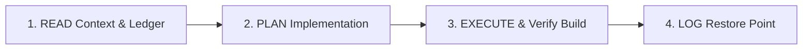

# 03 — Recovery & Rollback Protocols

This document establishes the recovery engine, self-healing protocols, and mandatory session workflows for all AI coding agents and human developers on **OdishaExamPrep**.

---

## 1. Automated Recovery & User Rollback Triggers

### A. Empowering the User
Whenever the user issues any of the following instructions (or equivalent intent):
- *"Restore"*
- *"Rollback"*
- *"Fix mistake"*
- *"Undo previous change"*
- *"Revert to last working state"*

The agent MUST execute the following protocol immediately:

1. **Inspect Ledger:** Immediately read `.agent/rules/02-changelog-restore-point.md` to identify the most recent change entry and its specific file list.
2. **Isolate Modified Files:** Determine the exact set of files created, modified, or deleted in that session.
3. **Execute Line-by-Line Reversal:** Revert every modified file back to its previous snapshot state recorded in the ledger or version control. Remove newly created files if they were part of the failed change.
4. **Compile & Verify:** Run `npm run build:frontend` to verify that the build compiles cleanly with zero TypeScript or bundler errors.
5. **Report & Wait:** Notify the user that the rollback is complete, provide the clean verification status, and wait for new instructions.

### B. Self-Correction & Zero-Stubbornness Rule
- **Never argue** or try to patch over a broken state with hasty, speculative band-aids.
- If a change introduces unexpected regressions or build failures that cannot be fixed in a single deterministic step, **perform the exact reversal first**.
- Always verify the app reaches a clean working state (`npm run build:frontend`) before proposing alternative architectural solutions.

---

## 2. Mandatory Session Workflow

Every future coding session MUST strictly follow this 4-step execution lifecycle:

### Step 1: READ (Context Alignment)
Before reading or editing project source files, the agent MUST review:
1. `.agent/rules/01-architecture-context.md` (Tech stack, theme tokens, coding standards)
2. `.agent/rules/02-changelog-restore-point.md` (Latest snapshot & history)
3. `.agent/rules/03-recovery-protocol.md` (Recovery guidelines)

### Step 2: PLAN (Architectural Review)
For any non-trivial or multi-file modification:
- Create or update `implementation_plan.md` before making code changes.
- Ensure all UI additions follow `@theme` tokens in `src/index.css` and use `cn()` for class merges.

### Step 3: EXECUTE & VERIFY
- Execute code changes cleanly with strict TypeScript types.
- Always run `npm run build:frontend` to guarantee zero compilation errors before declaring completion.

### Step 4: LOG (Ledger Update)
After completing every task, append a new entry to `.agent/rules/02-changelog-restore-point.md` containing:
- **Timestamp:** Current Date/Time in IST.
- **Action Type:** Feature, Bugfix, Refactor, or Optimization.
- **Files Modified / Added / Deleted:** Explicit list of files.
- **Summary:** Concise summary of UI/Logic changes made.
- **Verification:** Build test result (`npm run build:frontend`).
- **Rollback Instructions / Snapshot:** Exact diff or instructions needed to restore the codebase back to the state prior to this task.
