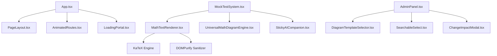

# UI Registry — OdishaExamPrep

This document is the living component registry for **OdishaExamPrep** (`https://www.odishaexamprep.in`). It catalogues every reusable UI component in the codebase.

Before creating any new component, developers and AI agents MUST consult this registry to reuse or extend existing components.

---

## How to Use

1. **Search First:** Before creating a UI component, search this registry.
2. **Reuse Before Creating:** If an existing component satisfies the requirement, use it.
3. **Extend Don't Duplicate:** If an existing component requires minor additions, add optional props to extend it.
4. **Register Immediately:** When a new reusable component is added or modified, update this registry.

---

## Component Index

| Component Name | Category | File Path | Variants | Used By | Status |
| :--- | :--- | :--- | :--- | :--- | :--- |
| **`PageLayout`** | Layout | [`src/components/PageLayout.tsx`](file:///c:/Users/Naresh%20Samal/Downloads/OdishaExamPrep%20Website/src/components/PageLayout.tsx) | Default, Full Width | All Page Views | Active |
| **`Button`** | Utility | [`src/components/Button.tsx`](file:///c:/Users/Naresh%20Samal/Downloads/OdishaExamPrep%20Website/src/components/Button.tsx) | Primary, Secondary, Glass | App.tsx, AdminPanel.tsx | Active |
| **`MathTextRenderer`** | Data Display | [`src/components/MathTextRenderer.tsx`](file:///c:/Users/Naresh%20Samal/Downloads/OdishaExamPrep%20Website/src/components/MathTextRenderer.tsx) | Inline, Block Math | MockTestSystem, BlogPost | Active |
| **`UniversalMathDiagramEngine`**| Data Display | [`src/components/UniversalMathDiagramEngine.tsx`](file:///c:/Users/Naresh%20Samal/Downloads/OdishaExamPrep%20Website/src/components/UniversalMathDiagramEngine.tsx) | Canvas, Vector SVG | MockTestSystem, AdminPanel | Active |
| **`DiagramTemplateSelector`** | Form Control | [`src/components/DiagramTemplateSelector.tsx`](file:///c:/Users/Naresh%20Samal/Downloads/OdishaExamPrep%20Website/src/components/DiagramTemplateSelector.tsx) | Modal Grid | AdminPanel.tsx | Active |
| **`StickyAICompanion`** | AI Assistant | [`src/components/StickyAICompanion.tsx`](file:///c:/Users/Naresh%20Samal/Downloads/OdishaExamPrep%20Website/src/components/StickyAICompanion.tsx) | Drawer, Floating FAB | MockTestSystem, App.tsx | Active |
| **`OnboardingTour`** | Feedback / Tour | [`src/components/OnboardingTour.tsx`](file:///c:/Users/Naresh%20Samal/Downloads/OdishaExamPrep%20Website/src/components/OnboardingTour.tsx) | Desktop Popover, Mobile Action Sheet | App.tsx | Active |
| **`PushPermissionPrompt`** | Feedback | [`src/components/PushPermissionPrompt.tsx`](file:///c:/Users/Naresh%20Samal/Downloads/OdishaExamPrep%20Website/src/components/PushPermissionPrompt.tsx) | Top Banner | App.tsx | Active |
| **`ChangeImpactModal`** | Modal | [`src/components/ChangeImpactModal.tsx`](file:///c:/Users/Naresh%20Samal/Downloads/OdishaExamPrep%20Website/src/components/ChangeImpactModal.tsx) | Warning Overlay | AdminPanel.tsx | Active |
| **`SearchableSelect`** | Form Control | [`src/components/SearchableSelect.tsx`](file:///c:/Users/Naresh%20Samal/Downloads/OdishaExamPrep%20Website/src/components/SearchableSelect.tsx) | Filterable Dropdown | AdminPanel.tsx | Active |
| **`TimePicker`** | Form Control | [`src/components/TimePicker.tsx`](file:///c:/Users/Naresh%20Samal/Downloads/OdishaExamPrep%20Website/src/components/TimePicker.tsx) | Time Input | AdminPanel.tsx | Active |
| **`YouTubeCarousel`** | Media | [`src/components/YouTubeCarousel.tsx`](file:///c:/Users/Naresh%20Samal/Downloads/OdishaExamPrep%20Website/src/components/YouTubeCarousel.tsx) | Video Carousel | App.tsx | Active |
| **`LoadingPortal`** | Feedback | [`src/components/LoadingPortal.tsx`](file:///c:/Users/Naresh%20Samal/Downloads/OdishaExamPrep%20Website/src/components/LoadingPortal.tsx) | Full Screen Spinner | App.tsx | Active |
| **`WelcomeVideoModal`** | Media / Modal | [`src/components/WelcomeVideoModal.tsx`](file:///c:/Users/Naresh%20Samal/Downloads/OdishaExamPrep%20Website/src/components/WelcomeVideoModal.tsx) | YouTube Embed Modal | App.tsx | Active |
| **`AnimatedRoutes`** | Navigation | [`src/components/AnimatedRoutes.tsx`](file:///c:/Users/Naresh%20Samal/Downloads/OdishaExamPrep%20Website/src/components/AnimatedRoutes.tsx) | Motion Fade Transition | App.tsx | Active |
| **`ProtectedRoute`** | Guard | [`src/components/ProtectedRoute.tsx`](file:///c:/Users/Naresh%20Samal/Downloads/OdishaExamPrep%20Website/src/components/ProtectedRoute.tsx) | Auth Route Guard | App.tsx | Active |
| **`VoiceWaveVisualizer`** | Feedback | [`src/components/VoiceWaveVisualizer.tsx`](file:///c:/Users/Naresh%20Samal/Downloads/OdishaExamPrep%20Website/src/components/VoiceWaveVisualizer.tsx) | Equalizer waveform animation | AiMentor.tsx, StickyAICompanion.tsx | Active |
| **`QuestionBankCard`** | Data Display | [`src/App.tsx`](file:///c:/Users/Naresh%20Samal/Downloads/OdishaExamPrep%20Website/src/App.tsx#L6885-L7080) | Grid Card, Mobile List Item | App.tsx | Active |
| **`ScheduledPracticeBankCard`** | Data Display | [`src/App.tsx`](file:///c:/Users/Naresh%20Samal/Downloads/OdishaExamPrep%20Website/src/App.tsx#L3073-L3285) | Desktop Grid, Mobile List Item | App.tsx | Active |
| **`NotificationCenter`** | Navigation / Overlay | [`src/components/NotificationCenter.tsx`](file:///c:/Users/Naresh%20Samal/Downloads/OdishaExamPrep%20Website/src/components/NotificationCenter.tsx) | Bell Trigger + Floating Popover | App.tsx (Header) | Active |
| **`GlobalSearchModal`** | Navigation / Overlay | [`src/components/GlobalSearchModal.tsx`](file:///c:/Users/Naresh%20Samal/Downloads/OdishaExamPrep%20Website/src/components/GlobalSearchModal.tsx) | Spotlight Search Portal (Full-screen portal) | App.tsx (Header) | Active |
| **`AdminSortDirectionToggle`** | Admin / Toolbar | [`src/AdminPanel.tsx`](file:///c:/Users/Naresh%20Samal/Downloads/OdishaExamPrep%20Website/src/AdminPanel.tsx) | Asc/Desc pill toggle in Content Banks sub-header | AdminPanel.tsx | Active |
| **`InlineOrderInput`** | Admin / Table Row | [`src/AdminPanel.tsx`](file:///c:/Users/Naresh%20Samal/Downloads/OdishaExamPrep%20Website/src/AdminPanel.tsx) | Editable numeric ORDER field in table rows | AdminPanel.tsx | Active |
| **`CategoryHierarchyPillBar`** | Admin / Toolbar | [`src/AdminPanel.tsx`](file:///c:/Users/Naresh%20Samal/Downloads/OdishaExamPrep%20Website/src/AdminPanel.tsx) | Hierarchy pill toolbar with auto tab switcher | AdminPanel.tsx | Active |
| **`AttemptPerformanceModal`** | Overlay / Modal | [`src/App.tsx`](file:///c:/Users/Naresh%20Samal/Downloads/OdishaExamPrep%20Website/src/App.tsx) | Glassmorphic score count-up & progress modal | App.tsx | Active |
| **`GuidedRecommendationHero`** | Navigation / Hero | [`src/App.tsx`](file:///c:/Users/Naresh%20Samal/Downloads/OdishaExamPrep%20Website/src/App.tsx) | Dynamic "What to Study Next" Recommendation Module | App.tsx (Exam Details) | Active |
| **`AIStudyPlanCard`** | Data Display / Plan | [`src/components/AIStudyPlanCard.tsx`](file:///c:/Users/Naresh%20Samal/Downloads/OdishaExamPrep%20Website/src/components/AIStudyPlanCard.tsx) | Desktop Grid, Mobile Compact Item | StudyPlanView.tsx, AnalyticsView.tsx, App.tsx | Active |
| **`DynamicVectorCard`** | Design System / Layout | [`src/components/DynamicVectorCard.tsx`](file:///c:/Users/Naresh%20Samal/Downloads/OdishaExamPrep%20Website/src/components/DynamicVectorCard.tsx) | Vector Grid Overlay, 3D Perspective Tilt, Viewport Cursor Spotlight Ring | App.tsx, YouTubeCarousel.tsx, All Page Sections | Active |
| **`OdishaLeaderboardCard`** | Gamification / Social | [`src/components/OdishaLeaderboardCard.tsx`](file:///c:/Users/Naresh%20Samal/Downloads/OdishaExamPrep%20Website/src/components/OdishaLeaderboardCard.tsx) | Pinned Hero, 3-Podium, Master List, Nearby Rivals | StudyPlanView.tsx, AnalyticsView.tsx, App.tsx | Active |
| **`AdminMockTestUploadQsButton`** | Admin / Card Action | [`src/AdminPanel.tsx`](file:///c:/Users/Naresh%20Samal/Downloads/OdishaExamPrep%20Website/src/AdminPanel.tsx#L5043-L5060) | Direct Upload Qs action button on Mock Test cards | AdminPanel.tsx | Active |
| **`AdminQuestionEditModalForm`** | Admin / Form Modal | [`src/AdminPanel.tsx`](file:///c:/Users/Naresh%20Samal/Downloads/OdishaExamPrep%20Website/src/AdminPanel.tsx#L2445-L2595) | Dynamic question form editor with optgroup target selector & active radio answer selector | AdminPanel.tsx | Active |
| **`CurrentAffairsPage`** | Page View | [`src/pages/CurrentAffairs.tsx`](file:///c:/Users/Naresh%20Samal/Downloads/OdishaExamPrep%20Website/src/pages/CurrentAffairs.tsx) | Multi-period time range toolbar & category grid view | Router (`/current-affairs`) | Active |
| **`CurrentAffairsReaderModal`** | Overlay / Modal | [`src/components/CurrentAffairsReaderModal.tsx`](file:///c:/Users/Naresh%20Samal/Downloads/OdishaExamPrep%20Website/src/components/CurrentAffairsReaderModal.tsx) | Glassmorphic 360° article reader with guaranteed self-test MCQs | CurrentAffairs.tsx | Active |
| **`TopHeaderNavigation`** | Navigation | [`src/App.tsx`](file:///c:/Users/Naresh%20Samal/Downloads/OdishaExamPrep%20Website/src/App.tsx#L2085-L2285) | Executive Widescreen (`w-full px-4 sm:px-6 lg:px-8`), Viewport-Fixed Glass Navbar | App.tsx | Active |
| **`ExamRegistryStatusBadges`** | Data Display | [`src/App.tsx`](file:///c:/Users/Naresh%20Samal/Downloads/OdishaExamPrep%20Website/src/App.tsx#L1013-L1020) | Adaptive Dual-Theme Status Badges (Notification, Admit Card, Applications, Result, Postponed, Upcoming) | App.tsx (Recruitment Bulletin) | Active |
| **`WidescreenLayoutBoundary`** | Layout System | [`src/App.tsx`](file:///c:/Users/Naresh%20Samal/Downloads/OdishaExamPrep%20Website/src/App.tsx) | Executive Widescreen (`max-w-7xl mx-auto px-4 sm:px-6 lg:px-8`), Responsive 3-Column Grid | App.tsx | Active |
| **`DynamicVectorCard`** | Container / Utility | [`src/components/DynamicVectorCard.tsx`](file:///c:/Users/Naresh%20Samal/Downloads/OdishaExamPrep%20Website/src/components/DynamicVectorCard.tsx) | 3D Magnetic Parallax, Surface Spotlight, Edge Ring Illumination | StudyPlanView, AnalyticsView, App.tsx | Active |
| **`MouseTrackingCanvas`** | Background / Canvas | [`src/components/MouseTrackingCanvas.tsx`](file:///c:/Users/Naresh%20Samal/Downloads/OdishaExamPrep%20Website/src/components/MouseTrackingCanvas.tsx) | 60fps Lerp Viewport Ambient Light Orb | App.tsx (Root) | Active |
| **`VectorCursorFollower`** | Utility / Feedback | [`src/components/VectorCursorFollower.tsx`](file:///c:/Users/Naresh%20Samal/Downloads/OdishaExamPrep%20Website/src/components/VectorCursorFollower.tsx) | Interactive Ring Follower + Center Precision Pointer Dot | App.tsx (Root) | Active |
| **`AntigravityMicroDistanceLenisScrollEngine`** | Performance / Physics | [`src/lib/lenisScroll.ts`](file:///c:/Users/Naresh%20Samal/Downloads/OdishaExamPrep%20Website/src/lib/lenisScroll.ts) | Micro-Distance Scaling (`0.60`), `lerp: 0.18`, `touchMultiplier: 0` | App.tsx (Root) | Active |
| **`OffscreenCardVirtualizationEngine`** | Performance / Rendering | [`src/index.css`](file:///c:/Users/Naresh%20Samal/Downloads/OdishaExamPrep%20Website/src/index.css) | `.cv-card-auto` Offscreen Layout Bypass | App.tsx (All Cards) | Active |
| **`AdminSWRControlCenterEngine`** | Admin / Performance | [`src/AdminPanel.tsx`](file:///c:/Users/Naresh%20Samal/Downloads/OdishaExamPrep%20Website/src/AdminPanel.tsx) | 0ms SWR Catalog Caching (`getAllMockTestsLite`), Skeleton Shimmer | AdminPanel.tsx | Active |
| **`AdminRefreshPersistenceEngine`** | Admin / Navigation | [`src/AdminPanel.tsx`](file:///c:/Users/Naresh%20Samal/Downloads/OdishaExamPrep%20Website/src/AdminPanel.tsx) | URL Param State Sync (`replaceState`), Session Persistence | AdminPanel.tsx | Active |
| **`AdminSubjectSelector`** | Admin / Form Control | [`src/AdminPanel.tsx`](file:///c:/Users/Naresh%20Samal/Downloads/OdishaExamPrep%20Website/src/AdminPanel.tsx#L2160-L2199) | Academic Subject Dropdown Filter + Custom Input (`✏️ + Enter Custom Subject...`) | AdminPanel.tsx | Active |
| **`QuestionBankReaderModal`** | Overlay / Modal | [`src/components/QuestionBankReaderModal.tsx`](file:///c:/Users/Naresh%20Samal/Downloads/OdishaExamPrep%20Website/src/components/QuestionBankReaderModal.tsx) | Interactive Web Reader, Filter Pills, Show/Hide Solutions, KaTeX Math & 1-Click PDF Export | App.tsx | Active |
| **`AdminQuestionBankJsonBuilder`** | Admin / Creation Flow | [`src/AdminPanel.tsx`](file:///c:/Users/Naresh%20Samal/Downloads/OdishaExamPrep%20Website/src/AdminPanel.tsx#L2749-L2970) | 2-Step Questions & Answer Key JSON Merger with Mode Switcher & Summary Card | AdminPanel.tsx | Active |
| **`AdminQuestionBankPreviewModal`** | Admin / Modal | [`src/AdminPanel.tsx`](file:///c:/Users/Naresh%20Samal/Downloads/OdishaExamPrep%20Website/src/AdminPanel.tsx#L7647-L7780) | Live Parsed Question Bank Review Modal with Math Renderer & Option Validation | AdminPanel.tsx | Active |
| **`QuestionBankGuideModal`** | Overlay / Onboarding | [`src/components/QuestionBankGuideModal.tsx`](file:///c:/Users/Naresh%20Samal/Downloads/OdishaExamPrep%20Website/src/components/QuestionBankGuideModal.tsx) | Interactive Feature Onboarding Dialog, First-Time Auto-Trigger, Feature Badges | QuestionBankReaderModal.tsx | Active |
| **`AuthModal`** | Overlay / Authentication | [`src/App.tsx`](file:///c:/Users/Naresh%20Samal/Downloads/OdishaExamPrep%20Website/src/App.tsx#L2880-L3125) | Glassmorphic Authentication Dialog, Dark-Mode Inputs, Google OAuth, Password Reset | App.tsx | Active |
| **`ExamAlertGraphicCard`** | Graphic / Social Card | [`automations/templates/template_alert.html`](file:///c:/Users/Naresh%20Samal/Downloads/OdishaExamPrep%20Website/automations/templates/template_alert.html) | 20-Category 1080x1080 Adaptive Visual Themes, Official Board Badges, Direct Gov Portal Verification | automations/breaking_engine.py | Active |
| **`ExecutiveBlogPostReader`** | Layout / Article | [`src/pages/BlogPost.tsx`](file:///c:/Users/Naresh%20Samal/Downloads/OdishaExamPrep%20Website/src/pages/BlogPost.tsx) & [`src/index.css`](file:///c:/Users/Naresh%20Samal/Downloads/OdishaExamPrep%20Website/src/index.css) | `.oep-article-prose`, `.oep-table-wrapper`, Dynamic TOC anchors, Reading progress tracker | Router (`/blog/:id`) | Active |
| **`ExamBoardVectorBanner`** | Graphic / Asset Engine | [`automations/shared/exam_logo_registry.py`](file:///c:/Users/Naresh%20Samal/Downloads/OdishaExamPrep%20Website/automations/shared/exam_logo_registry.py) | 1200x630 High-Resolution Vector Card Banner, 10 Official Board Themes, Procedural Grid, Verified Badge | automations/ | Active |

---

## Component Details

### 1. `PageLayout`
- **File Path:** [`src/components/PageLayout.tsx`](file:///c:/Users/Naresh%20Samal/Downloads/OdishaExamPrep%20Website/src/components/PageLayout.tsx)
- **Category:** Layout
- **Purpose:** Standard top-level container for all public pages, rendering the main header navigation, drawer menu, content container, and footer.
- **Props:** `children` (`ReactNode`, required), `className` (`string`, optional).
- **Styling:** `min-h-screen flex flex-col bg-[#FBF9F6]`.

```tsx
import { PageLayout } from '../components/PageLayout';

export function CustomPage() {
  return (
    <PageLayout>
      <div className="max-w-7xl mx-auto px-4 py-8">
        <h1>Page Content</h1>
      </div>
    </PageLayout>
  );
}
```

---

### 2. `MathTextRenderer`
- **File Path:** [`src/components/MathTextRenderer.tsx`](file:///c:/Users/Naresh%20Samal/Downloads/OdishaExamPrep%20Website/src/components/MathTextRenderer.tsx)
- **Category:** Data Display
- **Purpose:** Parses raw text strings containing inline (`$...$`) or block (`$$...$$`) LaTeX equations, renders them using KaTeX, and sanitizes the output with DOMPurify.
- **Props:** `text` (`string`, required), `className` (`string`, optional).
- **Dependencies:** `katex`, `dompurify`.

```tsx
import { MathTextRenderer } from '../components/MathTextRenderer';

<MathTextRenderer 
  text="Solve for x: $x^2 + 5x + 6 = 0$" 
  className="text-slate-800 text-base font-medium" 
/>
```

---

### 3. `UniversalMathDiagramEngine`
- **File Path:** [`src/components/UniversalMathDiagramEngine.tsx`](file:///c:/Users/Naresh%20Samal/Downloads/OdishaExamPrep%20Website/src/components/UniversalMathDiagramEngine.tsx)
- **Category:** Data Display
- **Purpose:** Renders dynamic vector SVG and Canvas geometric figures (triangles, circles, polygons, coordinate axes, Venn diagrams, circuits) based on structured JSON props.
- **Props:** `diagram` (`DiagramSpec`, required), `className` (`string`, optional).
- **Dependencies:** KaTeX, React Hooks.

```tsx
import { UniversalMathDiagramEngine } from '../components/UniversalMathDiagramEngine';

<UniversalMathDiagramEngine 
  diagram={{
    type: 'triangle',
    labels: { A: '(0,0)', B: '(4,0)', C: '(2,3)' },
    angles: { A: '60°', B: '60°', C: '60°' }
  }} 
/>
```

---

### 4. `StickyAICompanion`
- **File Path:** [`src/components/StickyAICompanion.tsx`](file:///c:/Users/Naresh%20Samal/Downloads/OdishaExamPrep%20Website/src/components/StickyAICompanion.tsx)
- **Category:** AI Assistant
- **Purpose:** Floating AI assistant drawer that accompanies students during mock tests and page navigation to provide live voice interaction, hints, and strategy guidance.
- **Props:** `isOpen` (`boolean`), `onClose` (`() => void`), `activeTab` (`string`), `user` (`User`), `profile` (`UserProfile`).
- **Dependencies:** `/api/chat/completions`, `useVoiceInteraction.ts`, `VoiceWaveVisualizer.tsx`, `lucide-react`.
- **Last Updated:** July 21, 2026

| Property | Class / Token |
| :--- | :--- |
| **Drawer Container** | `bg-white/95 backdrop-blur-sm border border-slate-200/80 shadow-2xl` |
| **Drawer Header** | `bg-gradient-to-r from-slate-900 via-brand-950 to-slate-900 border-b border-slate-800/90 text-white` |
| **Live Voice Button (Active)** | `bg-gradient-to-br from-emerald-500 to-teal-700 border-emerald-600 text-white shadow-emerald-500/30` |
| **Live Voice Button (Inactive)** | `bg-white hover:bg-slate-100 text-slate-700 border-slate-200/80 hover:border-emerald-300` |
| **Dictation Overlay Bar** | `bg-slate-950/95 backdrop-blur-xl border border-emerald-500/30 shadow-[0_0_20px_rgba(16,185,129,0.15)] rounded-2xl` |
| **Confirm Chip (Check ✓)** | `w-6.5 h-6.5 rounded-lg bg-emerald-500/20 hover:bg-emerald-500/90 text-emerald-300 hover:text-white border border-emerald-500/40` |
| **Cancel Chip (Close X)** | `w-6.5 h-6.5 rounded-lg bg-rose-500/20 hover:bg-rose-500/90 text-rose-300 hover:text-white border border-rose-500/40` |
| **Mute Toggle Button** | `w-7 h-7 rounded-xl border` (`bg-indigo-50 border-indigo-200 text-indigo-600` / `bg-slate-200 border-slate-300 text-slate-500`) |
| **Text — Primary** | `text-slate-800 text-sm font-normal leading-relaxed` |
| **Text — Secondary** | `text-slate-500 text-xs font-medium` |

**Pattern notes:**
- **Glassmorphic Action Chips**: Dictation confirm `[✓]` and cancel `[X]` buttons MUST use frosted glassmorphic chips (`bg-emerald-500/20`, `bg-rose-500/20`) with hover scale micro-animations instead of solid flat color blocks.
- **Flex Overflow Prevention**: Recording bars and parent flex containers MUST declare `min-w-0` across every container level, and control action buttons MUST declare `shrink-0` to guarantee on-screen visibility.
- **Single-Line Banners**: Labels inside `VoiceWaveVisualizer` MUST enforce `whitespace-nowrap shrink-0` to prevent line wrapping.
- **Auto-Scroll on Refresh/Mount**: Chat message lists in `AiMentor` and `StickyAICompanion` MUST place `<div ref={chatEndRef} />` at the bottom and use a mount `useEffect` to scroll directly to the bottom (`behavior: 'auto'`) on initial page load / refresh so users instantly see their latest messages.
- **Live Voice Control**: Clicking the green `((•))` button or the Red `X` button MUST set `setIsLiveVoiceMode(false)` synchronously to ensure auto-restart hooks cleanly halt.
- **Multi-Chat Session Manager**: OdishaExamPrep AI in `AiMentor.tsx` uses `ChatSession[]` stored in `localStorage` (`oep_ai_chat_sessions`). `+ New Chat` starts a fresh thread while `History 🕒` toggles a slide-over glassmorphic drawer (`bg-white/95 backdrop-blur-xl z-40`) featuring live search, inline title editing, and deletion.
- **Fullscreen Workspace Mode**: Fullscreen mode in `AiMentor.tsx` MUST use `fixed inset-0 z-[100] w-screen h-dvh rounded-none border-none shadow-none bg-white` container styling combined with browser HTML5 `requestFullscreen()` and an `ESC` key `fullscreenchange` event listener to ensure seamless enter/exit behavior across desktop viewports.
- **Smart Auto-Toggle Web Search**: The prompt input box in both `AiMentor.tsx` and `StickyAICompanion.tsx` contains an inline, left-aligned `Globe` button (🌐). As the user types, it automatically triggers a web search query (turns brand-blue) when keywords like "today", "current", "news", or "latest" are matched. The user can click it to manually force active/inactive states.
- **15-Domain Future-Proof Classifier (`getQuestionBankVectorTheme`)**: Question Bank cards use dynamic 0ms SVG/CSS vector banners (`h-44`) with 15 specialized domain matchers covering Healthcare/Nursing, Computer/IT, Odisha State GK, Quant/Math, Reasoning, Odia Language, English, Polity/Constitution, History, Geography, Economics/Banking, General Science, Defence/Police, Teaching/Pedagogy, and GK/PYQ. Each domain renders curated HSL gradients, geometric grid watermarks, subject vector icons (`HeartPulse`, `Laptop`, `MapPin`, `PieChart`, `Target`, `Scale`, `Compass`, `Globe`, `Receipt`, `Zap`, `ShieldCheck`, `BookOpen`), and real exam target badges (`OPSC OAS`, `OSSC CGL`, `OSSSC RI/AMIN`, `SSC CGL`, `IBPS PO`, `RRB NTPC`).
- **Guided Learning Recommendation Vector Hero (`src/App.tsx`)**: The "WHAT TO STUDY NEXT" hero banner uses dynamic HSL gradients matched to the recommended drill topic, featuring a radial grid watermark, a floating 3D vector watermark icon (`w-48 h-48 sm:w-64 sm:h-64 opacity-15 stroke-[1.2]`) that rotates on card hover, glassmorphic target score & duration pills, and a brand gradient CTA button.
- **Practice Mode Vector Selection Cards (`getPracticeModeVectorTheme`)**: Step 1 Practice Mode cards (`src/App.tsx`) use relatable 3D glassmorphic vector emblems (`BookOpen` + `Layers`, `Flame` + `Zap`, `Timer` + `Activity`, `Award` + `History`), mode-matched HSL vector header gradients, radial dot grid watermarks, 3D floating background icons (`w-44 h-44 opacity-15 stroke-[1.2]`), and glowing gradient CTA buttons.
- **Mock Test Vector Selection Cards (`getMockTestVectorTheme`)**: Step 2 Mock Test cards (`src/App.tsx`) feature relatable 3D glassmorphic vector emblems (`Award` + `Sparkles`, `Target` + `BarChart3`, `History` + `BookOpen`, `Timer` + `Activity`), mode-matched HSL vector header gradients, radial dot grid watermarks, 3D floating background icons (`w-44 h-44 opacity-15 stroke-[1.2]`), and glowing gradient CTA buttons.
- **Reference Library Vector Selection Cards (`getReferenceLibraryVectorTheme`)**: Step 3 Reference Library cards (`src/App.tsx`) feature relatable 3D glassmorphic vector emblems (`Layers` + `BookOpen`, `Target` + `Zap`, `BookMarked` + `FileText`, `History` + `Award`), mode-matched HSL vector header gradients, radial dot grid watermarks, 3D floating background icons (`w-40 h-40 opacity-15 stroke-[1.2]`), and glassmorphic resource count pills.
- **Academic Vector Canvas Page & Executive Header Card (`src/App.tsx`)**: Wraps the exam dashboard view in a bright academic vector canvas with geometric dot grid watermarks (`bg-[radial-gradient(#cbd5e1_1.2px,transparent_1.2px)]`), ambient HSL soft glows (`from-brand-300/20 via-indigo-200/15`), floating study vector watermarks (`GraduationCap`, `BookOpen`, `Award`, `Compass`), and an Executive Vector Header Banner Card with a 3D `GraduationCap` logo watermark emblem.
- **Study Plan Hub Academic Vector Canvas & 3D Vector Cards (`src/StudyPlanView.tsx`)**: Wraps the Study Plan Hub page in a bright Academic Vector Canvas (`GraduationCap`, `Calendar`, `Trophy`, `TrendingUp`) and transforms all 5 child cards (`AIStudyPlanCard`, `OdishaLeaderboardCard`, `SmartRecommendationCard`, `TopicConfidenceMatrix`, `PersonalBestCard`) into Executive 3D Vector Cards with HSL gradients, radial grid watermarks, and floating background icons (`w-52 h-52 opacity-15`).
- **Dynamic Bi-Directional 3D Vector Card Hover & Theme-Aware Spotlight (`DynamicVectorCard.tsx`)**: Real-time cursor tracking engine (`onMouseMove`) calculating relative card coordinates to dynamically tilt cards bi-directionally (stiffness 220, damping 22). Renders a smooth, professional 3-stop ambient gradient (`core → mid-ring → transparent edge`) at `z-0` behind `<div className="relative z-10">{children}</div>`, guaranteeing 100% crisp text readability and theme color matching without harsh floating orb artifacts. Features a 1px glowing rim border illumination ring at `z-20` using CSS `maskComposite: exclude` for crisp edge lighting.

- **Multimodal Image Attachment Upload**: Uploaded image files (`.png`, `.jpg`, `.jpeg`, `.webp`) convert to base64 Data URLs (`data:image/...`). Express body parser in `server.ts` enforces `limit: '50mb'` to handle high-resolution image uploads cleanly, routing vision payloads `{ type: 'image_url', image_url: { url } }` to `meta/llama-3.2-11b-vision-instruct` with seamless text-model fallback.
- **ChatGPT-Inspired Attachment Tray**: Attached files render inside a clean horizontal flex strip (`overflow-x-auto gap-2.5 py-1 px-1`). Images display as square 64x64px rounded thumbnail tiles (`w-16 h-16 rounded-xl border border-slate-200/90 shadow-xs object-cover`) with hover-overlay `✕` close buttons. Documents display as horizontal mini-cards (`rounded-xl bg-slate-50 border border-slate-200/80 max-w-[220px]`) with a red PDF badge icon, filename, size, and close icon. Sitting inside the input container, 1, 2, 3, or more files line up side-by-side without vertical stacking or overlapping Quick/Best mode buttons.
- **ChatGPT-Style Visual Chat Message Attachment Cards**: Attached images in student chat bubbles render as visual square thumbnail cards (`w-18 h-18 sm:w-22 sm:h-22 rounded-xl border border-white/30 object-cover shadow-md hover:scale-105`) instead of raw filename strings (`[ 📎 Gemini Generated Image... ]`). Clicking any image tile opens an interactive full-screen Lightbox Zoom Modal (`fixed inset-0 z-[300] bg-slate-950/90 backdrop-blur-md`).

---

### `ChatGPTAttachmentTray`

File: `src/pages/AiMentor.tsx`
Last updated: 2026-07-25

| Property | Class |
| :--- | :--- |
| Background — Container | `bg-white/90` |
| Background — Image Tile | `bg-slate-100` |
| Background — Doc Card | `bg-slate-50` |
| Background — PDF Badge | `bg-rose-50` |
| Border — Container | `border border-slate-200/80` |
| Border — Tile / Card | `border border-slate-200/90` |
| Border radius — Container | `rounded-2xl` |
| Border radius — Tiles / Cards | `rounded-xl` |
| Text — Primary (Filename) | `text-xs font-bold text-slate-800` |
| Text — Secondary (File Size) | `text-[10px] text-slate-400 font-medium font-mono` |
| Spacing — Tray | `mb-2 px-1 py-1` |
| Spacing — Flex Row | `gap-2.5 px-1 py-1 overflow-x-auto no-scrollbar scroll-smooth` |
| Hover state — Image Zoom | `group-hover/thumb:scale-105` |
| Hover state — Dismiss Badge | `bg-slate-950/75 hover:bg-rose-600 text-white` |
| Shadow | `shadow-xs` |

**Pattern notes:**
- Attached files sit inside the input wrapper above the prompt textarea, preventing vertical stacking or button misalignment.
- Image attachments render as 64x64px square thumbnail tiles (`w-14 h-14 sm:w-16 sm:h-16 rounded-xl object-cover`).
- Document attachments render as horizontal mini-cards (`max-w-[220px]`) with a red PDF badge icon, filename, and size.

---

### `ChatGPTChatAttachmentCards`

File: `src/pages/AiMentor.tsx`
Last updated: 2026-07-25

| Property | Class |
| :--- | :--- |
| Background — Chat Image Tile | `bg-slate-900/40` |
| Background — Doc Mini-Card | `bg-white/15 backdrop-blur-xs` |
| Background — Lightbox Overlay | `bg-slate-950/90 backdrop-blur-md` |
| Background — Lightbox Modal Card | `bg-slate-900 border border-slate-700/80` |
| Border — Chat Image Tile | `border border-white/30` |
| Border — Doc Mini-Card | `border border-white/25` |
| Border radius — Chat Tile / Card | `rounded-xl` |
| Border radius — Lightbox Modal | `rounded-2xl` |
| Text — Doc Filename | `text-xs font-semibold text-white` |
| Text — Lightbox Header | `text-xs font-bold text-slate-300` |
| Spacing — Chat Tile Grid | `flex items-center gap-2 flex-wrap mb-2 pt-0.5` |
| Spacing — Tile Dimensions | `w-18 h-18 sm:w-22 sm:h-22` (72x72px to 88x88px) |
| Hover state — Tile Zoom | `group/chatimg hover:scale-105 active:scale-95 transition-all` |
| Hover state — Zoom Overlay Icon | `opacity-0 group-hover/chatimg:opacity-100 transition-opacity` |
| Shadow | `shadow-md` (tiles), `shadow-2xl` (modal) |

**Pattern notes:**
- Attached images in student chat bubbles render as visual square thumbnail cards instead of raw text filename strings (`[ 📎 Gemini Generated Image... ]`).
- Prompt text stays clean and unpolluted by raw file badges.
- Clicking any image tile opens an interactive full-screen Lightbox Zoom Modal for inspecting uploaded question screenshots.

---

### 5. `SearchableSelect`
- **File Path:** [`src/components/SearchableSelect.tsx`](file:///c:/Users/Naresh%20Samal/Downloads/OdishaExamPrep%20Website/src/components/SearchableSelect.tsx)
- **Category:** Form Control
- **Purpose:** Custom dropdown menu with built-in real-time filter search bar for long option lists.
- **Props:** `options` (`Array<{value: string, label: string}>`, required), `value` (`string`, required), `onChange` (`(val: string) => void`, required), `placeholder` (`string`, optional).

```tsx
import { SearchableSelect } from '../components/SearchableSelect';

<SearchableSelect 
  options={[{ value: 'opsc', label: 'OPSC Civil Services' }, { value: 'ossc', label: 'OSSC CGL' }]}
  value={selectedExam}
  onChange={setSelectedExam}
  placeholder="Select Exam..."
/>
```

---

### 6. `LoadingPortal`
- **File Path:** [`src/components/LoadingPortal.tsx`](file:///c:/Users/Naresh%20Samal/Downloads/OdishaExamPrep%20Website/src/components/LoadingPortal.tsx)
- **Category:** Feedback
- **Purpose:** Renders full-screen backdrop loading state with platform logo and animated pulse spinner during initial app load.

### 7. `YouTubeCarousel`
- **File Path:** [`src/components/YouTubeCarousel.tsx`](file:///c:/Users/Naresh%20Samal/Downloads/OdishaExamPrep%20Website/src/components/YouTubeCarousel.tsx)
- **Category:** Media / Carousel
- **Purpose:** Renders an infinite, auto-scrolling strategy video carousel with dynamic YouTube oEmbed title resolution, keyword category tagging, and an integrated modal video player window.
- **Props:** `videoIds` (`string[]`, optional).
- **Last Updated:** August 18, 2026

| Property | Class / Token |
| :--- | :--- |
| **Carousel Container** | `w-full relative py-3 sm:py-12 overflow-hidden bg-[#F2EFE9] dark:bg-slate-900 border-2 border-slate-900 dark:border-slate-700 rounded-[2rem] sm:rounded-[2.5rem] shadow-[6px_6px_0px_rgba(0,0,0,1)]` |
| **Track Padding & Alignment** | `px-6 sm:px-10 py-3` (matches desktop header `px-10` for 100% full-card clearance) |
| **Edge-Fade Mask** | `maskImage: linear-gradient(to right, transparent 0%, black 24px, black calc(100% - 32px), transparent 100%)` |
| **Card Dimensions & Border** | `width: cardWidth`, `rounded-2xl border-2 border-slate-900 dark:border-slate-700 bg-white dark:bg-slate-900` |
| **Card Vector Shadow** | `shadow-[4px_4px_0px_rgba(0,0,0,1)] dark:shadow-[4px_4px_0px_rgba(37,99,235,0.4)] md:hover:-translate-x-0.5 md:hover:-translate-y-0.5` |
| **Modal Backdrop** | `backdrop-blur-2xl bg-slate-950/85` |
| **Modal Window Header** | `bg-slate-900 border-b border-slate-800/90` |
| **Category Badges** | `Aptitude` (blue), `Strategy` (amber), `General Studies` (emerald), `Language` (purple), `Current Affairs` (rose) |

**Pattern notes:**
- **Full Card Clearance Guarantee**: The carousel track uses `px-6 sm:px-10` padding matching the desktop header (`px-10`) so cards never hit the outer container's `rounded-[2.5rem]` curved border wall, ensuring 100% full-card thumbnail, text, and 3D shadow visibility.
- **Alpha Mask Edge Fade**: Smooth CSS `maskImage` / `WebkitMaskImage` alpha gradient eliminates hard box clipping and provides a soft, elegant card-dissolve effect at the edges.
- **Modal Video Player**: Video lightboxes use an integrated top window header bar (`bg-slate-900 border-b border-slate-800`) with the video title on the left and the close button on the top-right corner of the header.

---

### 8. `QuizTabChips` (AI Mentor Quizzer)
- **File Path:** [`src/pages/AiMentor.tsx`](file:///c:/Users/Naresh%20Samal/Downloads/OdishaExamPrep%20Website/src/pages/AiMentor.tsx#L4851-L4880)
- **Category:** Form Control / Chips
- **Purpose:** Renders dynamic removable topic suggestion chips in the AI MCQ Quizzer workspace with symmetrical, flex-centered vector delete buttons.
- **Last Updated:** July 20, 2026

| Property | Class / Token |
| :--- | :--- |
| **Chip Container** | `inline-flex items-center gap-1.5 px-2.5 py-1 border text-[9px] font-black uppercase tracking-wider rounded-lg transition-all shrink-0 select-none` |
| **Active Chip State** | `bg-teal-500/10 border-teal-500/35 text-[#2563EB] font-bold` |
| **Inactive Chip State** | `bg-white border-slate-200 text-slate-500 hover:text-slate-700 hover:bg-slate-50` |
| **Delete Icon Button** | `w-3.5 h-3.5 rounded-full flex items-center justify-center text-slate-400 hover:text-rose-600 hover:bg-rose-100/80 transition-all ml-0.5 cursor-pointer shrink-0` |
| **Delete Vector Icon** | `<X className="w-2.5 h-2.5 stroke-[2.5]" />` |

**Pattern notes:**
- Removable tag/chip components MUST use Lucide vector icons (`<X className="w-2.5 h-2.5" />`) inside a dedicated flex-centered circular button (`w-3.5 h-3.5 rounded-full flex items-center justify-center`).
- Never use raw font text characters (`"×"` or `"x"`) for dismiss/delete buttons on chips, as font baselines cause vertical misalignment.
- Parent chip containers MUST enforce `inline-flex items-center` cross-axis alignment to keep text labels and close icons on the exact same vertical center line.

---

### 9. `AIDiagnosticsActionPlan` (Analytics Action Plan Cards)
- **File Path:** [`src/AnalyticsView.tsx`](file:///c:/Users/Naresh%20Samal/Downloads/OdishaExamPrep%20Website/src/AnalyticsView.tsx#L1649-L1680)
- **Category:** Data Display / Checklist Cards
- **Purpose:** Renders dynamic interactive checklist cards for AI diagnostic recommendations without text truncation, maintaining top alignment across multi-line tasks.
- **Last Updated:** July 20, 2026

| Property | Class / Token |
| :--- | :--- |
| **Card Container** | `p-3.5 sm:p-4 bg-slate-50/80 border border-slate-200/70 rounded-2xl flex items-start gap-3 hover:bg-white hover:border-[#2563EB]/40 transition-all duration-300` |
| **Checked State** | `bg-[#2563EB]/5 border-[#2563EB]/20` |
| **Checkbox Square** | `w-5 h-5 rounded-md border flex items-center justify-center shrink-0 mt-0.5` |
| **Active Checkbox** | `bg-emerald-500 border-emerald-400 text-white shadow-xs` |
| **Task Typography** | `text-slate-800 text-xs sm:text-sm font-semibold leading-relaxed whitespace-normal break-words` |
| **Checked Typography** | `line-through text-slate-400` |
| **Score Boost Badge** | `px-2 py-0.5 bg-emerald-50 text-emerald-700 text-[9px] font-black rounded-lg border border-emerald-200/50 uppercase` |

**Pattern notes:**
- Action plan & checklist items MUST NEVER use `truncate` or `line-clamp-1`; sentence tasks must wrap naturally using `whitespace-normal break-words`.
- Multi-line card containers MUST enforce `flex items-start` top alignment so checkboxes and score boost badges stay anchored at the top row.
- Checkbox indicators MUST use vector `<Check className="w-3.5 h-3.5 text-white stroke-[3]" />` icons instead of raw text checkmarks.

---

### 10. `OnboardingTour` (Guided Interactive Tour)
- **File Path:** [`src/components/OnboardingTour.tsx`](file:///c:/Users/Naresh%20Samal/Downloads/OdishaExamPrep%20Website/src/components/OnboardingTour.tsx)
- **Category:** Feedback / Tour
- **Purpose:** Interactive guided onboarding walkthrough with responsive desktop popover positioning and a dedicated mobile bottom action sheet drawer.
- **Last Updated:** July 21, 2026

| Property | Class / Token |
| :--- | :--- |
| **Card Background** | `bg-white` (Popover & Mobile Drawer) |
| **Backdrop Overlay** | `fill="rgba(15, 23, 42, 0.48)"` (SVG Mask, 0 backdrop blur) |
| **Border & Radius** | `border border-slate-200/90 rounded-2xl sm:rounded-3xl` (Desktop), `rounded-[2rem]` (Mobile Drawer) |
| **Spotlight Ring** | `border-2 border-brand-500 shadow-[0_0_0_2px_rgba(255,255,255,0.8),0_0_25px_rgba(37,99,235,0.7)]` |
| **Text — Primary** | `text-slate-900 font-extrabold text-base sm:text-lg` |
| **Text — Secondary**| `text-slate-600 font-medium text-xs sm:text-sm leading-relaxed` |
| **Step Badge** | `text-brand-600 bg-brand-50 border border-brand-100 text-[10px] font-black uppercase tracking-widest px-2.5 py-1 rounded-full` |
| **Mobile Drawer Container** | `fixed bottom-0 left-0 right-0 z-[1000] p-4 pb-6` with `w-10 h-1 bg-slate-200 rounded-full mx-auto` |
| **Mobile Location Badge** | `bg-brand-600 text-white font-extrabold text-[11px] uppercase tracking-wider px-4 py-1.5 rounded-full shadow-lg animate-bounce` |
| **Pointer Arrow** | `w-3.5 h-3.5 bg-white border-slate-300 rotate-45 shadow-sm z-30` |
| **Primary Action Button** | `bg-brand-600 hover:bg-brand-700 text-white font-black text-xs px-4 py-2 rounded-xl shadow-md shadow-brand-500/20` |

**Pattern notes:**
- On mobile viewports (<768px), onboarding tour components MUST render as fixed bottom drawer cards (`bottom-0 left-0 right-0`) rather than pixel-positioned floating cards.
- Tour backdrops MUST NOT use heavy `backdrop-blur` filters that obscure the target UI; backdrop overlays must remain transparent (`rgba(15, 23, 42, 0.48)`) so underlying web content stays crystal clear.
- All step card popovers MUST clamp `left` and `top` coordinates between `16px` and `viewportWidth - actualWidth - 16px` to prevent screen boundary clipping.

---

### 11. `VoiceWaveVisualizer`
- **File Path:** [`src/components/VoiceWaveVisualizer.tsx`](file:///c:/Users/Naresh%20Samal/Downloads/OdishaExamPrep%20Website/src/components/VoiceWaveVisualizer.tsx)
- **Category:** Feedback
- **Purpose:** Renders an animated equalizer frequency bar layout indicating active user recording (Speech-to-Text) or active AI speech readout (Text-to-Speech).
- **Props:** `isActive` (`boolean`), `type` (`'listening' | 'speaking'`), `bars` (`number`), `className` (`string`), `label` (`string`).

---

### 12. `SmartSearchPromptInput`
- **File Path:** [`src/pages/AiMentor.tsx`](file:///c:/Users/Naresh%20Samal/Downloads/OdishaExamPrep%20Website/src/pages/AiMentor.tsx#L4345-L4390) & [`src/components/StickyAICompanion.tsx`](file:///c:/Users/Naresh%20Samal/Downloads/OdishaExamPrep%20Website/src/components/StickyAICompanion.tsx#L2355-L2370)
- **Category:** Form Control / Interactive Input
- **Purpose:** Chat prompt input fields utilized by both AiMentor and the floating StickyAICompanion, optimized for inline web search auto-toggle and voice dictation support.
- **Props:** Input value and state toggles managed locally inside page contexts.

| Property | Class / Token |
| :--- | :--- |
| **Input Background** | `bg-white` (AiMentor) / `bg-slate-50/70` (StickyAICompanion) |
| **Input Border** | `border border-slate-200/60 focus:border-slate-300/80` (AiMentor) / `border border-slate-200/60 focus:border-brand-400/80` (StickyAICompanion) |
| **Border Radius** | `rounded-xl` (AiMentor) / `rounded-2xl` (StickyAICompanion) |
| **Text — Primary** | `text-slate-800 font-semibold` (AiMentor) / `text-slate-800 font-medium` (StickyAICompanion) |
| **Text — Secondary** | `placeholder:text-slate-500` (AiMentor) / `placeholder:text-slate-450` (StickyAICompanion) |
| **Spacing & Padding** | `pl-9 pr-10 py-2.5` (AiMentor) / `pl-7.5 pr-8 py-2 sm:py-2.5` (StickyAICompanion) |
| **Focus Highlight** | Focus glow overlay: `group-focus-within:opacity-100 blur-sm bg-gradient-to-r from-brand-500/40 to-brand-600/20` (AiMentor) / `focus:bg-white` (StickyAICompanion) |
| **Globe Button (Active)** | `absolute left-2.5 (or left-2) top-1/2 -translate-y-1/2 p-1 rounded-lg border text-brand-600 bg-brand-50 border-brand-200/50 shadow-xs hover:bg-brand-100/50 animate-pulse` |
| **Globe Button (Inactive)** | `absolute left-2.5 (or left-2) top-1/2 -translate-y-1/2 p-1 rounded-lg border text-slate-400 border-transparent hover:text-slate-650 hover:bg-slate-100` |

**Pattern notes:**
- **Symmetric Inline Icons:** Chat input fields MUST place the `Globe` search button (🌐) on the absolute left (`left-2.5` / `left-2`) and the `Mic` dictation button (🎙️) on the absolute right (`right-2.5` / `right-2`).
- **Grounded Auto-Toggle Feedback:** As the user types, the `Globe` icon MUST automatically turn brand-blue and pulse when matching current affairs query keywords (such as "today", "current", "latest", "news", "2026", "opsc", etc.). Manual clicking allows toggling and overrides auto-detection.
- **Line Height Prevention:** Parent divs MUST declare `relative flex-1` to prevent flex boundaries from squishing input elements.

---

### 13. `QuestionBankCard`
- **File Path:** [`src/App.tsx`](file:///c:/Users/Naresh%20Samal/Downloads/OdishaExamPrep%20Website/src/App.tsx#L6885-L7080)
- **Category:** Data Display / Card
- **Purpose:** Displays individual downloadable Question Banks and PDF collections with question count indicators, premium/free badges, tagline chips, and interactive view details triggers.
- **Last Updated:** July 25, 2026

| Property | Class / Token |
| :--- | :--- |
| **Background (Desktop Card)** | `bg-white shadow-sm flex flex-col` |
| **Background (Mobile Item)** | `bg-white border border-slate-100 rounded-2xl` |
| **Border & Radius (Desktop)** | `border-slate-200/50 rounded-[2rem]` |
| **Border & Radius (Mobile)** | `border border-slate-100 rounded-2xl` |
| **Hero Image Section** | `h-44 overflow-hidden relative shrink-0 border-b border-slate-100` |
| **Text — Primary Title** | `text-lg font-serif font-extrabold text-slate-900 capitalize tracking-tight leading-snug line-clamp-1` |
| **Text — Secondary Stat** | `text-xs font-bold text-slate-500` |
| **Free Badge** | `px-2 py-0.5 bg-emerald-50 text-emerald-700 text-[8px] font-black uppercase tracking-wider rounded border border-emerald-200/40` |
| **Premium Badge** | `px-2 py-0.5 bg-rose-50 text-[#2563EB] text-[8px] font-black uppercase tracking-wider rounded border border-rose-200/40` |
| **Tagline Badge** | `bg-gradient-to-r from-brand-50/70 to-indigo-50/40 px-3 py-1.5 rounded-xl border border-brand-100/30 text-brand-650 text-[10px] font-black uppercase tracking-wider` |
| **Primary Action Button** | `w-full py-3 px-6 rounded-xl font-black text-xs uppercase tracking-wider border border-brand-100 bg-brand-50/40 text-brand-600 shadow-sm` |
| **Hover State** | `whileHover.liftTap` on parent `<motion.div>` + `hover:border-brand-300/80 hover:shadow-xl` on Card |

**Pattern notes:**
- **Hover Paint-Containment Protection**: When items use `.cv-card-auto` (`content-visibility: auto`), hover lift transformations MUST be placed on the outer `<motion.div whileHover={whileHover.liftTap}>` instead of using CSS `hover:-translate-y-*` on the child `<Card>`. This prevents the top edge from clipping against the browser's paint containment boundary.
- **Admin `questionCount` Priority**: Question Bank cards MUST prioritize displaying `item.questionCount` (the total number of questions configured by the admin for the downloadable bank) rather than overwriting it with interactive DB practice test counts.
- **Defensive Tagline Parsing**: Tagline values stored in `questionBanks` table can be either plain strings (`"Concept-Focused Practice"`) or JSON-encoded strings (`{"text": "...", "price": 499}`). Parsers in `App.tsx` and `AdminPanel.tsx` MUST check `trim().startsWith('{')` before parsing JSON to prevent wiping plain text taglines.

---

## Component Dependency Graph



---

## Duplicate Prevention Rules

1. NEVER create another equation renderer; always use `MathTextRenderer.tsx`.
2. NEVER create static image diagrams when `UniversalMathDiagramEngine.tsx` vectors can be used.
3. NEVER write custom dropdown search logic; always reuse `SearchableSelect.tsx`.
4. NEVER build custom full-screen loading spinners; use `LoadingPortal.tsx`.
5. NEVER duplicate top navigation header structures; wrap pages in `PageLayout.tsx`.
6. NEVER create alternative payment unlock overlays outside Razorpay modal handlers in `App.tsx`.
7. NEVER hardcode Bank Category labels in JSX — always derive from `categoryOptions[tMode]` so labels stay in sync with the selected Display Target.

---

### 14. `ContentBankModal` (Add / Edit Content Bank Form)

File: [`src/AdminPanel.tsx`](file:///c:/Users/Naresh%20Samal/Downloads/OdishaExamPrep%20Website/src/AdminPanel.tsx)
Last updated: 2026-07-25

| Property | Class |
| --- | --- |
| Background — Modal Overlay | `fixed inset-0 bg-slate-950/60 backdrop-blur-sm z-50 flex items-center justify-center` |
| Background — Modal Card | `bg-white rounded-[2rem] shadow-2xl` |
| Background — Bottom Section | `bg-slate-50/40 p-6 rounded-3xl border border-slate-200/60 shadow-sm` |
| Background — PDF Link Row | `bg-slate-50/30 p-5 rounded-2xl border border-slate-200/60 shadow-sm` |
| Border — Modal Card | `border border-slate-200/60` |
| Border radius — Modal | `rounded-[2rem]` |
| Border radius — Bottom Panel | `rounded-3xl` |
| Border radius — PDF Row | `rounded-2xl` |
| Text — Section Label | `text-sm font-black text-slate-800 uppercase tracking-wider` |
| Text — Field Label | `text-xs font-black text-slate-600 uppercase tracking-wider` (via `labelClass`) |
| Text — Helper Caption | `text-xs text-slate-400 font-semibold` |
| Text — Tiny Caption | `text-[10px] font-bold text-slate-400 italic` |
| Spacing — Form Grid | `grid grid-cols-1 md:grid-cols-2 gap-6` |
| Spacing — Bottom Section Gap | `flex flex-col gap-5` |
| Input — Background | `bg-slate-50/50 border border-slate-200/80 rounded-xl` (via `inputClass`) |
| Input — Focus | `focus:outline-none focus:ring-2 focus:ring-brand-500/20 focus:border-brand-400` |
| Select Wrapper | `relative` with `ChevronDown` icon absolutely positioned `right-3.5 top-1/2 -translate-y-1/2 pointer-events-none` |
| Hover state — Divider Row | `pt-4 border-t border-slate-200/60` |
| Toggle — Off | `bg-slate-200` |
| Toggle — On | `peer-checked:bg-brand-500` |
| Shadow | `shadow-sm` on bottom section panel |
| Accent — Banner (Bank Only) | `bg-amber-50 border-amber-200 text-amber-700 rounded-2xl` |
| Accent — Banner (Practice Only) | `bg-brand-50 border-brand-200 text-brand-700 rounded-2xl` |

**Pattern notes:**
- The modal `case 'banks'` block MUST open with a `const tMode` declaration block before the `return ()` so all conditional vars (`showPdf`, `showTagline`, `showPracticeToggle`, `activeCategoryOptions`) are derived from `formData.target_mode` — this keeps the entire form reactive in one place.
- Bank Category labels MUST come from the `categoryOptions[tMode]` lookup table and NEVER be hardcoded in the JSX `<option>` tags, so switching Display Target instantly remaps the labels without requiring a separate state update.
- The PDF Download Links section, Tagline field, and Image URL field MUST all be conditionally hidden when `tMode === 'practice'` — practice-only banks only need Exam, Title, Category, and Questions Count.
- The "Enable Practice Now" toggle MUST only appear when `tMode === 'both'` — it is redundant for bank-only (always OFF) and practice-only (always ON), and auto-managed by selecting the Display Target card.
- Info banners at the top MUST use amber (`bg-amber-50`) for bank-only and brand-blue (`bg-brand-50`) for practice-only to give immediate visual distinction before the user reads any text.

---

### 15. `DisplayTargetSelector` (3-Card Target Picker)

File: [`src/AdminPanel.tsx`](file:///c:/Users/Naresh%20Samal/Downloads/OdishaExamPrep%20Website/src/AdminPanel.tsx)
Last updated: 2026-07-25

| Property | Class |
| --- | --- |
| Background — Card (inactive) | `bg-white` |
| Background — Card (active) | `bg-brand-50` |
| Border — Card (inactive) | `border-2 border-slate-200` |
| Border — Card (active) | `border-2 border-brand-500` |
| Border radius — Card | `rounded-2xl` |
| Text — Card Label (inactive) | `text-xs font-black tracking-tight text-slate-700` |
| Text — Card Label (active) | `text-xs font-black tracking-tight text-brand-700` |
| Text — Card Sub | `text-[10px] font-semibold text-slate-400 leading-tight` |
| Spacing — Card Grid | `grid grid-cols-3 gap-3` |
| Spacing — Card Padding | `p-4` |
| Hover state | `hover:border-brand-300` |
| Shadow — active | `shadow-md shadow-brand-500/10` |
| Icon | `text-xl` emoji, rendered as first item in flex-column |

**Pattern notes:**
- This 3-card picker pattern MUST always use a `grid grid-cols-3 gap-3` layout — never tabs or a single dropdown — so all three options are visually simultaneously visible and comparable.
- Clicking a card MUST also auto-set dependent state (e.g., `hasPracticeMode`) in the same `setFormData` call — never in a separate `useEffect`.
- Active card highlight uses `border-brand-500 bg-brand-50 shadow-md shadow-brand-500/10` (3 properties together) — never just border or background alone.
- Cards use `type="button"` attribute to prevent accidental form submission when clicked inside a `<form>` element.

---

### 16. `BankSubTabSwitcher` (Content Bank vs Practice Mode Switcher)

File: [`src/AdminPanel.tsx`](file:///c:/Users/Naresh%20Samal/Downloads/OdishaExamPrep%20Website/src/AdminPanel.tsx)
Last updated: 2026-07-25

| Property | Class |
| --- | --- |
| Container | `flex flex-col sm:flex-row items-start sm:items-center justify-between gap-4 p-2 bg-slate-100/90 rounded-2xl border border-slate-200/80 mb-6` |
| Active Tab (Question Banks) | `bg-amber-500 text-white shadow-md shadow-amber-500/20` |
| Active Tab (Practice Mode Sets) | `bg-brand-600 text-white shadow-md shadow-brand-500/20` |
| Active Tab (All Items) | `bg-slate-900 text-white shadow-md shadow-slate-900/20` |
| Inactive Tab | `text-slate-600 hover:text-slate-900 hover:bg-white/50` |
| Badge (Active) | `bg-white/20 text-white` |
| Badge (Inactive) | `bg-slate-200 text-slate-700` |

**Pattern notes:**
- Main Admin Content Banks section MUST separate Question Banks (`target_mode !== 'practice'`) and Practice Sets (`target_mode !== 'bank'`) into dedicated sub-tabs so admins never see Practice Mode quizes mixed into Question Banks.
- Switching sub-tabs MUST automatically adjust `formData.target_mode` when clicking "+ Add New" button.

---

### 17. `ScheduledPracticeBankCard` & `ScheduledMockTestCard` (Scheduled & Dynamic Status Practice Cards)

File: [`src/App.tsx`](file:///c:/Users/Naresh%20Samal/Downloads/OdishaExamPrep%20Website/src/App.tsx#L3098-L3312)
Last updated: 2026-07-26

| Property | Class |
| --- | --- |
| Container (Grid Layout) | `h-full flex flex-col justify-between` |
| Background — Card (Upcoming) | `bg-amber-50/10 border-amber-200 cursor-not-allowed` |
| Icon Container (Upcoming) | `bg-gradient-to-br from-amber-400 to-orange-500 shadow-md text-white` |
| Icon Container (Completed) | `bg-gradient-to-br from-emerald-500 to-teal-600 shadow-md text-white` |
| Icon Container (In-Progress) | `bg-gradient-to-br from-amber-400 to-orange-500 shadow-md text-white animate-pulse` |
| Badge — UPCOMING | `bg-amber-100 text-amber-800 border border-amber-200 text-[10px] font-black uppercase tracking-widest` |
| Badge — COMPLETED | `bg-emerald-100 text-emerald-800 border border-emerald-200 text-[10px] font-black uppercase tracking-widest flex items-center gap-1` |
| Badge — IN PROGRESS | `bg-amber-100 text-amber-800 border border-amber-200 text-[10px] font-black uppercase tracking-widest flex items-center gap-1 animate-pulse` |
| Action Button — Completed | `bg-gradient-to-r from-emerald-600 to-teal-600 text-white shadow-emerald-500/20 hover:shadow-emerald-500/40` (`Retake Practice` + `<RotateCw />`) |
| Action Button — In-Progress | `bg-gradient-to-r from-amber-500 to-orange-600 text-white shadow-amber-500/20 hover:shadow-amber-500/40` (`Continue Practice (X%)` + `<Play />`) |
| Action Button — Unattempted | `premium-gradient text-white shadow-brand-500/10 hover:shadow-brand-500/30` (`Start Practice` + `<ChevronRight />`) |
| Unlock Action Button (Upcoming) | `w-full h-[48px] rounded-xl flex items-center justify-center gap-2 font-black text-xs sm:text-sm bg-amber-500/15 border-2 border-amber-400 text-amber-950 shadow-sm cursor-not-allowed mt-auto pointer-events-none` |

**Pattern notes:**
- Scheduled release cards MUST use `h-full flex flex-col justify-between` wrapper to guarantee equal card heights and baseline button alignment across grid rows.
- Action buttons MUST dynamically change label, icon, and color theme based on user progress (`Retake Practice` for completed, `Continue Practice` for in-progress, `Start Practice` for unattempted) rather than generically showing `Start Practice` everywhere.
- Card badges MUST reflect student attempt status at a glance: `COMPLETED` (emerald check), `IN PROGRESS (X%)` (pulsing amber), or `Practice Set` (slate border).
- Mobile list items MUST mirror the exact same badge labels (`COMPLETED`, `IN PROGRESS`) and right indicator icons (`RotateCw`, `Play`, `ChevronRight`).

---

### `NotificationCenter`

File: [`src/components/NotificationCenter.tsx`](file:///c:/Users/Naresh%20Samal/Downloads/OdishaExamPrep%20Website/src/components/NotificationCenter.tsx)
Last updated: 2026-07-25

| Property | Class |
| --- | --- |
| Background — Popover | `bg-white/95 backdrop-blur-3xl` |
| Border — Popover | `border border-white/60` |
| Border radius — Popover | `rounded-3xl` |
| Shadow — Popover | `shadow-[0_20px_50px_rgba(12,35,64,0.15)] premium-shadow` |
| Header — Background | `bg-white/70 backdrop-blur-xs` |
| Header — Border | `border-b border-slate-100` |
| Header — Spacing | `p-4` |
| Header — Title text | `font-extrabold text-sm text-slate-900` |
| Header — Action text | `text-[11px] font-extrabold` (brand-600 for Mark read, slate-500 for Clear) |
| List row — Spacing | `p-3.5` |
| List row — Gap | `gap-3.5` |
| List row — Border | `border-l-2 border-b border-b-slate-100/40` |
| Row state — Unread | `bg-brand-500/[0.02] hover:bg-brand-500/[0.05] border-l-brand-500` |
| Row state — Read | `bg-transparent hover:bg-white/40 border-l-transparent hover:border-l-brand-500/40` |
| Row state — LIVE | `bg-amber-50/60 hover:bg-amber-50 border-l-amber-500` |
| Row state — SOON | `bg-slate-50/50 border-l-slate-200 opacity-80 cursor-default` |
| Icon container | `w-9 h-9 rounded-xl text-white mt-0.5` |
| Icon — new_exam | `bg-gradient-to-br from-indigo-500 to-purple-500 shadow-md shadow-indigo-500/15` |
| Icon — new_test | `bg-gradient-to-br from-blue-500 to-cyan-500 shadow-md shadow-blue-500/15` |
| Icon — new_bank | `bg-gradient-to-br from-emerald-500 to-teal-500 shadow-md shadow-emerald-500/15` |
| Icon — scheduled_live | `bg-gradient-to-br from-amber-500 to-orange-500 shadow-md shadow-amber-500/25 animate-pulse` |
| Icon — scheduled_upcoming | `bg-gradient-to-br from-slate-400 to-slate-500 shadow-sm` |
| Title text — default | `font-extrabold text-xs text-slate-900 group-hover:text-brand-600` |
| Title text — LIVE | `font-extrabold text-xs text-amber-900 group-hover:text-amber-700` |
| Body text — default | `text-[11px] font-semibold text-slate-500 group-hover:text-slate-600` |
| Body text — LIVE | `text-[11px] font-semibold text-amber-700 group-hover:text-amber-800` |
| Badge — Unread dot | `w-2 h-2 rounded-full bg-brand-500 animate-pulse` |
| Badge — LIVE pill | `px-1.5 py-0.5 bg-rose-500 text-white text-[9px] font-black rounded uppercase tracking-wide animate-pulse` |
| Badge — SOON pill | `px-1.5 py-0.5 bg-slate-200 text-slate-600 text-[9px] font-black rounded uppercase tracking-wide` |
| Unread count badge (bell) | `w-4 h-4 bg-rose-500 text-white font-black text-[9px] rounded-full border-2 border-white animate-pulse` |
| Unread count badge (header) | `px-2 py-0.5 text-[10px] font-black text-rose-700 bg-rose-100 rounded-full border border-rose-200 animate-pulse` |
| Bell trigger | `p-2 rounded-xl text-slate-600 hover:text-brand-600 hover:bg-slate-100/80 transition-all duration-200` |
| Scroll container | `max-h-[380px] overflow-y-auto divide-y divide-slate-100/60 premium-scrollbar` |
| Empty state icon | `w-8 h-8 text-brand-500/60 mx-auto animate-bounce` |
| Empty state title | `text-xs font-black text-slate-800` |
| Empty state body | `text-[10px] font-semibold text-slate-400` |

**Pattern notes:**
- The popover uses `rounded-3xl` (not `rounded-2xl`) to feel deliberately distinct from the card modals (`rounded-[2rem]`).
- Notification row icons are always `rounded-xl w-9 h-9` with a `bg-gradient-to-br` two-color gradient. Each notification type gets its own gradient pair — do not mix them.
- LIVE scheduled tests are **always sorted before all other notifications** in the list, regardless of their timestamp. This is enforced in the `useMemo` builder by splitting `liveItems` and `otherItems`.
- UPCOMING (not-yet-live scheduled) notifications are **non-clickable** (`actionType: 'none'`, `cursor-default`). No chevron is rendered for them.
- Empty question banks (0 questions AND 0 pdfLinks) must be filtered out before being added to the notification list. The filter is: `hasQuestions || hasPdfs` must be `true`.
- The bell badge uses `border-2 border-white` to create a cutout effect over the header background.
- Animation entry uses framer-motion `spring` with `damping: 25, stiffness: 300` — do not change to `ease` or `tween` for this component.

---

### `GlobalSearchModal`

File: [`src/components/GlobalSearchModal.tsx`](file:///c:/Users/Naresh%20Samal/Downloads/OdishaExamPrep%20Website/src/components/GlobalSearchModal.tsx)
Last updated: 2026-07-25

| Property | Class |
| --- | --- |
| Background — Modal window | `bg-white/80 backdrop-blur-2xl` |
| Border — Modal | `border border-white/60` |
| Border radius — Modal | `rounded-[2rem]` |
| Shadow — Modal | `shadow-[0_25px_60px_-15px_rgba(12,35,64,0.18)] premium-shadow` |
| Backdrop | `bg-slate-900/60 backdrop-blur-md` |
| Search input bar — Background | `bg-white/40` (focuses to `bg-white/70`) |
| Search input bar — Border | `border-b border-slate-100` |
| Search input bar — Focus ring | `focus-within:ring-2 focus-within:ring-brand-500/8 focus-within:border-brand-500/20` |
| Input text | `text-slate-900 font-extrabold text-base sm:text-lg` |
| Input placeholder | `placeholder:text-slate-400` |
| Section heading | `text-[11px] font-black uppercase tracking-wider text-slate-400` |
| Result card — Default | `p-3.5 bg-white/40 hover:bg-white border border-slate-200/50 rounded-2xl` |
| Result card — Exam hover | `hover:border-brand-300 hover:shadow-lg hover:shadow-brand-500/5` |
| Result card — Test hover | `hover:border-indigo-300 hover:shadow-lg hover:shadow-indigo-500/5` |
| Result card — Bank hover | `hover:border-emerald-300 hover:shadow-lg hover:shadow-emerald-500/5` |
| Result card title | `font-extrabold text-xs sm:text-sm text-slate-900` |
| Result card title hover — Exam | `group-hover:text-brand-700` |
| Result card title hover — Test | `group-hover:text-indigo-700` |
| Result card title hover — Bank | `group-hover:text-emerald-700` |
| Result card body | `text-[10px] text-slate-500` |
| Type badge — Mock Test | `bg-indigo-50 text-indigo-700 border border-indigo-100 text-[9px] font-black uppercase` |
| Type badge — Scheduled | `bg-amber-100 text-amber-800 border border-amber-200 text-[9px] font-black uppercase` |
| Type badge — Practice | `bg-emerald-100 text-emerald-800 font-extrabold text-[10px] rounded-lg` |
| CTA button — Start Test | `bg-indigo-600 text-white hover:bg-indigo-700 rounded-xl font-extrabold text-xs` |
| CTA button — Locked | `bg-amber-50 text-amber-800 border border-amber-200/50 rounded-xl` |
| View All button | `py-2 bg-white/40 hover:bg-white border border-slate-200/50 rounded-2xl font-extrabold text-[11px]` |
| Footer bar | `p-3 bg-slate-50 border-t border-slate-100 text-[11px] font-bold text-slate-400` |
| Kbd shortcut chip | `px-1.5 py-0.5 bg-white border border-slate-200 rounded text-[10px]` |
| Scroll container | `flex-1 overflow-y-auto p-4 sm:p-6 space-y-6 premium-scrollbar` |
| Empty state container | `w-12 h-12 rounded-2xl bg-slate-100 text-slate-400` |
| Empty state title | `font-extrabold text-slate-800 text-base` |
| Empty state body | `text-xs text-slate-500` |

**Pattern notes:**
- The modal renders via `createPortal(…, document.body)` so it sits outside the React component tree and always renders above everything. Do not remove the portal.
- The window uses `rounded-[2rem]` (same as card modals in App.tsx) — **not** `rounded-3xl` like the NotificationCenter popover.
- Each content section (Exams, Mock Tests, Practice Sets) uses its own accent color for hover states: `brand-*` for exams, `indigo-*` for tests, `emerald-*` for banks. This must remain consistent — do not mix accent colors across sections.
- The search input has **no visible border** on its container; focus is communicated only via `focus-within:ring-2` and a subtle background shift (`bg-white/40 → bg-white/70`).
- Upcoming/scheduled tests inside the search results are non-clickable (`cursor-not-allowed opacity-85`) with amber theming, matching the same system as `ScheduledMockTestCard`.
- Animation: `spring` with `damping: 25, stiffness: 300`, modal enters from `scale: 0.95, y: -20` (drops down from top, not slides up).

---

### 18. `AdminSortDirectionToggle` (Asc / Desc Pill Group)

File: [`src/AdminPanel.tsx`](file:///c:/Users/Naresh%20Samal/Downloads/OdishaExamPrep%20Website/src/AdminPanel.tsx)
Last updated: 2026-07-25

| Property | Class |
| --- | --- |
| Background | `bg-white/80 p-1 rounded-xl border border-slate-200/80 shadow-2xs` |
| Border | `border border-slate-200/80` |
| Border radius | `rounded-xl` (container) / `rounded-lg` (each button) |
| Button — inactive | `px-3 py-1 rounded-lg text-xs font-black text-slate-600 hover:text-slate-900` |
| Button — active | `px-3 py-1 rounded-lg text-xs font-black bg-brand-600 text-white shadow-xs` |
| Spacing | `gap-1` between buttons, `p-1` container padding |
| Shadow | `shadow-2xs` on container, `shadow-xs` on active button |
| Accent usage | `bg-brand-600` for active state — always brand, never amber or indigo |

**Pattern notes:**
- This toggle group MUST always use `bg-brand-600 text-white shadow-xs` for the active segment and `text-slate-600 hover:text-slate-900` (no background) for the inactive one.
- The container pill uses `bg-white/80` (slightly translucent) against the `bg-slate-100/90` sub-header backdrop — do not use `bg-white` which would look too heavy.
- This component controls `bankSortDirection` state (`'asc' | 'desc'`) — any new admin section adding a sort toggle MUST follow this same pill group pattern and state shape.
- Border radius: outer container is `rounded-xl`, each button inside is `rounded-lg` — the tighter inner radius prevents visual overcrowding.

---

### 19. `InlineOrderInput` (Numeric Sort Order Field in Table Rows)

File: [`src/AdminPanel.tsx`](file:///c:/Users/Naresh%20Samal/Downloads/OdishaExamPrep%20Website/src/AdminPanel.tsx)
Last updated: 2026-07-25

| Property | Class |
| --- | --- |
| Background | `bg-slate-50/50` |
| Border | `border border-slate-200` |
| Border radius | `rounded-lg` |
| Text | `text-center font-black` (always centered, always black weight) |
| Size | `w-16 px-2 py-1` |
| Focus state | `focus:border-brand-500 focus:ring-2 focus:ring-brand-500/10 outline-none` |
| Shadow | `shadow-sm` |
| Transition | `transition-all` |

**Pattern notes:**
- The input auto-saves to Supabase **on `Blur` and on `Enter` keydown** — never on every keystroke. The `onChange` handler updates local `items` state immediately for visual responsiveness, but the actual save (`handleBankInlineOrderChange` / `handleInlineOrderChange`) fires only on Blur or Enter.
- The save function MUST check `newVal !== originalSortOrder` before calling Supabase to avoid unnecessary DB writes on focus-without-change.
- Table column layout when ORDER is present: `col-span-1` checkbox · `col-span-1` order input · `col-span-5` basic info · `col-span-2` details · `col-span-3` actions = **12 total**.
- Table column layout when ORDER is absent (other tabs): `col-span-1` checkbox · `col-span-5` basic info · `col-span-3` details · `col-span-3` actions = **12 total**.
- The `sortOrder` column in Supabase defaults to `null` — items without a sortOrder sort to position 9999 (end of list) on client. Do not use 0 as a default — 0 would wrongly push null-order items to the top.

---

### 20. `CategoryHierarchyPillBar` (Content Banks Hierarchy Pill Bar)

File: [`src/AdminPanel.tsx`](file:///c:/Users/Naresh%20Samal/Downloads/OdishaExamPrep%20Website/src/AdminPanel.tsx)
Last updated: 2026-07-26

| Property | Class |
| --- | --- |
| Container | `flex flex-wrap items-center gap-2 p-2 bg-white/80 rounded-2xl border border-slate-200/80 shadow-2xs` |
| Category pill — active | `flex items-center gap-2 px-3.5 py-2 rounded-xl text-xs font-black bg-slate-900 text-white shadow-md shadow-slate-900/10` |
| Category pill — inactive | `flex items-center gap-2 px-3.5 py-2 rounded-xl text-xs font-black bg-slate-100/80 text-slate-600 hover:text-slate-900 hover:bg-slate-200/60` |
| Badge — active pill | `px-2 py-0.5 rounded-md text-[10px] font-black bg-white/20 text-white` |
| Badge — inactive pill | `px-2 py-0.5 rounded-md text-[10px] font-black bg-slate-200/80 text-slate-700` |
| Hierarchy Label | `text-xs font-black uppercase tracking-wider text-slate-400 px-3 py-1` |

**Pattern notes:**
- **Pill Count Calculation**: Pill counts must **never be filtered by `bankSubTab`** (`banks`, `practice`). They calculate true total count per category across all modes (`matchExam && matchCat`), guaranteeing counts like High-Yield (6) remain visible even when viewing Question Banks (Step 1).
- **Auto-Switching Sub-Tab**: Clicking a category pill automatically sets both `bankFilter` state AND `bankSubTab` state via `autoTab`:
  - `🌟 All Categories` → `autoTab: 'all'`
  - `📘 Chapter-Wise Practice` → `autoTab: 'banks'`
  - `🎯 High-Yield Topic` → `autoTab: 'practice'`
  - `⚡ Daily Speed Quiz` → `autoTab: 'practice'`
  - `📜 Topic-Wise PYQ` → `autoTab: 'practice'`
- This prevents admins from seeing a 0-item empty view when selecting a category that only has practice-mode items while sitting on the Question Banks sub-tab.

---

### 45. `DirectClientPdfExportEngine`

File: [`src/lib/pdfExportEngine.ts`](file:///c:/Users/Naresh%20Samal/Downloads/OdishaExamPrep%20Website/src/lib/pdfExportEngine.ts), [`src/components/QuestionBankReaderModal.tsx`](file:///c:/Users/Naresh%20Samal/Downloads/OdishaExamPrep%20Website/src/components/QuestionBankReaderModal.tsx)
Last updated: August 18, 2026

| Property | Implementation Pattern |
| :--- | :--- |
| **PDF Compilation** | `html2pdf().set(opt).from(pdfContainer).save()` |
| **Canvas Options** | `scale: 2, useCORS: true, letterRendering: true, windowWidth: 800` |
| **Document Geometry** | `unit: 'mm', format: 'a4', orientation: 'portrait', margin: [12, 12, 14, 12]` |
| **Auto File Naming** | `${cleanTitle} - OdishaExamPrep.pdf` directly saved to client Downloads |
| **Page Break Avoidance** | `pagebreak: { mode: ['avoid-all', 'css', 'legacy'], avoid: ['.question-card', '.title-card', '.promotional-footer-card', '.hero-banner'] }` |
| **Button Loading Indicator** | `isGeneratingPdf` spinner with `"Saving PDF..."` state |

**Pattern notes:**
- **Zero Print Spooler Lag**: Bypasses the native OS print screen and Windows `spoolsv.exe` completely, eliminating the blank file name dialog and saving the `.pdf` file with 1 single click.
- **Full Vector & LaTeX Integrity**: KaTeX formulas, SVG logo marks, and hyperlink annotations are compiled in memory without browser header/footer leaks.

---

### 21. `AttemptPerformanceModal` (Attempt Performance & Progress Detail Overlay)

File: [`src/App.tsx`](file:///c:/Users/Naresh%20Samal/Downloads/OdishaExamPrep%20Website/src/App.tsx)
Last updated: 2026-07-27

| Property | Class |
| :--- | :--- |
| Container — Backdrop | `fixed inset-0 z-[9999] flex items-center justify-center p-4 bg-slate-950/60 backdrop-blur-sm` |
| Container — Card | `bg-white rounded-3xl border border-slate-200/80 shadow-2xl max-w-md w-full p-6 space-y-5 relative overflow-hidden text-left` |
| Score Stat Tile | `p-4 bg-gradient-to-br from-emerald-50/90 to-emerald-100/40 rounded-2xl border border-emerald-200/60 text-center shadow-xs` |
| Accuracy Stat Tile | `p-4 bg-gradient-to-br from-teal-50/90 to-teal-100/40 rounded-2xl border border-teal-200/60 text-center shadow-xs` |
| Progress Bar Container | `w-full bg-slate-200/70 rounded-full h-2.5 overflow-hidden p-0.5 relative` |
| Progress Bar Fill | `bg-gradient-to-r from-amber-400 via-amber-500 to-orange-500 h-1.5 rounded-full relative overflow-hidden shadow-xs` |
| Text — Score Counter | `text-2xl sm:text-3xl font-black text-emerald-950 font-mono tracking-tight` |
| Text — Accuracy Counter | `text-2xl sm:text-3xl font-black text-teal-950 font-mono tracking-tight` |
| Motion Entrance | `initial={{ opacity: 0, scale: 0.9, y: 20 }} animate={{ opacity: 1, scale: 1, y: 0 }} transition={{ type: "spring", damping: 25, stiffness: 350 }}` |

**Pattern notes:**
- **React Portal Isolation**: Modal MUST use `createPortal(..., document.body)` so it mounts directly to `document.body` outside parent component DOM trees, preventing card scale/opacity blinks.
- **Dynamic Count-Up Counters**: Uses `useEffect` with `requestAnimationFrame` and cubic-easing (`1 - Math.pow(1 - progress, 3)`) over 600ms to animate score (`0` ➔ `score`) and accuracy (`0%` ➔ `accuracy%`).
- **Synchronized 1-Indexed Progress Formula**: In-progress tests compute progress percentage as `Math.min(100, Math.round(((currentQuestionIndex + 1) / totalQs) * 100))`, matching the card badge and button (`1%` on Question 1 of 200).
- **Side-by-Side Action Bar Integration**: Triggered from 48px side-by-side action buttons (`[ 📊 Score ]` + `[ 🔄 Retake ]` / `[ 📊 Progress ]` + `[ ⏯ Resume ]`) on cards, maintaining zero height drift across grid rows.

---

### 22. `GuidedRecommendationHero` (Guided Learning Path "What to Study Next" Recommendation Banner)

File: [`src/App.tsx`](file:///c:/Users/Naresh%20Samal/Downloads/OdishaExamPrep%20Website/src/App.tsx)
Last updated: 2026-08-07

| Property | Class |
| :--- | :--- |
| Container | `relative overflow-hidden rounded-2xl sm:rounded-[2.2rem] bg-gradient-to-br from-brand-950 via-slate-900 to-indigo-950 text-white p-4 sm:p-8 md:p-10 shadow-2xl shadow-brand-950/20 border border-brand-500/20 card-3d-deep group mb-6 sm:mb-10` |
| Background Glows | `absolute -right-16 -top-16 w-64 h-64 bg-brand-500/20 rounded-full blur-3xl group-hover:bg-brand-500/30 transition-all duration-700 pointer-events-none` |
| Header Badge | `badge-recommended flex items-center gap-1.5 shadow-sm text-[9px] sm:text-xs py-0.5 sm:py-1 px-2.5 sm:px-3` |
| Category Pill | `px-2.5 py-0.5 sm:px-3 sm:py-1 bg-white/10 text-white/80 text-[8.5px] sm:text-[10px] font-black uppercase tracking-widest rounded-full border border-white/10 backdrop-blur-md` |
| Text — Primary Title | `text-base sm:text-2xl md:text-3xl font-black tracking-tight text-white leading-snug` |
| Text — Description | `text-slate-300 font-medium text-xs sm:text-sm md:text-base leading-relaxed mt-1 sm:mt-2` |
| Text — Stat Chips (Desktop) | `text-xs font-bold text-slate-300 flex items-center gap-1.5` |
| Text — Stat Chips (Mobile) | `text-[11px] font-bold text-slate-300 bg-emerald-950/40 border border-emerald-500/20 px-2.5 py-1 rounded-lg` |
| Action Button | `h-11 sm:h-16 px-5 sm:px-8 rounded-xl sm:rounded-2xl bg-gradient-to-r from-brand-500 via-indigo-600 to-brand-600 hover:from-brand-400 hover:to-indigo-500 text-white font-black text-xs sm:text-base shadow-lg shadow-brand-500/25 hover:shadow-brand-500/50 hover:scale-[1.02] active:scale-95 transition-all flex items-center justify-center gap-2 sm:gap-3 group/btn relative overflow-hidden cursor-pointer w-full sm:w-auto` |

**Pattern notes:**
- **4-Tier Incomplete Activity Matching**: Searches `activities` for `test_incomplete` using a 4-tier fallback (`examId` match ➔ `bankId` match ➔ `title` match ➔ `selectedExam` active fallback), ensuring in-progress sessions are consistently surfaced.
- **Dynamic 3-Tier Metric Engine**:
  1. *Active Session*: Displays real-time session accuracy e.g. `🎯 75% Session Accuracy (3/4 Solved)`.
  2. *Returning Student*: Displays personal average accuracy vs goal e.g. `🎯 Your Avg: 78% | Goal: 85%+`.
  3. *New Student*: Displays qualifying benchmark e.g. `🎯 85% Pass Benchmark`.
- **Exact Unrounded Duration Display**: Computes remaining time as exact minutes and seconds (`remMins = Math.floor(leftSeconds / 60)`, `remSecs = leftSeconds % 60`) e.g. `17m 49s Left`.
- **Mobile Responsive Text Sizing & Glass Pills**: Uses `sm:hidden` concise descriptions (`3 of 20 questions completed. Tap to continue session.`) and semi-transparent pill badges (`[ 🎯 0% Accuracy ]` `[ ⏱️ 17m 49s Left ]`) to eliminate text repetition and visual line wrapping bloat on mobile screens.
- **Direct Resumed Test Launch**: Invokes `handleStartDirectPractice(targetTest, incompleteActivity)` with full `resumeState`, directly restoring saved questions, answered state, and timer.

---

### 23. `StreakDetailModal` (Daily Study Streak & Gamification Retention Drawer)

File: [`src/components/StreakDetailModal.tsx`](file:///c:/Users/Naresh%20Samal/Downloads/OdishaExamPrep%20Website/src/components/StreakDetailModal.tsx)

---

### 24. `TopHeaderNavigation` (Executive Viewport-Fixed Glass Navigation)

File: [`src/App.tsx`](file:///c:/Users/Naresh%20Samal/Downloads/OdishaExamPrep%20Website/src/App.tsx#L2085-L2285)
Last updated: 2026-08-15

| Property | Class / Token |
| :--- | :--- |
| **Container (Top)** | `w-full z-[60] sticky top-0 bg-white/60 dark:bg-slate-900/60 backdrop-blur-md border-b border-slate-200/40 dark:border-slate-800/40 transition-all duration-300` |
| **Container (Scrolled)** | `w-full z-[60] fixed top-0 left-0 right-0 bg-white/95 dark:bg-slate-900/95 backdrop-blur-xl border-b border-slate-200/80 dark:border-slate-800 shadow-md shadow-slate-900/10 dark:shadow-black/60 transition-all duration-300` |
| **Height (Top vs Scrolled)** | `h-16 sm:h-20` (top) ➔ `h-14 sm:h-16` (scrolled) |
| **Nav Pill Container** | `flex items-center gap-1 bg-slate-100/80 dark:bg-slate-800/70 border border-slate-200/80 dark:border-slate-700/60 rounded-2xl p-1 shadow-xs` |
| **Active Nav Link** | `bg-white dark:bg-slate-900 text-[#2563EB] dark:text-brand-400 shadow-xs font-black px-3.5 py-2 rounded-xl text-xs uppercase tracking-wider` |
| **Inactive Nav Link** | `text-slate-600 dark:text-slate-300 hover:text-[#2563EB] dark:hover:text-white hover:bg-white/60 dark:hover:bg-slate-800 px-3.5 py-2 rounded-xl text-xs font-black uppercase tracking-wider` |
| **Sign In CTA Button** | `px-6 h-10 text-xs font-black uppercase tracking-widest rounded-xl bg-[#2563EB] hover:bg-brand-700 text-white shadow-md hover:shadow-[#2563EB]/25 hover:-translate-y-0.5 active:translate-y-0 transition-all duration-300` |

**Pattern notes:**
- **Flexbox Positioning**: On scroll down, navigation switches from `sticky top-0` to `fixed top-0 left-0 right-0` to bypass flexbox height bounds, ensuring 100% viewport anchoring.
- **Signed-Out Clean View**: Hides `Search` button and `NotificationCenter` bell when `!user`, showing only `ThemeToggle` and `SIGN IN` for an uncluttered guest experience.
- **Unified Nav Links**: Combines `Exams`, `Syllabus`, `Achievers`, `Current Affairs`, and `Blog` into a single container pill bar with dynamic dark/light active states.

---

### 25. `ExamRegistryStatusBadges` (Dual-Theme Adaptive Recruitment Bulletin Badges)

File: [`src/App.tsx`](file:///c:/Users/Naresh%20Samal/Downloads/OdishaExamPrep%20Website/src/App.tsx#L1013-L1020)
Last updated: 2026-08-15

| Property | Class / Token |
| :--- | :--- |
| **Notification Released** | `bg-emerald-50 dark:bg-emerald-950/70 text-emerald-700 dark:text-emerald-300 border-emerald-200 dark:border-emerald-800` |
| **Admit Card Out** | `bg-amber-50 dark:bg-amber-950/70 text-amber-700 dark:text-amber-300 border-amber-200 dark:border-amber-800` |
| **Applications Active** | `bg-blue-50 dark:bg-blue-950/70 text-blue-700 dark:text-blue-300 border-blue-200 dark:border-blue-800` |
| **Result Declared** | `bg-purple-50 dark:bg-purple-950/70 text-purple-700 dark:text-purple-300 border-purple-200 dark:border-purple-800` |
| **Postponed** | `bg-rose-50 dark:bg-rose-950/70 text-rose-700 dark:text-rose-300 border-rose-200 dark:border-rose-800` |
| **Upcoming** | `bg-slate-50 dark:bg-slate-800 text-slate-600 dark:text-slate-300 border-slate-200 dark:border-slate-700` |
| **Action CTA Button** | `bg-[#2563EB] dark:bg-[#2563EB] hover:bg-brand-500 dark:hover:bg-brand-500 text-white border-slate-900 dark:border-slate-700 shadow-[4px_4px_0px_rgba(15,23,42,1)] dark:shadow-[4px_4px_0px_rgba(37,99,235,0.4)]` |

**Pattern notes:**
- **Dual-Theme High Contrast**: Status badges use deep dark backgrounds (`bg-*-950/70`) with light pastel text (`text-*-300`) in dark mode to maintain 7:1 AAA contrast accessibility.
- **Action CTA Token**: `FREE TEST →` action buttons remain luminous blue (`bg-[#2563EB]`) with 3D drop shadows (`shadow-[4px_4px_0px_rgba(37,99,235,0.4)]`) in dark mode for maximum conversion pop.

---

### 26. `WidescreenLayoutBoundary` (Executive 1440px Grid System)

File: [`src/App.tsx`](file:///c:/Users/Naresh%20Samal/Downloads/OdishaExamPrep%20Website/src/App.tsx)
Last updated: 2026-08-15

| Property | Class / Token |
| :--- | :--- |
| **Main Widescreen Container** | `max-w-7xl mx-auto px-4 sm:px-6 lg:px-8` |
| **Section Boundary** | `py-12 md:py-16 scroll-mt-24 border-b border-slate-200/50 dark:border-slate-800` |
| **3-Column Grid Layout** | `grid grid-cols-1 md:grid-cols-2 lg:grid-cols-3 gap-6 md:gap-4 max-w-7xl mx-auto` |

**Pattern notes:**
- **Full Widescreen Expansion**: All primary landing sections (`Exams`, `Syllabus`, `Achievers Journal`, `Exam Registry`) expand to `max-w-7xl` (1280px / 1440px) to utilize ultra-wide monitors cleanly.
- **3-Column Grid System**: Cards in Syllabus and Achievers sections tile into responsive 3-column layouts on desktop screens (`lg:grid-cols-3`).
Last updated: 2026-08-07

| Property | Class |
| :--- | :--- |
| Container | `relative w-full sm:max-w-lg bg-slate-900 border border-slate-800 text-white rounded-t-[2rem] sm:rounded-3xl p-4.5 sm:p-7 shadow-2xl overflow-hidden z-10 space-y-3.5 sm:space-y-5 max-h-[88vh] sm:max-h-none overflow-y-auto no-scrollbar` |
| Mobile Drag Handle | `w-12 h-1 rounded-full bg-slate-700/80 mx-auto sm:hidden -mt-1 mb-1 shrink-0` |
| Top Icon Pill | `p-1.5 sm:p-2 rounded-xl bg-amber-500/10 border border-amber-500/20 text-amber-400` |
| Main Hero Box | `p-3.5 sm:p-5 rounded-2xl bg-gradient-to-br from-slate-850 via-slate-900 to-amber-950/40 border border-amber-500/25` |
| Hero Flame Box | `w-12 h-12 sm:w-20 sm:h-20 rounded-2xl bg-amber-500/10 border border-amber-500/30` |
| Progress Bar Box | `p-3 sm:p-4 rounded-2xl bg-slate-800/80 border border-slate-700/60 space-y-2` |
| Progress Fill | `h-full rounded-full bg-gradient-to-r from-amber-500 via-orange-500 to-amber-400` |
| Week Day Card (Active Today) | `py-1.5 sm:p-2 rounded-xl bg-amber-500/15 border-amber-500/40 text-amber-300 shadow-sm` |
| Week Day Card (Completed) | `py-1.5 sm:p-2 rounded-xl bg-emerald-500/10 border-emerald-500/30 text-emerald-300` |
| Action Button | `w-full h-11 sm:h-12 rounded-xl bg-gradient-to-r from-amber-500 via-orange-500 to-amber-600 text-slate-950 font-black text-xs sm:text-sm shadow-lg shadow-amber-500/20` |

**Pattern notes:**
- **React Portal Mounting**: Uses `createPortal(..., document.body)` so modal mounts directly to document root, preventing z-index blinks or scale clipping from parent containers.
- **Mobile Bottom Sheet Optimization**: Features a top drag handle pill (`w-12 h-1 bg-slate-700`), compact `p-4.5` padding, `max-h-[88vh]` vertical scrolling, `py-1.5` 7-column calendar pills, and `h-11` touch action buttons specifically tuned for mobile viewports.
- **Week-at-a-Glance Grid**: Displays Mon–Sun activity status with real-time green checkmarks and active date highlights.
- **Expandable Milestone Badges Drawer**: Tapping the Milestones tile toggles an animated sub-grid displaying unlock status for Bronze Scholar (7d), Silver Warrior (30d), Gold Master (90d), and Legendary Rank (365d) badges.

---

### 24. `DailyStreakGoalBar` (Zero-Clutter Home Dashboard Progress Widget)

File: [`src/App.tsx`](file:///c:/Users/Naresh%20Samal/Downloads/OdishaExamPrep%20Website/src/App.tsx)
Last updated: 2026-08-07

| Property | Class |
| :--- | :--- |
| Container | `bg-slate-900 border border-slate-800 text-white rounded-2xl p-3.5 sm:p-5 shadow-xl shadow-slate-950/20 relative overflow-hidden group` |
| Mobile 1-Line Bar | `sm:hidden flex items-center justify-between gap-3 text-xs` |
| Mobile Flame Pill | `font-mono font-black text-amber-400 shrink-0 bg-amber-500/10 px-2 py-0.5 rounded-lg border border-amber-500/20` |
| Desktop Action Button | `h-10 px-5 rounded-xl bg-gradient-to-r from-amber-500 to-orange-500 text-slate-950 font-black text-xs shadow-md shadow-amber-500/20` |

**Pattern notes:**
- **Zero-Clutter Mobile Architecture**: Occupies only 44px on mobile viewports with a 1-line progress bar, avoiding vertical page bloat while preserving 100% daily retention engagement.

---

### 25. `ExamReadinessCard` (Unified Goal Progress & Exam Readiness Dashboard Card)

File: [`src/components/ExamReadinessCard.tsx`](file:///c:/Users/Naresh%20Samal/Downloads/OdishaExamPrep%20Website/src/components/ExamReadinessCard.tsx)
Last updated: 2026-08-07

| Property | Class |
| :--- | :--- |
| Container | `bg-slate-900 border border-slate-800 text-white rounded-2xl sm:rounded-[2.2rem] p-4 sm:p-7 shadow-xl shadow-slate-950/20 relative overflow-hidden group mb-6 sm:mb-10` |
| Radial Ring Container | `relative w-24 h-24 flex items-center justify-center shrink-0` |
| Score Text | `text-2xl font-black font-mono text-white tracking-tight leading-none` |
| Rank Badge Pill | `px-2.5 py-0.5 rounded-full text-[9.5px] font-black uppercase tracking-wider border` |
| Component Mini-Card | `p-2.5 rounded-xl bg-slate-800/60 border border-slate-750 space-y-1` |
| Action Button | `h-11 px-5 rounded-xl bg-brand-500 hover:bg-brand-400 text-white font-black text-xs shadow-lg shadow-brand-500/25` |

**Pattern notes:**
- **Unified 4-Weighted Readiness Formula**: Combines 40% Accuracy Rate + 20% Syllabus Coverage + 20% Question Volume + 20% Mock Completion into a single qualification index (0-100%).
- **Spacious & Clean Layout**: Uses wide flex gaps (`gap-8`), rounded corners (`rounded-[2.2rem]`), and subtle mesh radial gradients for a premium, uncluttered presentation.
- **Mobile 1-Line Bar**: On mobile screens, renders as a sleek 44px 1-line bar (`72% Exam Ready • View Diagnosis →`).
- **Calculation Precision Engine**: Calculates cumulative accuracy ratios ($\frac{\sum \text{Correct}}{\sum \text{Attempted}}$) and cleans topic names to guarantee 100% calculation accuracy.

---

### 26. `ReadinessDetailModal` (Comprehensive Readiness Breakdown & Action Plan Drawer)

File: [`src/components/ReadinessDetailModal.tsx`](file:///c:/Users/Naresh%20Samal/Downloads/OdishaExamPrep%20Website/src/components/ReadinessDetailModal.tsx)
Last updated: 2026-08-07

| Property | Class |
| :--- | :--- |
| Container | `relative w-full sm:max-w-lg bg-slate-900 border border-slate-800 text-white rounded-t-[2rem] sm:rounded-3xl p-5 sm:p-7 shadow-2xl overflow-hidden z-10 space-y-4 sm:space-y-6 max-h-[90vh] sm:max-h-none overflow-y-auto no-scrollbar` |
| Large Radial SVG Ring | `w-32 h-32 flex items-center justify-center shrink-0` |
| Breakdown Progress Box | `p-3 rounded-xl bg-slate-800/70 border border-slate-750 space-y-1.5` |
| Action Plan Banner | `p-4 rounded-2xl bg-gradient-to-r from-brand-950 via-slate-900 to-indigo-950 border border-brand-500/30 flex items-center justify-between gap-4` |

**Pattern notes:**
- **React Portal Isolation**: Mounts directly to `document.body` via `createPortal`.
- **Target Action Recommendation**: Provides an actionable target plan (`Solve 25 Qs today to gain +1.5% Readiness!`).

---

### 27. `BeginnerFriendlyExamReadiness` (Simplified Exam Readiness System)

File: [`src/components/ReadinessDetailModal.tsx`](file:///c:/Users/Naresh%20Samal/Downloads/OdishaExamPrep%20Website/src/components/ReadinessDetailModal.tsx) & [`src/components/ExamReadinessCard.tsx`](file:///c:/Users/Naresh%20Samal/Downloads/OdishaExamPrep%20Website/src/components/ExamReadinessCard.tsx)
Last updated: 2026-08-07

| Property | Class |
| :--- | :--- |
| **Container** | `bg-slate-900 border border-slate-800 text-white rounded-2xl sm:rounded-3xl p-5 sm:p-7 shadow-2xl` |
| **Main Title** | `text-base sm:text-lg font-black tracking-tight text-white leading-tight` (**Your Exam Readiness Score**) |
| **Subtitle** | `text-slate-400 text-xs font-medium` (*How ready are you for the exam today?*) |
| **Rank Badge** | `px-3 py-1 rounded-full text-xs font-black uppercase tracking-wider border` (**Getting Started** / **Great Progress!**) |
| **Live Data Audit Banner** | `p-3 rounded-xl bg-slate-800/80 border border-slate-700/80 text-[11px] text-slate-300 font-medium flex items-center gap-2` |
| **Pillar Card Container** | `p-3 rounded-xl bg-slate-800/70 border border-slate-750 space-y-1.5` |
| **Value Text** | `font-mono text-emerald-400 text-xs font-black` (**24% Correct** / **7 of 10 Subjects**) |
| **Subtext Caption** | `text-[10px] text-slate-400 font-medium` (*44 right answers out of 185 questions solved*) |
| **Action Plan Banner** | `p-4 rounded-2xl bg-brand-500/10 border border-brand-500/20 flex flex-col sm:flex-row items-center justify-between gap-3` |
| **Primary Action Button** | `bg-brand-500 hover:bg-brand-400 text-white font-bold text-xs px-4 py-2 rounded-xl` (**Start Today's Practice →**) |

**Pattern notes:**
- **Zero Math Jargon**: Replaced confusing point numbers (`9.6/40 pts`) with plain percentages (**24% Correct**), plain question counts (**185 Questions Solved**), and friendly action steps (**Start Today's Practice →**).
- **Double Parentheses Prevention**: Never use nested parentheses like `(44/185 Correct (24%))`. Use clear subtext lines below progress bars.

---

### 28. `BeginnerFriendlyTopicMatrix` (Simplified Weak Topics & Practice Plan Card)

File: [`src/components/TopicConfidenceMatrix.tsx`](file:///c:/Users/Naresh%20Samal/Downloads/OdishaExamPrep%20Website/src/components/TopicConfidenceMatrix.tsx)
Last updated: 2026-08-07

| Property | Class |
| :--- | :--- |
| **Container** | `bg-white p-4 sm:p-7 rounded-2xl sm:rounded-[2.25rem] shadow-sm border border-slate-200/80 space-y-3 sm:space-y-4` |
| **Header Title** | `text-xs sm:text-base font-black text-slate-900 tracking-tight leading-tight` (**Your Weak Topics & Practice Plan**) |
| **Header Subtitle** | `text-slate-500 text-[10px] sm:text-xs font-medium` (*Focus on your weakest subjects first to quickly raise your exam score*) |
| **Status Badge (Critical)** | `bg-rose-50 text-rose-700 border-rose-200` (**Needs Practice**) |
| **Status Badge (Developing)**| `bg-amber-50 text-amber-700 border-amber-200` (**In Progress**) |
| **Status Badge (Mastered)**  | `bg-emerald-50 text-emerald-700 border-emerald-200` (**Strong Area**) |
| **Top Right Metric** | `font-bold text-slate-700 text-[11px] sm:text-xs` (**0% Correct • 20 Questions**) |
| **Bottom Session Subtext** | `text-[10px] sm:text-[11px] text-slate-500 font-medium` (**6 practice sessions**) |
| **Unfinished Progress Pill** | `px-2 py-0.5 rounded-md bg-amber-100 text-amber-800 border border-amber-300 font-bold text-[9.5px]` (**Unfinished (Question 4 of 20)**) |
| **Action Button (Fresh)** | `bg-brand-50 hover:bg-brand-100 text-brand-600 font-bold px-2.5 py-1 rounded-lg text-xs` (**Start Practice →**) |
| **Action Button (Resume)**| `bg-amber-500 hover:bg-amber-400 text-slate-950 font-black px-2.5 py-1 rounded-lg text-xs shadow-sm` (**Resume Practice →**) |

**Pattern notes:**
- **Encouraging Non-Intimidating Labels**: Avoid scary terms like "CRITICAL"; use friendly badges like **Needs Practice** or **In Progress**.
- **Instant CBT Test Resumption**: Clicking **"Resume Practice →"** dispatches `oep-launch-topic-drill` and opens `MockTestSystem` at the exact saved question index and remaining time.

---

### 29. `BeginnerFriendlyStreakModal` (Simplified Daily Study Streak Modal)

File: [`src/components/StreakDetailModal.tsx`](file:///c:/Users/Naresh%20Samal/Downloads/OdishaExamPrep%20Website/src/components/StreakDetailModal.tsx)
Last updated: 2026-08-07

| Property | Class |
| :--- | :--- |
| **Modal Container** | `relative w-full sm:max-w-lg bg-slate-900 border border-slate-800 text-white rounded-t-[2rem] sm:rounded-3xl p-4.5 sm:p-7 shadow-2xl` |
| **Header Title** | `text-sm sm:text-lg font-black tracking-tight text-white` (**Daily Study Streak**) |
| **Header Subtitle** | `text-slate-400 text-[10px] sm:text-xs font-medium` (*Study every day to build confidence*) |
| **Streak Counter** | `text-2xl sm:text-4xl font-black text-amber-400 font-mono` (**1 Day In A Row**) |
| **Daily Goal Counter** | `font-mono text-amber-400 font-bold` (**227 / 20 Questions Solved**) |
| **Streak Protection Card** | `p-2.5 sm:p-3 rounded-xl bg-slate-800/60 border border-slate-750` (**Streak Protection** • *Protects if you miss 1 day*) |
| **Streak Badges Card** | `p-2.5 sm:p-3 rounded-xl bg-slate-800/60 border border-slate-750` (**Streak Badges** • *Click to view rewards*) |
| **Badges Section Header** | `text-[10px] font-bold uppercase tracking-wider text-slate-400` (**Streak Rewards & Badges**) |

**Pattern notes:**
- **No Abbreviation Jargon**: Replaced `Qs` with full word **Questions**.
- **Plain Explanations**: Subtexts explicitly explain features (*Protects if you miss 1 day*), eliminating confusion for first-time students.

---

### 30. `AIStudyPlanCard` & `StudyPlanView` (Actionable Study Hub & AI Planner)

File: [`src/components/AIStudyPlanCard.tsx`](file:///c:/Users/Naresh%20Samal/Downloads/OdishaExamPrep%20Website/src/components/AIStudyPlanCard.tsx), [`src/StudyPlanView.tsx`](file:///c:/Users/Naresh%20Samal/Downloads/OdishaExamPrep%20Website/src/StudyPlanView.tsx)
Last updated: 2026-08-07

| Property | Class |
| :--- | :--- |
| **Card Container** | `bg-white p-4 sm:p-7 rounded-2xl sm:rounded-[2.25rem] shadow-sm border border-slate-200/80 space-y-4` |
| **Header Title** | `text-xs sm:text-base font-black text-slate-900 tracking-tight leading-tight` (**Today's AI Study Plan**) |
| **Header Subtitle** | `text-slate-500 text-[10px] sm:text-xs font-medium` (*Personalized time-boxed schedule for maximum score improvement*) |
| **Time Budget Pill** | `px-2.5 py-1 rounded-full text-xs font-bold text-slate-700 bg-slate-100 border border-slate-200 font-mono` (**45 Mins Total**) |
| **Expected Gain Pill**| `px-2.5 py-1 rounded-full text-xs font-black text-brand-700 bg-brand-50 border border-brand-200 font-mono` (**+5% Score Gain**) |
| **Progress Track Bar** | `p-3 rounded-xl bg-slate-50 border border-slate-200/80` (**75% Completed (3 of 4 Finished)**) |
| **Task Card (Active)** | `p-3 sm:p-3.5 rounded-xl border border-slate-200/90 bg-white text-slate-900 shadow-xs hover:border-slate-300` |
| **Task Card (Done)** | `p-3 sm:p-3.5 rounded-xl border border-slate-200 bg-slate-50/60 text-slate-500 opacity-75` |
| **Priority 1 Badge** | `px-2 py-0.5 rounded-full text-[9px] font-bold uppercase tracking-wider border bg-rose-50 text-rose-700 border-rose-200` (**Priority 1 • High Impact**) |
| **Priority 2 Badge** | `px-2 py-0.5 rounded-full text-[9px] font-bold uppercase tracking-wider border bg-amber-50 text-amber-700 border-amber-200` (**Priority 2 • High Yield**) |
| **1-Click Execution** | `px-3 py-1.5 rounded-lg text-xs font-bold inline-flex items-center gap-1.5 bg-brand-50 hover:bg-brand-100 text-brand-600 shadow-xs` (**Start Task →**) |

**Pattern notes:**
- **Zero Decision Fatigue**: Delivers 3 to 4 actionable time-boxed tasks calculated from student weak topics and streak goals.
- **1-Click Direct Execution**: Clicking **"Start Task →"** dispatches `oep-launch-topic-drill` and opens the practice session in `< 100ms` with **0 popups or alerts**.

---

### 31. `OdishaLeaderboardCard` (PrepRank & Master State Leaderboard)

File: [`src/components/OdishaLeaderboardCard.tsx`](file:///c:/Users/Naresh%20Samal/Downloads/OdishaExamPrep%20Website/src/components/OdishaLeaderboardCard.tsx)
Last updated: 2026-08-08

| Property | Class |
| :--- | :--- |
| **Card Container** | `bg-white p-3.5 sm:p-7 rounded-2xl sm:rounded-[2.25rem] shadow-xs border border-slate-200/80 space-y-4 sm:space-y-5 mb-6 sm:mb-8 relative overflow-hidden` |
| **Header Title** | `text-xs sm:text-base font-black text-slate-900 tracking-tight leading-tight truncate` (**Odisha Rank & Student Leagues**) |
| **Header Subtitle** | `text-slate-500 text-[10px] sm:text-xs font-medium truncate hidden sm:block` (*Earn effort XP points, unlock league tiers, and compete among 18,500 Odisha aspirants*) |
| **Current League Badge**| `inline-flex items-center gap-1 px-2.5 py-0.5 sm:px-3 sm:py-1 rounded-full text-[10px] sm:text-xs font-extrabold border shrink-0 font-mono shadow-2xs` |
| **Pinned Hero Dark Card**| `p-3.5 sm:p-5 rounded-xl sm:rounded-2xl bg-gradient-to-br from-slate-900 via-slate-950 to-indigo-950 text-white shadow-sm relative overflow-hidden space-y-3` |
| **Yellow Rank Badge** | `min-w-[3.5rem] sm:min-w-[4rem] w-auto h-12 sm:h-14 px-2 py-1 rounded-xl sm:rounded-2xl bg-gradient-to-tr from-amber-400 to-yellow-300 text-slate-950 font-black flex flex-col items-center justify-center font-mono shadow-xs shrink-0 leading-none` |
| **District Badge Pill** | `inline-flex items-center gap-1 text-[9px] sm:text-[10px] font-bold text-amber-300 bg-amber-400/15 hover:bg-amber-400/25 px-2 py-0.5 rounded border border-amber-400/30 transition-all cursor-pointer group shrink-0` |
| **League Progress Box** | `w-full md:w-64 space-y-1 bg-slate-800/80 p-2.5 sm:p-3 rounded-xl border border-slate-700/70 shrink-0` |
| **Time Reset Tabs** | `flex items-center bg-slate-100 p-0.5 sm:p-1 rounded-xl border border-slate-200 shrink-0` (**Daily / Weekly / All-Time**) |
| **All Odisha Badge** | `inline-flex items-center gap-1 px-2.5 py-1 rounded-xl text-[10px] sm:text-xs font-extrabold text-slate-700 bg-slate-100/80 border border-slate-200 shrink-0 font-mono` |
| **Top 3 Podium Step (1st)**| `p-2.5 sm:p-5 rounded-xl sm:rounded-2xl bg-gradient-to-b from-amber-100 via-amber-50 to-orange-100/80 border-2 border-amber-300 space-y-0.5 relative -mt-2 shadow-xs` |
| **Top 3 Podium Step (2nd)**| `p-2 sm:p-4 rounded-xl sm:rounded-2xl bg-gradient-to-b from-slate-100 to-slate-200/70 border border-slate-300/80 space-y-0.5 relative` |
| **Top 3 Podium Step (3rd)**| `p-2 sm:p-4 rounded-xl sm:rounded-2xl bg-gradient-to-b from-amber-50 to-orange-100/50 border border-amber-200/80 space-y-0.5 relative` |
| **Topper Row (User)** | `bg-amber-50/80 border-amber-300 ring-2 ring-amber-400/30 font-bold` |
| **Topper Row (Peer)** | `bg-slate-50/60 border-slate-200/80 hover:bg-slate-100/70` |

**Pattern notes:**
- **Mobile-First Compact Hero**: Header title & league badge remain inline across all viewports.
- **Interactive District Selector**: Tapping the district badge pill opens a modal covering all 30 districts of Odisha with instant profile sync.
- **No Overflowing Badges**: Yellow Rank badge uses `min-w-[3.5rem] sm:min-w-[4rem]` with responsive font scaling to guarantee 5-digit ranks like `#12,891` fit cleanly without border overflow.

---

### 32. `PersonalBestCard` (Personal Records & Milestones Display Card)

File: [`src/components/PersonalBestCard.tsx`](file:///c:/Users/Naresh%20Samal/Downloads/OdishaExamPrep%20Website/src/components/PersonalBestCard.tsx)
Last updated: 2026-08-08

| Property | Class / Token |
| :--- | :--- |
| **Card Container** | `bg-white p-4 sm:p-7 rounded-2xl sm:rounded-[2.25rem] shadow-sm border border-slate-200/80 space-y-4` |
| **Header Title** | `text-xs sm:text-base font-black text-slate-900 tracking-tight leading-tight` (**Your Personal Records & Milestones**) |
| **Header Subtitle** | `text-slate-500 text-[10px] sm:text-xs font-medium` (*Track your best achievements and beat your own records*) |
| **Tile 1 (Score)** | `p-3 sm:p-4 rounded-xl bg-gradient-to-br from-amber-50/70 to-orange-50/40 border border-amber-200/70 space-y-1` |
| **Tile 2 (Accuracy)**| `p-3 sm:p-4 rounded-xl bg-gradient-to-br from-emerald-50/70 to-teal-50/40 border border-emerald-200/70 space-y-1` |
| **Tile 3 (Speed)**   | `p-3 sm:p-4 rounded-xl bg-gradient-to-br from-cyan-50/70 to-blue-50/40 border border-cyan-200/70 space-y-1` |
| **Tile 4 (Streak)**  | `p-3 sm:p-4 rounded-xl bg-gradient-to-br from-orange-50/70 to-amber-50/40 border border-orange-200/70 space-y-1` |
| **Value Typography** | `text-base sm:text-xl font-black text-slate-900 font-mono pt-0.5` |
| **Audit Badge Pill** | `inline-flex items-center gap-1.5 px-3 py-1 rounded-full text-[10px] sm:text-xs font-bold text-slate-700 bg-slate-100 border border-slate-200 shrink-0` |
| **Expandable Drawer Button**| `w-full py-2.5 px-4 rounded-xl bg-slate-50 hover:bg-slate-100 border border-slate-200/80 text-slate-700 text-xs font-bold flex items-center justify-between transition-colors` |

**Pattern notes:**
- **Color-Coded Achievement Gradients**: Score uses Amber/Orange, Accuracy uses Emerald/Teal, Speed uses Cyan/Blue, Streak uses Orange/Amber.
- **Subject-Wise Drawer**: Expandable framer-motion drawer lists subject accuracy badges (`% Correct`) with 1-click visibility toggle.

---

### 33. `SmartRecommendationCard` (AI Target Practice & Weak Area Banner)

File: [`src/components/SmartRecommendationCard.tsx`](file:///c:/Users/Naresh%20Samal/Downloads/OdishaExamPrep%20Website/src/components/SmartRecommendationCard.tsx)
Last updated: 2026-08-08

| Property | Class / Token |
| :--- | :--- |
| **Card Container** | `bg-slate-900 border border-slate-800 text-white rounded-2xl sm:rounded-[2.2rem] p-4 sm:p-7 shadow-xl shadow-slate-950/20 relative overflow-hidden group mb-6 sm:mb-8` |
| **Background Glows** | `absolute -left-20 -top-20 w-64 h-64 bg-amber-500/10 rounded-full blur-3xl` & `bg-brand-500/10` |
| **Header Badge** | `inline-flex items-center gap-1.5 px-3 py-1 rounded-full text-xs font-black uppercase tracking-wider bg-amber-500/15 text-amber-300 border border-amber-500/30` |
| **Marks Weight Pill**| `px-2.5 py-0.5 rounded-full text-[10px] font-mono font-extrabold bg-slate-800 text-slate-300 border border-slate-700` |
| **Focus Topic Title**| `text-lg font-black text-white tracking-tight leading-tight` (with `text-amber-400` highlight) |
| **Action Button** | `w-full sm:w-auto h-12 px-6 rounded-xl bg-gradient-to-r from-amber-500 via-orange-500 to-amber-600 hover:from-amber-400 hover:to-orange-400 text-slate-950 font-black text-xs sm:text-sm shadow-lg shadow-amber-500/20` |
| **Mobile 1-Line Bar** | `sm:hidden flex items-center justify-between gap-3 text-xs cursor-pointer` |

---

### 34. `TopicBankCard & ContinuePracticeCard` (Practice Mode & Resume Cards)

File: [`src/App.tsx`](file:///c:/Users/Naresh%20Samal/Downloads/OdishaExamPrep%20Website/src/App.tsx#L3494-L3780)
Last updated: 2026-08-10

| Property | Class / Token |
| :--- | :--- |
| **Topic Bank Container** | `p-6 bg-white border border-slate-200 shadow-lg shadow-slate-200/30 rounded-[1.5rem] flex flex-col justify-between gap-6 relative overflow-hidden h-full` |
| **Continue Practice Container** | `w-[76vw] sm:w-[300px] lg:w-[340px] rounded-2xl border border-slate-100/90 sm:border-white/40 bg-white sm:glass shadow-[0_4px_16px_rgba(0,0,0,0.035)] p-3.5 sm:p-5 flex flex-col gap-2.5` |
| **Topic Title Typography** | `font-black text-base sm:text-lg text-slate-950 tracking-tight uppercase leading-snug line-clamp-2` |
| **Card Stat Badges** | `flex items-center gap-1 bg-slate-50 px-2 py-1 rounded text-xs font-bold text-slate-555` (`{totalQs} Questions`, `{totalQs} Mins Session`) |
| **Completed Status Badge** | `px-1.5 py-0.5 bg-emerald-100 text-emerald-800 text-[8.5px] font-black rounded border border-emerald-200 uppercase tracking-wider flex items-center gap-1` |
| **In-Progress Status Badge** | `px-1.5 py-0.5 bg-amber-100 text-amber-800 text-[8.5px] font-black rounded border border-amber-200 uppercase tracking-wider animate-pulse` |
| **Action Button — Unattempted** | `w-full h-[48px] rounded-xl flex items-center justify-center gap-2 font-black text-sm premium-gradient text-white shadow-md shadow-brand-500/10 hover:shadow-brand-500/30` |
| **Action Button — Completed** | `bg-gradient-to-r from-emerald-600 to-teal-600 text-white shadow-emerald-500/20 hover:shadow-emerald-500/40` (`Retake` + `<RotateCw />`) |
| **Action Button — In-Progress** | `bg-gradient-to-r from-amber-500 to-orange-600 text-white shadow-amber-500/20 hover:shadow-amber-500/40` (`Resume (X%)` + `<Play />`) |

**Pattern notes:**
- **Synchronized Questions & Duration**: Topic Cards MUST compute `targetCount` and `targetDuration` consistently (`practiceQuestionCount || actualQuestionCount || questionCount`), ensuring card labels, pre-test briefing modals, and session launch logic match 100%.
- **Case-Insensitive Title & ID Matching**: `completedAct` and `incompleteAct` matching algorithms MUST case-normalize title strings (`.toLowerCase()`) and remove session suffixes (`"- Practice Session"`) to handle uppercase/mixed-case title variations cleanly.
- **Egress-Safe Fallback Resume**: When resuming stripped cloud-synced practice activities (`toCloudSafe()`), cards MUST fallback to instant topic question compilation (`getInstantQuestionsForTopic`) to launch sessions in <10ms without throwing missing payload alerts.

---

### 35. `ExamContextSelectorModal` (Glassmorphic Multi-Exam Target Selector)

File: [`src/components/ExamContextSelectorModal.tsx`](file:///c:/Users/Naresh%20Samal/Downloads/OdishaExamPrep%20Website/src/components/ExamContextSelectorModal.tsx)
Last updated: 2026-08-10

| Property | Class / Token |
| :--- | :--- |
| **Backdrop Overlay** | `fixed inset-0 bg-slate-950/75 backdrop-blur-md transition-opacity z-[120]` |
| **Modal Container (Desktop)** | `sm:max-w-xl md:max-w-2xl bg-white/95 sm:bg-white/90 backdrop-blur-2xl rounded-[2.5rem] border border-white/50 sm:border-slate-200/80 shadow-2xl shadow-slate-950/30 overflow-hidden relative text-left flex flex-col max-h-[85vh]` |
| **Bottom Sheet Panel (Mobile)** | `w-full bg-white rounded-t-[2.5rem] border-t border-slate-200 shadow-2xl overflow-hidden max-h-[90vh] flex flex-col` |
| **Sticky Header** | `sticky top-0 z-20 bg-white/95 backdrop-blur-md border-b border-slate-100/90 shrink-0` |
| **Quick Search Bar** | `w-full pl-10 pr-4 py-2.5 bg-slate-50 hover:bg-white focus:bg-white border border-slate-200/90 rounded-xl text-xs sm:text-sm font-semibold text-slate-800 focus:ring-2 focus:ring-brand-500/20 focus:border-brand-500` |
| **Scrollable Body** | `p-4 sm:p-6 overflow-y-auto overscroll-contain space-y-5 flex-1 premium-scrollbar max-h-[55vh] sm:max-h-[60vh]` |
| **All-Exams Combined Card** | `w-full p-4 rounded-2xl border text-left bg-gradient-to-r from-brand-50/90 via-indigo-50/40 to-white border-brand-400 shadow-md ring-2 ring-brand-500/30 hover:scale-[1.008]` |
| **Target Exam Item (Active)**| `bg-brand-50/90 font-bold text-brand-700 border border-brand-200/70 hover:scale-[1.005]` |
| **Target Exam Item (Inactive)**| `hover:bg-slate-50 text-slate-800 border-none` |
| **Active Target Badge** | `px-2.5 py-1 rounded-full text-[10px] font-black uppercase tracking-wider bg-brand-600 text-white shadow-2xs inline-flex items-center gap-1` |
| **Sticky Footer Bar** | `sticky bottom-0 z-20 bg-slate-50/95 backdrop-blur-md border-t border-slate-200/80 px-4 sm:px-6 py-3.5 flex items-center justify-between gap-3 text-xs` |

**Pattern notes:**
- **Sticky Header & Footer Locks**: Title, close icon, and search bar are fixed at top (`sticky top-0 z-20`). Status bar and close button are fixed at bottom (`sticky bottom-0 z-20`). Only the middle body container (`premium-scrollbar max-h-[55vh]`) scrolls.
- **Body Scroll Lock**: Background page scrolling is locked (`document.body.style.overflow = 'hidden'`) while modal is active to eliminate background jank.
- **Database-Driven Category Builder**: All categories and exam list options are generated dynamically from active platform database records (`buildCategorizedExamsFromDb`).

---

### 36. `GuestSignInCalloutBanner` (Auth Guard & Guest CTA Banner)

Files: [`src/App.tsx`](file:///c:/Users/Naresh%20Samal/Downloads/OdishaExamPrep%20Website/src/App.tsx#L3160-L3185), [`src/StudyPlanView.tsx`](file:///c:/Users/Naresh%20Samal/Downloads/OdishaExamPrep%20Website/src/StudyPlanView.tsx#L76-L102)
Last updated: 2026-08-10

| Property | Class / Token |
| :--- | :--- |
| **Banner Container** | `bg-gradient-to-r from-slate-900 via-brand-950 to-slate-900 border border-slate-800 rounded-2xl sm:rounded-[2.25rem] p-6 sm:p-10 text-white shadow-xl relative overflow-hidden flex flex-col sm:flex-row items-center justify-between gap-6` |
| **Feature Tag Badge** | `inline-flex items-center gap-2 px-3 py-1 rounded-full text-xs font-black uppercase tracking-wider bg-brand-500/20 text-brand-300 border border-brand-500/30` |
| **Headline Typography** | `text-xl sm:text-2xl font-black tracking-tight text-white` |
| **Subtext Typography** | `text-xs sm:text-sm font-medium text-slate-300 leading-relaxed` |
| **CTA Action Button** | `px-6 py-3.5 rounded-xl bg-gradient-to-r from-brand-500 to-indigo-600 hover:from-brand-400 hover:to-indigo-500 text-white font-black text-xs sm:text-sm shadow-lg shadow-brand-500/25 transition-all duration-200 active:scale-95 cursor-pointer border-none` |

**Pattern notes:**
- **Strict User Auth Guard**: Rendered ONLY when `!user` (unauthenticated visitors). Completely hides private readiness scores, study plan tasks, weak topic matrices, and daily streak counters until a user logs in.
- **Event-Driven Sign-In Trigger**: Clicking the CTA button dispatches `oep-open-auth-modal` or sets `showAuthModal(true)`, opening the instant login dialog cleanly.
- **Header Flame Removal**: Header streak flame pill buttons (`🔥 X Days` / `🔥 Xd`) are wrapped in `{user && ( ... )}` on desktop and mobile, ensuring zero dummy metrics appear for signed-out guests.

---

### 37. `OdishaLeaderboardCard` (Gamification & Student Leagues Engine)

File: [`src/components/OdishaLeaderboardCard.tsx`](file:///c:/Users/Naresh%20Samal/Downloads/OdishaExamPrep%20Website/src/components/OdishaLeaderboardCard.tsx)
Last updated: 2026-08-10

| Property | Class / Token |
| :--- | :--- |
| **Container Card** | `bg-white p-3.5 sm:p-7 rounded-2xl sm:rounded-[2.25rem] shadow-xs border border-slate-200/80 space-y-4 sm:space-y-5 mb-6 sm:mb-8 relative overflow-hidden` |
| **Header Title** | `text-xs sm:text-base font-black text-slate-900 tracking-tight leading-tight block` |
| **League Badge** | `inline-flex items-center gap-1 px-2.5 py-0.5 sm:px-3 sm:py-1 rounded-full text-[10px] sm:text-xs font-extrabold border shrink-0 font-mono shadow-2xs` |
| **Pinned Dark Hero Banner** | `p-3.5 sm:p-5 rounded-xl sm:rounded-2xl bg-gradient-to-br from-slate-900 via-slate-950 to-indigo-950 text-white shadow-sm relative overflow-hidden space-y-3` |
| **Rank Badge (Hero)** | `min-w-[3.5rem] sm:min-w-[4rem] w-auto h-12 sm:h-14 px-2 py-1 rounded-xl sm:rounded-2xl bg-gradient-to-tr from-amber-400 to-yellow-300 text-slate-950 font-black flex flex-col items-center justify-center font-mono shadow-xs shrink-0 leading-none` |
| **Top 3 Podium (Gold #1)** | `p-2.5 sm:p-5 rounded-xl sm:rounded-2xl bg-gradient-to-b from-amber-100 via-amber-50 to-orange-100/80 border-2 border-amber-300 space-y-0.5 relative -mt-2 shadow-xs` |
| **Master List Item (Topper)** | `p-2.5 sm:p-3 rounded-xl border flex items-center justify-between text-xs transition-all bg-slate-50/60 border-slate-200/80 hover:bg-slate-100/70` |
| **Nearby Rival Item (User)** | `p-2.5 sm:p-3 rounded-xl border flex items-center justify-between text-xs transition-all bg-amber-100/90 border-amber-300 ring-2 ring-amber-400/40 shadow-xs` |
| **Rank Number Container** | `w-14 sm:w-16 font-mono font-black text-left shrink-0 text-[10px] sm:text-xs` |
| **Avatar Circle** | `w-7 h-7 sm:w-8 sm:h-8 rounded-full text-white font-bold flex items-center justify-center shrink-0 text-xs overflow-hidden` |
| **XP Score Pill** | `px-2 py-0.5 sm:px-2.5 sm:py-1 rounded-lg bg-white border border-slate-200 text-slate-800 font-mono font-black text-[10px] sm:text-xs shrink-0 shadow-2xs` |

---

### 38. `TopicConfidenceMatrix` (Your Weak Topics & Practice Plan Engine)

File: [`src/components/TopicConfidenceMatrix.tsx`](file:///c:/Users/Naresh%20Samal/Downloads/OdishaExamPrep%20Website/src/components/TopicConfidenceMatrix.tsx)
Last updated: 2026-08-10

| Property | Class / Token |
| :--- | :--- |
| **Container Card** | `bg-white p-4 sm:p-7 rounded-2xl sm:rounded-[2.25rem] shadow-sm border border-slate-200/80 space-y-3 sm:space-y-4` |
| **Header Icon Pill** | `p-1.5 sm:p-2 rounded-xl bg-amber-50 border border-amber-100 text-amber-600 shrink-0` |
| **Item Card Container** | `p-3 sm:p-3.5 rounded-xl bg-slate-50/70 border border-slate-200/80 space-y-2.5 hover:border-slate-300 transition-colors` |
| **Status Badge (Needs Practice)**| `bg-rose-50 text-rose-700 border-rose-200 px-2 py-0.5 rounded-full text-[8.5px] sm:text-[9px] font-bold uppercase tracking-wider border` |
| **Status Badge (Strong Area)**| `bg-emerald-50 text-emerald-700 border-emerald-200 px-2 py-0.5 rounded-full text-[8.5px] sm:text-[9px] font-bold uppercase tracking-wider border` |
| **Status Badge (In Progress)**| `bg-amber-50 text-amber-700 border-amber-200 px-2 py-0.5 rounded-full text-[8.5px] sm:text-[9px] font-bold uppercase tracking-wider border` |
| **Progress Bar Track** | `w-full h-1.5 sm:h-2 bg-slate-200/80 rounded-full overflow-hidden p-0.5` |
| **Mobile Action CTA Button**| `w-full py-2 rounded-lg text-xs font-black inline-flex items-center justify-center gap-1.5 shadow-2xs bg-amber-500 text-slate-950` |

**Pattern notes:**
- **Dedicated Mobile Card Architecture**: On mobile viewports (`<640px`), uses a structured 2-line header layout (full-width topic title on line 1, status badge and accuracy metadata sub-row on line 2) to eliminate text squishing and truncation.
- **Full-Width Touch CTAs**: Mobile action buttons render full-width (`w-full py-2`) with explicit state labels (`Resume Practice (Q16/100)` or `Start Practice Drill →`), eliminating cramped vertical text wrapping.
- **Desktop/Laptop Layout Lock**: Desktop header (`hidden sm:flex`) and inline CTA buttons remain 100% untouched.

---

### 39. `PersonalBestCard` (Your Personal Records & Milestones Engine)

File: [`src/components/PersonalBestCard.tsx`](file:///c:/Users/Naresh%20Samal/Downloads/OdishaExamPrep%20Website/src/components/PersonalBestCard.tsx)
Last updated: 2026-08-10

| Property | Class / Token |
| :--- | :--- |
| **Container Card** | `bg-white p-4 sm:p-7 rounded-2xl sm:rounded-[2.25rem] shadow-sm border border-slate-200/80 space-y-4` |
| **Data Audit Badge** | `inline-flex items-center gap-1.5 px-3 py-1 rounded-full text-[10px] sm:text-xs font-bold text-slate-700 bg-slate-100 border border-slate-200 shrink-0` |
| **Tile (Best Score)** | `p-3 sm:p-4 rounded-xl bg-gradient-to-br from-amber-50/70 to-orange-50/40 border border-amber-200/70 space-y-1` |
| **Tile (Best Accuracy)** | `p-3 sm:p-4 rounded-xl bg-gradient-to-br from-emerald-50/70 to-teal-50/40 border border-emerald-200/70 space-y-1` |
| **Tile (Fastest Speed)** | `p-3 sm:p-4 rounded-xl bg-gradient-to-br from-cyan-50/70 to-blue-50/40 border border-cyan-200/70 space-y-1` |
| **Tile (Best Streak)** | `p-3 sm:p-4 rounded-xl bg-gradient-to-br from-orange-50/70 to-amber-50/40 border border-orange-200/70 space-y-1` |
| **Tile Main Value** | `text-xs sm:text-xl font-black text-slate-900 font-mono pt-0.5 tracking-tight leading-snug` |

**Pattern notes:**
- **Mobile Header Pill Lock**: On mobile viewports (`<640px`), redundant category tag pills (`Score`, `Accuracy`, `Speed`, `Streak`) are hidden (`hidden sm:inline-block`), giving tile headers 100% width with zero badge-title collisions.
- **Clean Empty State Formatting**: Empty states render as 1 single clean line (`No Record Yet` in `text-slate-400 font-sans font-bold`), preventing words from wrapping line-by-line across 3 vertical lines (`No \n Record \n Yet`).
- **Single Subtext Line**: Eliminates duplicate subtext stacks on mobile to maintain clean tile proportions.
- **Desktop/Laptop View Lock**: Desktop tag pills, large font sizing (`sm:text-xl`), and full titles remain 100% untouched.

---

### 40. `ActiveExamContextBar` & `ExamContextSelectorModal` (Target Exam Context Engine)

Files: [`src/components/ActiveExamContextBar.tsx`](file:///c:/Users/Naresh%20Samal/Downloads/OdishaExamPrep%20Website/src/components/ActiveExamContextBar.tsx) & [`src/components/ExamContextSelectorModal.tsx`](file:///c:/Users/Naresh%20Samal/Downloads/OdishaExamPrep%20Website/src/components/ExamContextSelectorModal.tsx)
Last updated: 2026-08-10

| Property | Class / Token |
| :--- | :--- |
| **Bar Container** | `w-full bg-gradient-to-r from-slate-50/90 via-white to-brand-50/30 sm:bg-white border border-slate-200/90 rounded-2xl sm:rounded-3xl p-3 sm:p-4 shadow-xs mb-6 sm:mb-8` |
| **Active Target Icon** | `w-8 h-8 sm:w-9 sm:h-9 rounded-xl flex items-center justify-center shrink-0 shadow-2xs bg-brand-600 text-white border border-brand-500` |
| **Mobile Trigger Pill** | `inline-flex items-center gap-1 sm:gap-1.5 px-3 py-1.5 sm:px-4 sm:py-2 rounded-xl bg-brand-50 hover:bg-brand-100 sm:bg-slate-900 border border-brand-200/80 text-brand-700 font-black text-xs` |
| **Modal Drag Handle** | `w-12 h-1.5 bg-slate-300 rounded-full mx-auto` |
| **Modal Sheet Panel** | `w-full sm:max-w-xl md:max-w-2xl bg-white rounded-t-[2.5rem] sm:rounded-[2.5rem] border border-slate-200/80 shadow-2xl overflow-hidden text-left flex flex-col max-h-[85vh]` |
| **All Exams Card Badge**| `px-2 py-0.5 rounded-full text-[8.5px] sm:text-[9px] font-black uppercase tracking-wider bg-brand-100 text-brand-700 border border-brand-200/60 shrink-0` |

**Pattern notes:**
- **Sleek Mobile Bar Design**: On mobile (`<640px`), active target bar renders a subtle gradient background card with a sleek brand glassmorphic pill button (`[ Switch ⌄ ]`), replacing heavy solid black buttons.
- **Stacked Badge Sub-Row**: On mobile screens, the `AGGREGATED VIEW` badge renders on Line 2 (`flex flex-col sm:flex-row`), avoiding horizontal collisions with checkmark icons.
- **Compact Selected Indicators**: Selected items render a compact checkmark icon on mobile (`CheckCircle2`), preventing exam titles (`OSSSC Nursing Officer`) from truncating.
- **Desktop/Laptop View Lock**: Desktop dark button (`bg-slate-900`), full titles, and inline badges remain 100% untouched.

---

### 41. `WelcomeVideoModal`, `OnboardingTour` & `PushPermissionPrompt` (Authenticated Onboarding & Permission Engine)

Files: [`src/components/WelcomeVideoModal.tsx`](file:///c:/Users/Naresh%20Samal/Downloads/OdishaExamPrep%20Website/src/components/WelcomeVideoModal.tsx), [`src/components/OnboardingTour.tsx`](file:///c:/Users/Naresh%20Samal/Downloads/OdishaExamPrep%20Website/src/components/OnboardingTour.tsx) & [`src/components/PushPermissionPrompt.tsx`](file:///c:/Users/Naresh%20Samal/Downloads/OdishaExamPrep%20Website/src/components/PushPermissionPrompt.tsx)
Last updated: 2026-08-10

| Property | Class / Token |
| :--- | :--- |
| **Welcome Video Modal Window**| `relative w-full max-w-lg lg:max-w-4xl bg-white rounded-2xl sm:rounded-3xl border border-slate-200/80 shadow-[0_30px_70px_-15px_rgba(0,0,0,0.35)] overflow-hidden z-10` |
| **Welcome Video Header Bar** | `bg-slate-950 px-4 sm:px-6 py-2.5 sm:py-3 flex items-center justify-between border-b border-slate-800 text-white shrink-0 z-30` |
| **Welcome CTA Button** | `py-2.5 px-5 rounded-xl font-black text-xs text-white bg-brand-600 hover:bg-brand-700 transition-all shadow-md hover:shadow-brand-500/20` |
| **Push Permission Card** | `p-4 sm:p-5 rounded-2xl sm:rounded-3xl bg-slate-900/95 text-white border border-slate-800 shadow-2xl backdrop-blur-xl space-y-3` |
| **Push Allow Button** | `px-4 py-2 rounded-xl bg-brand-600 hover:bg-brand-500 text-white font-black text-xs transition-all shadow-sm active:scale-95` |

**Pattern notes:**
- **Strict User Auth Guarding**: Onboarding video modals, guided tour overlays, and push permission prompts are rendered ONLY when a user is authenticated (`user && !loading`). Unauthenticated (logged-out) visitors browsing the site will never see onboarding popups.
- **First-Time Account Persistence**: `WelcomeVideoModal` and `OnboardingTour` auto-trigger ONLY for newly registered accounts on their very first login. Completion state is permanently persisted per account ID (`oep_welcome_video_seen_${userId}` and `oep_tour_completed_${userId}`) so popups never recur for that account.
- **Permission & Dismissal Guards**: `PushPermissionPrompt` auto-triggers ONLY if `permissionState === 'default'` (never allowed or blocked) AND `!localStorage.getItem('oep_push_prompt_dismissed_' + userId)`. Dismissals and permission grants/denials suppress subsequent prompts permanently.

---

### 42. `CurrentAffairsGraphicEngine` & `AutomatedMCQEngine` (Automated Channel Graphic Engine)

Files: [`automations/ca_renderer.py`](file:///c:/Users/Naresh%20Samal/Downloads/OdishaExamPrep%20Website/automations/ca_renderer.py) & [`automations/ca_formatter.py`](file:///c:/Users/Naresh%20Samal/Downloads/OdishaExamPrep%20Website/automations/ca_formatter.py)
Last updated: 2026-08-14

| Property | Class / Token |
| :--- | :--- |
| **Canvas Dimensions** | `1080px x 1080px` (Instagram / Telegram 1:1 High-Res PNG) |
| **Category Pill Badge** | `color: #FFFFFF; padding: 12px 28px; font-weight: 800; font-size: 19px; letter-spacing: 1px; text-transform: uppercase; border-radius: 30px;` |
| **Emoji Policy** | `100% Emoji-Free Pill Badges & Bullet Points` (Clean text category labels + yellow arrow `►` keypoint bullets) |
| **Dynamic Palette Generator** | `DYNAMIC_COLOR_PALETTES` wheel with keyword mapping (`EXAM` ➔ Red, `SCHEMES` ➔ Indigo, `APPOINTMENTS` ➔ Emerald, `ECONOMY` ➔ Cyan, `SPORTS` ➔ Gold, `SCIENCE` ➔ Purple, `DEFENCE` ➔ Orange) + string hash fallback |
| **7 Daily Layout Variants** | Variant 0: Glassmorphic Hero Grid, Variant 1: Split Accent Stripe, Variant 2: Ambient Halo Glow, Variant 3: Nordic Offset Frame, Variant 4: Banner Ribbon, Variant 5: Tech Blueprint Grid, Variant 6: Executive Gold-Rimmed |
| **Logo Icon Branding** | `background: linear-gradient(135deg, #6366F1 0%, #3B82F6 100%);` (Constant signature blue-indigo logo icon across all slides) |
| **Footer Right CTA (CA)** | `Daily CA Quiz & Practice 🚀` (`color: #94A3B8; font-weight: 600; font-size: 19px;`) |
| **Deduplication Engine** | `seen_ca_news.json` persistent 60-day history tracking + 7 rotating daily fallback suites (Mon-Sun) |

**Pattern notes:**
- **Future-Proof Dynamic Tagging**: Category pill badges automatically format and map ANY accurate category string generated by AI (e.g. `SPORTS & GAMES`, `DEFENCE & SECURITY`, `SCIENCE & SPACE`, `SCHEMES & POLICIES`, `ECONOMY & TECH`, `BREAKING NOTICE`, `ENVIRONMENT & ECOLOGY`) to a matching vibrant color palette without emojis.
- **Constant Signature Logo**: The bottom left logo icon always retains its signature blue-indigo brand gradient (`#6366F1` ➔ `#3B82F6`), maintaining core brand identity across every daily layout.
- **Caption HTML Safety**: Telegram captions automatically pass through `clean_html_caption` to auto-balance any truncated `<b>` or `<i>` tags, preventing `Error 400: Unclosed end tag` failures.
- **Multi-Platform Automation**: Renders high-resolution 1080x1080 PNG slides, publishes to Telegram Public Channel (`@OdishaExamPrepOfficial`), YouTube Community, and reports status to `Odisha Prep Admin Bot`.

---

### 43. `StrategicEngagementEngine` (Workflow 4 — Strategic Engagement Engine & Rotational Student Promo Cards)

File: [`automations/engagement_engine.py`](file:///c:/Users/Naresh%20Samal/Downloads/OdishaExamPrep%20Website/automations/engagement_engine.py) & [`automations/post_to_youtube.py`](file:///c:/Users/Naresh%20Samal/Downloads/OdishaExamPrep%20Website/automations/post_to_youtube.py)
Last updated: 2026-08-14

| Property | Class / Token |
| :--- | :--- |
| **Telegram Poll Mode** | `type="regular"` (Open Text Engagement Poll — 0 green checkmarks, 0 red X's) |
| **YouTube Community Mode** | `add a text poll` (Text Poll Mode — 4 visible options: Option A, B, C, D — 0 pre-marked correct answers) |
| **Follow-up Message Bubble** | `sendPhoto` with `student {dayOfWeek}.png` attachment (Rotational Student Promo Photo of the Day) + HTML Strategy Insights |
| **Student Photo Rotation** | 7-day automated cycle (`student 1.png` on Monday ... `student 7.png` on Sunday) |
| **Website Link CTA** | `🎯 Practice Daily Mock Tests & Question Banks:` `👉 https://www.odishaexamprep.in/` |
| **Duplicate Prevention** | `published_history.json` persistent history tracking + DeepSeek quality gate |

**Pattern notes:**
- **Open Engagement Architecture**: Workflow 4 is strictly designed as an open Text Engagement Poll (`type="regular"` on Telegram and `add a text poll` on YouTube Community) rather than a quiz. Students can vote freely on strategy/concept choices without getting marked wrong.
- **Direct Photo Attachment Guarantee**: Instead of relying on Telegram link previews (which cache old OpenGraph images), the follow-up strategy insight message sends `sendPhoto` with `student 1.png` - `student 7.png` directly, rotating high-res student cards every day of the week.
- **YouTube DOM Option Scoping**: YouTube Community option inputs are scoped inside `ytd-backstage-post-dialog-renderer` / `#poll-editor`, dynamically expanding up to 4 option fields (`Option A`, `Option B`, `Option C`, `Option D`) with clean input event dispatching.

---

### 44. `CrossPlatformCTAPromotionEngine` (Unified Cross-Platform Cross-Promotion Engine)

Files: [`automations/ca_publisher.py`](file:///c:/Users/Naresh%20Samal/Downloads/OdishaExamPrep%20Website/automations/ca_publisher.py), [`automations/mcq_engine.py`](file:///c:/Users/Naresh%20Samal/Downloads/OdishaExamPrep%20Website/automations/mcq_engine.py), [`automations/engagement_engine.py`](file:///c:/Users/Naresh%20Samal/Downloads/OdishaExamPrep%20Website/automations/engagement_engine.py), [`automations/post_to_youtube.py`](file:///c:/Users/Naresh%20Samal/Downloads/OdishaExamPrep%20Website/automations/post_to_youtube.py)
Last updated: 2026-08-14

| Property | Standard Pattern / Token |
| :--- | :--- |
| **Telegram Post CTA Footer** | Website Link (`https://www.odishaexamprep.in/`) + YouTube Channel Link (`https://www.youtube.com/@OdishaExamPrep365`) |
| **YouTube Post CTA Footer** | Website Link (`https://www.odishaexamprep.in/`) + Telegram Channel Link (`https://t.me/OdishaExamPrepOfficial`) |
| **Telegram Budget Guard** | `build_bulletproof_caption()` pre-calculates combined header and CTA footer lengths under 1024 limit |
| **Cross-Promotion Scope** | Enforced across all 4 workflows: MCQ Engine, Current Affairs Decks, Engagement Polls, Community Posts |

**Pattern notes:**
- **Symmetric Cross-Platform Growth**: Every Telegram post drives traffic to YouTube (`@OdishaExamPrep365`), and every YouTube post drives traffic to Telegram (`@OdishaExamPrepOfficial`), while both consistently prioritize the official website (`www.odishaexamprep.in`).
- **Zero-Truncation Guarantee**: Pre-calculated Telegram character budgets prevent footer link truncation, ensuring valid, clickable markdown/HTML links on every message.

---

### 45. `ExamVisualContextImageEngine` (Workflow 5 — Exam Visual Context Intelligence & Pexels Photo Deduplication Engine)

Files: [`automations/shared/exam_visual_context.py`](file:///c:/Users/Naresh%20Samal/Downloads/OdishaExamPrep%20Website/automations/shared/exam_visual_context.py), [`automations/shared/pexels_image_fetcher.py`](file:///c:/Users/Naresh%20Samal/Downloads/OdishaExamPrep%20Website/automations/shared/pexels_image_fetcher.py), [`automations/shared/wikimedia_fetcher.py`](file:///c:/Users/Naresh%20Samal/Downloads/OdishaExamPrep%20Website/automations/shared/wikimedia_fetcher.py), [`automations/published_image_history.json`](file:///c:/Users/Naresh%20Samal/Downloads/OdishaExamPrep%20Website/automations/published_image_history.json)
Last updated: 2026-08-14

| Property | Standard Pattern / Token |
| :--- | :--- |
| **Visual Context Registry** | Master `EXAM_VISUAL_CONTEXT` mapping target exams to visual domains, preferred queries, and avoid keywords |
| **Dynamic Context Inference** | Auto-derives visual domain for unlisted exams (`AIIMS Nursing` $\rightarrow$ Nursing, `RRB ALP` $\rightarrow$ Technical/Railway, `CTET` $\rightarrow$ Teaching) |
| **Query Combination** | $\text{Exam Context} + \text{Article Subject} + \text{Real-World Activity}$ (e.g. `"Indian nursing student studying pharmacology textbook"`) |
| **Negative Filtering** | Hard exclusion of home decor/living room furniture (`furniture`, `living room`, `cabinet`, `sofa`, `couch`) |
| **100-Point Scoring** | Exam Match (25%), Article Match (30%), Profession Match (20%), Activity Match (15%), Quality (5%), Uniqueness (5%) |
| **Image Cooldown Window** | 30-blog cooldown filtering + previous blog photo ID hard rejection |
| **Persistent Tracking** | `published_image_history.json` tracks `blog_id`, `slug`, `exam`, `content_type`, `image_source`, `image_id`, `image_url`, `photographer`, `published_at` |
| **Secondary Fallback** | Wikimedia Commons API search with open CC BY / Public Domain license verification |
| **Safe Failure Mode** | `IMAGE_NOT_FOUND` fallback safely publishes article without forcing an irrelevant image |

**Pattern notes:**
- **Zero Generic Campus Photos**: Articles are mapped to real-world profession domains (Healthcare/Nursing, Engineering/Technical, Competitive Exam Study Desk) before querying Pexels API.
- **Zero AI Image Generation**: Uses 100% real landscape stock photography from Pexels API and Wikimedia Commons API.
- **Strict Anti-Repetition**: Persistent tracking in `published_image_history.json` ensures zero duplicate photo IDs across published articles.

---

### 46. `CurrentAffairsPortal` & `CurrentAffairsReaderModal` (Daily 360° Current Affairs Website Portal & Student Community Hub)

Files: [`src/pages/CurrentAffairs.tsx`](file:///c:/Users/Naresh%20Samal/Downloads/OdishaExamPrep%20Website/src/pages/CurrentAffairs.tsx), [`src/components/CurrentAffairsReaderModal.tsx`](file:///c:/Users/Naresh%20Samal/Downloads/OdishaExamPrep%20Website/src/components/CurrentAffairsReaderModal.tsx), [`src/services/currentAffairsService.ts`](file:///c:/Users/Naresh%20Samal/Downloads/OdishaExamPrep%20Website/src/services/currentAffairsService.ts), [`automations/ca_website_publisher.py`](file:///c:/Users/Naresh%20Samal/Downloads/OdishaExamPrep%20Website/automations/ca_website_publisher.py), [`automations/.github/workflows/daily_ca_website.yml`](file:///c:/Users/Naresh%20Samal/Downloads/OdishaExamPrep%20Website/automations/.github/workflows/daily_ca_website.yml)
Last updated: 2026-08-14

| Property | Standard Pattern / Token |
| :--- | :--- |
| **Page Route** | `/current-affairs` (`ROUTE_PATHS.CURRENT_AFFAIRS`) |
| **Vector Exam Card Banners** | Odisha: `bg-gradient-to-br from-amber-600 via-amber-700 to-orange-950 text-amber-50`<br>National: `bg-gradient-to-br from-teal-700 via-emerald-800 to-slate-950 text-teal-50`<br>World: `bg-gradient-to-br from-indigo-700 via-purple-800 to-slate-950 text-purple-50` |
| **Category Pills** | `Odisha State` (amber pill), `National` (emerald pill), `World` (purple pill) |
| **Quick Date Controls** | `⚡ Today's News` (active brand-500) / `📚 All Timeline Archives` (slate button) + inline calendar picker |
| **Hero Header** | `bg-gradient-to-br from-slate-900 via-brand-950 to-slate-900 rounded-3xl p-6 sm:p-10 text-white shadow-xl` |
| **Reader Modal Backdrop** | `bg-slate-950/80 fixed inset-0 z-50 overflow-hidden` (0 backdrop-blur for 60FPS scroll performance) |
| **Reader Modal Window** | `bg-white border border-slate-200/90 rounded-2xl sm:rounded-3xl shadow-2xl max-w-4xl max-h-[92vh] transform-gpu` |
| **Modal Scroll Container** | `overflow-y-auto overscroll-contain p-5 sm:p-8 space-y-6 text-slate-800 scroll-smooth [will-change:transform] [webkit-overflow-scrolling:touch]` |
| **Student Community Banner** | Dynamically themed by category (`from-amber-700` / `from-teal-800` / `from-indigo-800`) with `Join Telegram` (sky blue), `Watch YouTube` (crimson), `Print PDF` (glassmorphic) buttons |
| **Summary Callout Box** | `bg-gradient-to-br from-brand-50/80 to-indigo-50/50 border border-brand-200/80 rounded-2xl p-5 sm:p-6 shadow-xs` |
| **Static GK Callout Card** | `background: linear-gradient(135deg, #eff6ff 0%, #dbeafe 100%); border-left: 4px solid #2563eb; rounded-2xl` |
| **Practice MCQ Cards** | `bg-slate-50/80 border border-slate-200/80 rounded-2xl p-5` with instant option highlight & explanation |

- **360° Exam Digest Structure**: Every article contains Headline, 3-Bullet Executive Summary, Full Background Context, Static GK Exam Pointer Box, Key Data Table, and 2 Interactive Practice MCQs.

---

### 47. `DynamicVectorCard` & `AcademicVectorCanvas`

File: [`src/components/DynamicVectorCard.tsx`](file:///c:/Users/Naresh%20Samal/Downloads/OdishaExamPrep%20Website/src/components/DynamicVectorCard.tsx), [`src/StudyPlanView.tsx`](file:///c:/Users/Naresh%20Samal/Downloads/OdishaExamPrep%20Website/src/StudyPlanView.tsx), [`src/AnalyticsView.tsx`](file:///c:/Users/Naresh%20Samal/Downloads/OdishaExamPrep%20Website/src/AnalyticsView.tsx)  
Last updated: 2026-08-15

| Property | Standard Class / Token |
| :--- | :--- |
| **Full-Screen Page Canvas** | `relative w-full min-h-screen bg-[#F8FAFC] overflow-x-hidden` |
| **Canvas Geometric Dot Matrix** | `fixed inset-0 bg-[radial-gradient(#cbd5e1_1.2px,transparent_1.2px)] [background-size:20px_20px] opacity-40 pointer-events-none z-0` |
| **Canvas Ambient HSL Glows** | `fixed top-20 left-1/4 w-96 h-96 bg-brand-300/20 rounded-full blur-3xl pointer-events-none z-0` |
| **Floating Viewport Watermarks** | `fixed inset-0 overflow-hidden pointer-events-none z-0 opacity-20` (`GraduationCap`, `Calendar`, `Trophy`, `TrendingUp`, `Activity`, `Brain`) |
| **Card Container Wrapper** | `relative rounded-3xl sm:rounded-[2.5rem] transition-all duration-300` |
| **Card Interior Base** | `relative overflow-hidden bg-gradient-to-br from-slate-900 via-blue-950/40 to-slate-900 text-white rounded-3xl sm:rounded-[2.5rem] p-5 sm:p-7 lg:p-9 shadow-xl border border-blue-500/30 group` |
| **Spotlight Overlay Layer** | `pointer-events-none absolute inset-0 rounded-[inherit] transition-opacity duration-500 z-[1] overflow-hidden mix-blend-soft-light` |
| **Spotlight Glow Color** | `rgba(59, 130, 246, 0.08)` (subtle ambient spotlight reflection) |
| **Radial Grid Watermark** | `absolute inset-0 bg-[radial-gradient(#fff_1px,transparent_1px)] [background-size:16px_16px] opacity-10 pointer-events-none z-0` |
| **3D Background Icon Watermarks** | `absolute -right-6 -bottom-6 w-44 h-44 opacity-15 stroke-[1.2] text-slate-300 pointer-events-none transition-transform duration-700 group-hover:scale-110 group-hover:rotate-6 z-0` |
| **Text — Primary Header** | `text-lg sm:text-xl font-black text-white tracking-tight uppercase` |
| **Text — Secondary Subtext** | `text-xs font-semibold text-slate-200 leading-none` |
| **Accent Gold Subtext** | `text-amber-200/90 font-mono font-black` |

**Pattern notes:**
- **Full-Screen Edge-to-Edge Canvas**: All main page view containers (`StudyPlanView`, `AnalyticsView`) MUST use `relative w-full min-h-screen bg-[#F8FAFC] overflow-x-hidden` with `fixed inset-0` dot matrix backgrounds to ensure the background spans 100% of the viewport from edge-to-edge.
- **Spotlight z-Index Isolation (`z-[1]`)**: The cursor reflection spotlight overlay inside `DynamicVectorCard` MUST be set to `z-[1]` with `mix-blend-soft-light` and soft ambient glow opacity (`rgba(59, 130, 246, 0.08)`). It MUST NEVER use high z-indices (`z-30`) or harsh white opacities (`0.15`), which cause top-corner diagonal glare washouts.
- **Unified Corner Radius (`rounded-3xl sm:rounded-[2.5rem]`)**: Every card wrapped in `<DynamicVectorCard>` MUST explicitly declare `rounded-3xl sm:rounded-[2.5rem]` on both parent and child elements so card borders, shadows, backgrounds, and spotlight overlays share 100% pixel-perfect vector curves.
- **Unique Niche-Aligned Watermark Icons**: StatCards and feature cards MUST assign unique watermark icons matching their specific niche (`Zap` for Average Score, `Target` for Accuracy, `Timer` for Pace, `History` for Attempts, `TrendingUp` for Trend, `Crosshair` for Skill Profile).

---

### 18. `AdminMockTestUploadQsButton`

File: [`src/AdminPanel.tsx`](file:///c:/Users/Naresh%20Samal/Downloads/OdishaExamPrep%20Website/src/AdminPanel.tsx#L5158-L5171)
Last updated: August 15, 2026

| Property | Class |
| :--- | :--- |
| Background — Button | `bg-brand-50 hover:bg-brand-600` |
| Text — Button Label | `text-brand-600 hover:text-white text-xs font-black` |
| Border — Button | `border border-brand-200` |
| Border radius — Button | `rounded-xl` |
| Spacing & Sizing | `px-3 py-1.5 shrink-0` |
| Icon | `<Upload className="w-3.5 h-3.5" />` |
| Interaction | `e.stopPropagation()` with smooth `transition-all cursor-pointer shadow-xs` |

**Pattern notes:**
- **Propagation Safeguard**: Action buttons placed inside clickable card containers MUST include `e.stopPropagation()` to execute the button action (e.g. launching the upload modal) without triggering the parent card click navigation.
- **Visual Consistency**: Admin card upload buttons across both Content Banks and Mock Tests MUST share identical styling (`px-3 py-1.5 rounded-xl text-xs font-black bg-brand-50 text-brand-600 hover:bg-brand-600 hover:text-white border border-brand-200 transition-all flex items-center gap-1.5 cursor-pointer shadow-xs shrink-0`) for 100% UI consistency.

---

### 19. `AdminQuestionEditModalForm`

File: [`src/AdminPanel.tsx`](file:///c:/Users/Naresh%20Samal/Downloads/OdishaExamPrep%20Website/src/AdminPanel.tsx#L2445-L2595)
Last updated: August 15, 2026

| Property | Class |
| :--- | :--- |
| Container Layout | `space-y-6` |
| Grid Structure | `grid grid-cols-1 md:grid-cols-3 gap-6` |
| Form Input Base | `w-full px-5 py-3 rounded-2xl border border-slate-200 bg-slate-50/30 text-slate-800 placeholder-slate-400 font-semibold focus:bg-white focus:border-brand-500 focus:ring-4 focus:ring-brand-500/15 outline-none transition-all duration-200 shadow-inner` |
| Option Radio Card — Active | `flex items-center gap-3 p-3.5 rounded-2xl border bg-brand-50/80 border-brand-300 ring-2 ring-brand-500/20 transition-all` |
| Option Radio Card — Inactive | `flex items-center gap-3 p-3.5 rounded-2xl border bg-slate-50/40 border-slate-200 transition-all` |
| Radio Input | `w-4 h-4 text-brand-600 focus:ring-brand-500 cursor-pointer shrink-0` |
| Target Selector Optgroups | `<optgroup label="📦 Question Banks & Practice Sets">` and `<optgroup label="📝 Mock Tests">` |

**Pattern notes:**
- **Dynamic Switch Case Inclusion**: Every `activeTab` value MUST have a matching `case '[tab]'` in `renderFormFields()` so clicking Add/Edit never yields a blank modal form.
- **Active Radio Container Highlight**: Correct answer option cards inside the Question Editor MUST dynamically switch background and border styles (`bg-brand-50/80 border-brand-300 ring-2 ring-brand-500/20`) when `correctAnswerIndex === idx` to give instant visual feedback.

---

### 20. `CurrentAffairsPage`

File: [`src/pages/CurrentAffairs.tsx`](file:///c:/Users/Naresh%20Samal/Downloads/OdishaExamPrep%20Website/src/pages/CurrentAffairs.tsx)
Last updated: August 15, 2026

| Property | Class |
| :--- | :--- |
| **Hero Background** | `bg-gradient-to-br from-slate-900 via-brand-950 to-slate-900 rounded-3xl p-6 sm:p-10 text-white shadow-xl relative overflow-hidden` |
| **Time-Range Pill — Active** | `bg-brand-500 text-slate-950 border-brand-400 shadow-sm px-3 py-2 rounded-xl text-xs font-black transition-all border shrink-0` |
| **Time-Range Pill — Inactive** | `bg-slate-800/90 text-slate-300 border-slate-700/80 hover:bg-slate-700 px-3 py-2 rounded-xl text-xs font-black transition-all border shrink-0` |
| **Category Pill — Active** | `bg-slate-900 text-white border-slate-900 shadow-md inline-flex items-center gap-2 px-4 py-2.5 rounded-2xl text-xs sm:text-sm font-extrabold transition-all shrink-0 border` |
| **Category Pill — Inactive** | `bg-white text-slate-600 border-slate-200/80 hover:bg-slate-100/80 hover:border-slate-300 inline-flex items-center gap-2 px-4 py-2.5 rounded-2xl text-xs sm:text-sm font-extrabold transition-all shrink-0 border` |
| **Article Card Container** | `bg-white border border-slate-200/80 rounded-3xl overflow-hidden shadow-sm hover:shadow-xl hover:-translate-y-1 transition-all duration-300 flex flex-col justify-between group` |

**Pattern notes:**
- **Multi-Period Filtering**: Time-range toolbar MUST support `⚡ Today's News`, `📅 Last 7 Days`, `🗓️ This Month`, `📆 Last 3 Months`, `📊 Last 6 Months`, and `📚 All Time Archives`.
- **Dynamic Date Comparison**: "Today's News" matches articles where `event_date === today` OR `created_at` timestamp matches today.

---

### 21. `CurrentAffairsReaderModal`

File: [`src/components/CurrentAffairsReaderModal.tsx`](file:///c:/Users/Naresh%20Samal/Downloads/OdishaExamPrep%20Website/src/components/CurrentAffairsReaderModal.tsx)
Last updated: August 19, 2026

| Property | Class |
| :--- | :--- |
| **Modal Overlay** | `fixed inset-0 z-50 overflow-hidden bg-slate-950/80 flex items-center justify-center p-2 sm:p-4 animate-fadeIn` |
| **Modal Container** | `bg-white border border-slate-200/90 rounded-2xl sm:rounded-3xl shadow-2xl w-full max-w-4xl max-h-[90vh] sm:max-h-[92vh] flex flex-col overflow-hidden my-auto transform-gpu` |
| **Summary Box** | `bg-gradient-to-br from-brand-50/80 to-indigo-50/50 border border-brand-200/80 rounded-2xl p-5 sm:p-6 shadow-xs` |
| **Callout — Odisha** | `p-4 rounded-2xl bg-amber-50 border border-amber-200 text-amber-900 font-medium my-4` |
| **Callout — Scheme** | `p-4 rounded-2xl bg-emerald-50 border border-emerald-200 text-emerald-900 font-medium my-4` |
| **Callout — Defense/Science**| `p-4 rounded-2xl bg-indigo-50 border border-indigo-200 text-indigo-900 font-medium my-4` |
| **Callout — International** | `p-4 rounded-2xl bg-purple-50 border border-purple-200 text-purple-900 font-medium my-4` |
| **MCQ Option — Default** | `p-3 rounded-xl border text-left text-xs sm:text-sm transition-all flex items-center justify-between bg-white border-slate-200 text-slate-700 hover:border-brand-400 hover:bg-brand-50/50` |
| **MCQ Option — Correct** | `bg-emerald-500 text-white border-emerald-600 shadow-sm font-bold p-3 rounded-xl border text-left text-xs sm:text-sm transition-all flex items-center justify-between` |

**Pattern notes:**
- **Dynamic 5-MCQ High-Yield Generator**: Supports up to 5 syllabus-aligned, high-yield practice MCQs per article based on topic depth. If `article.mcqs` contains 3, 4, or 5 MCQs, `CurrentAffairsReaderModal` renders all questions dynamically with instant feedback.
- **Dynamic Source Data Adaptability**: Gracefully renders optional fields (`data_table_html`, `static_gk_pointers`). Missing optional fields leave 0 empty containers or broken borders.
- **Domain-Aware Callouts**: Renders distinct pastel callouts (`bg-amber-50`, `bg-emerald-50`, `bg-indigo-50`, `bg-purple-50`) matched to the news domain.

---

### 22. `TopHeaderNavigation`

File: [`src/App.tsx`](file:///c:/Users/Naresh%20Samal/Downloads/OdishaExamPrep%20Website/src/App.tsx#L2085-L2285)
Last updated: August 15, 2026

| Property | Class |
| :--- | :--- |
| **Header Container** | `w-full transition-[background-color,border-color,box-shadow,transform] duration-300` |
| **Inner Layout Container** | `w-full px-4 sm:px-6 lg:px-8 h-16 sm:h-20 flex items-center justify-between relative z-[65]` |
| **Sticky Glass Background** | `sticky top-0 z-[60] navbar-glass dark:bg-slate-900/80 dark:backdrop-blur-xl dark:border-b dark:border-slate-700/40` |
| **Sticky Scrolled Background** | `sticky top-0 z-[60] navbar-scrolled dark:bg-slate-900/95 dark:border-slate-700/60 dark:backdrop-blur-xl` |
| **Brand Logo Emblem** | `w-9 h-9 sm:w-11 sm:h-11 rounded-xl border-2 border-slate-900 dark:border-slate-700 bg-[#2563EB] flex items-center justify-center shadow-[3px_3px_0px_#0f172a]` |
| **Brand Logo Text** | `font-serif font-black text-lg sm:text-2xl tracking-tight text-slate-900 dark:text-white uppercase` |
| **Nav Pill Container** | `flex items-center border-2 border-slate-900 dark:border-slate-700 bg-white dark:bg-slate-800 rounded-xl p-0.5 shadow-[3px_3px_0px_#0f172a]` |
| **Current Affairs Link** | `flex items-center gap-1.5 px-3 py-1.5 rounded-xl bg-amber-500/10 dark:bg-amber-500/20 text-amber-700 dark:text-amber-300 border border-amber-500/30 text-xs font-black uppercase` |
| **Blog Link** | `flex items-center gap-1.5 px-3 py-1.5 rounded-xl bg-slate-100/90 dark:bg-slate-800 text-slate-700 dark:text-slate-200 border border-slate-200/80 text-xs font-black uppercase` |
| **Search Trigger Button** | `flex items-center gap-1.5 px-3 py-1.5 rounded-xl bg-slate-100/90 dark:bg-slate-800 text-slate-600 dark:text-slate-300 border border-slate-200/80 text-xs font-black` |
| **Streak Flame Pill** | `flex items-center gap-1 sm:gap-1.5 px-2.5 sm:px-3 py-1.5 rounded-xl bg-amber-500/10 text-amber-600 border border-amber-500/30 text-xs font-black` |
| **User Avatar Trigger** | `flex items-center gap-3 cursor-pointer hover:bg-slate-50 dark:hover:bg-slate-800 p-1.5 pr-3 rounded-full transition-colors` |

---

### 23. `DynamicVectorCard`

File: [`src/components/DynamicVectorCard.tsx`](file:///c:/Users/Naresh%20Samal/Downloads/OdishaExamPrep%20Website/src/components/DynamicVectorCard.tsx)
Last updated: August 15, 2026

| Property | Class |
| :--- | :--- |
| **Card Container** | `relative rounded-3xl sm:rounded-[2.5rem]` |
| **3D Transform Engine** | `perspective: 1000px, transformStyle: preserve-3d, scale3d(1.015, 1.015, 1.015)` |
| **Surface Spotlight Overlay** | `pointer-events-none absolute inset-0 z-20 overflow-hidden mix-blend-soft-light` |
| **Ambient Light Flare** | `pointer-events-none absolute inset-0 z-20 opacity-30 dark:opacity-40` |
| **Border Ring Illumination** | `pointer-events-none absolute -inset-[1.5px] z-30 (WebkitMaskComposite: xor)` |

**Pattern notes:**
- **Layering Order**: Surface spotlight overlay (`z-20`) and edge illumination ring (`z-30`) MUST sit on top of `{children}` so cursor tracking remains visible over opaque card backgrounds.
- **Subtle 3D Perspective**: 3D magnetic parallax tilt (`rotateX`, `rotateY`) is capped at `3.5deg` max for a refined tactile response.

---

### 24. `MouseTrackingCanvas`

File: [`src/components/MouseTrackingCanvas.tsx`](file:///c:/Users/Naresh%20Samal/Downloads/OdishaExamPrep%20Website/src/components/MouseTrackingCanvas.tsx)
Last updated: August 15, 2026

| Property | Class |
| :--- | :--- |
| **Viewport Canvas Layer** | `fixed inset-0 pointer-events-none z-[1] overflow-hidden` |
| **Ambient Light Orb** | `absolute w-[600px] h-[600px] -ml-[300px] -mt-[300px] rounded-full blur-[90px]` |
| **Light Mode Gradient** | `radial-gradient(circle, rgba(37, 99, 235, 0.3) 0%, rgba(129, 140, 248, 0.15) 45%, transparent 70%)` |
| **Dark Mode Gradient** | `radial-gradient(circle, rgba(99, 102, 241, 0.4) 0%, rgba(37, 99, 235, 0.2) 45%, transparent 70%)` |

**Pattern notes:**
- **60fps Lerp Loop**: Uses `requestAnimationFrame` with smooth lerp interpolation (`0.12`) to keep animation fluid and lightweight.
- **Pointer Device Guard**: Disabled on touch devices (`pointer: coarse`) to conserve mobile battery.

---

### 25. `VectorCursorFollower`

File: [`src/components/VectorCursorFollower.tsx`](file:///c:/Users/Naresh%20Samal/Downloads/OdishaExamPrep%20Website/src/components/VectorCursorFollower.tsx)
Last updated: August 15, 2026

| Property | Class |
| :--- | :--- |
| **Follower Layer** | `fixed pointer-events-none z-[9999] transition-transform duration-150 ease-out` |
| **Ring — Normal** | `w-6 h-6 border-brand-400/50 dark:border-brand-300/40 bg-brand-500/5 rounded-full` |
| **Ring — Hover Expanded** | `w-10 h-10 border-brand-500 bg-brand-500/15 shadow-[0_0_15px_rgba(37,99,235,0.4)] backdrop-blur-[1px]` |
| **Center Pointer Dot** | `w-1.5 h-1.5 bg-brand-500/70 (Expanded: w-2 h-2 bg-brand-600 shadow-[0_0_8px_#2563EB])` |

**Pattern notes:**
- **Interactive Element Detection**: Automatically expands ring scale (`1.45x`) when hovering over `button`, `a`, `input`, `[role="button"]`, `.cursor-pointer`, or `.group/card`.

---

### 26. `ExamRegistryStatusBadge & ActionButtons`

File: [`src/App.tsx`](file:///c:/Users/Naresh%20Samal/Downloads/OdishaExamPrep%20Website/src/App.tsx#L1015-L1165)
Last updated: August 15, 2026

| Property | Class |
| :--- | :--- |
| **Notification Badge** | `bg-emerald-50 dark:bg-emerald-950/70 text-emerald-700 dark:text-emerald-300 border-emerald-200 dark:border-emerald-800` |
| **Admit Card Badge** | `bg-amber-50 dark:bg-amber-950/70 text-amber-700 dark:text-amber-300 border-amber-200 dark:border-amber-800` |
| **Applications Active Badge** | `bg-blue-50 dark:bg-blue-950/70 text-blue-700 dark:text-blue-300 border-blue-200 dark:border-blue-800` |
| **Result Declared Badge** | `bg-purple-50 dark:bg-purple-950/70 text-purple-700 dark:text-purple-300 border-purple-200 dark:border-purple-800` |
| **Practice Action Button — Desktop** | `bg-[#2563EB] dark:bg-[#2563EB] hover:bg-brand-500 dark:hover:bg-brand-500 text-white border-2 border-slate-900 dark:border-slate-700 shadow-[4px_4px_0px_rgba(15,23,42,1)] dark:shadow-[4px_4px_0px_rgba(37,99,235,0.4)]` |
| **Practice Action Button — Mobile** | `bg-[#2563EB] hover:bg-brand-600 text-white text-xs font-black uppercase tracking-widest border border-[#2563EB] shadow-sm active:scale-[0.97]` |

**Pattern notes:**
- **High-Contrast Dual-Theme**: Practice buttons feature luminous blue background with white text (`text-white`) and hard-edge vector shadows (`shadow-[4px_4px_0px_rgba(37,99,235,0.4)]`), ensuring 100% legibility in both Light and Night Mode.
- **Deep Slate Status Pill Bases**: Status badges use deep tinted backgrounds (`dark:bg-emerald-950/70`, `dark:bg-amber-950/70`) with matching border accents to eliminate washed-out light mode badges on dark vector cards.

---

### 27. `DualThemeVectorButton`

File: [`src/App.tsx`](file:///c:/Users/Naresh%20Samal/Downloads/OdishaExamPrep%20Website/src/App.tsx#L1640-L1650)
Last updated: August 15, 2026

| Property | Class |
| :--- | :--- |
| **Button Base** | `font-black uppercase tracking-widest text-xs sm:text-sm rounded-xl border-2 transition-all duration-200 cursor-pointer` |
| **Desktop Background** | `bg-white dark:bg-slate-900 hover:bg-slate-50 dark:hover:bg-slate-800` |
| **Desktop Typography** | `text-slate-900 dark:text-white` |
| **Desktop Border & Shadow** | `border-slate-900 dark:border-slate-700 shadow-[4px_4px_0px_#2563EB] dark:shadow-[4px_4px_0px_rgba(37,99,235,0.5)]` |
| **Mobile Button Variant** | `w-full py-3 bg-[#2563EB] dark:bg-[#2563EB] text-white border-[#2563EB] shadow-sm active:scale-[0.98]` |

**Pattern notes:**
- **Universal Adaptation**: Replaces legacy light-only buttons. In Light Mode, renders crisp white card buttons with dark borders and blue offset shadows. In Night Mode, renders dark slate card buttons (`dark:bg-slate-900`) with white text and glowing blue offset vector shadows.

---

### 28. `LenisScrollEngine`

File: [`src/lib/lenisScroll.ts`](file:///c:/Users/Naresh%20Samal/Downloads/OdishaExamPrep%20Website/src/lib/lenisScroll.ts)
Last updated: August 15, 2026

| Property | Value |
| :--- | :--- |
| **Duration / Smoothness** | `1.05s` (lerp `0.1`) |
| **Easing Function** | `(t) => Math.min(1, 1.001 - Math.pow(2, -10 * t))` |
| **Orientation** | `vertical`, smoothTouch `false` (native touch preservation) |
| **Scroll Guard Lock** | `.is-scrolling * { pointer-events: none !important; }` |

**Pattern notes:**
- **120 FPS Zero Re-Render Loop**: Integrates Lenis smooth scrolling globally while locking pointer events during active inertia scrolling (`is-scrolling`), preventing hover jank and ensuring butter-smooth 120 FPS performance across all viewports.

---

### 29. `BigBrandFooterWatermark`

File: [`src/App.tsx`](file:///c:/Users/Naresh%20Samal/Downloads/OdishaExamPrep%20Website/src/App.tsx#L1910-L1916)
Last updated: August 15, 2026

| Property | Class / Value |
| :--- | :--- |
| **Watermark Headline** | `font-serif font-black tracking-tighter text-center whitespace-nowrap leading-none select-none pointer-events-none` |
| **Responsive Typography Scale** | `text-4xl sm:text-6xl md:text-8xl lg:text-[7.5rem] xl:text-[9.5rem] 2xl:text-[11rem]` |
| **Metallic Text Gradient** | `bg-gradient-to-b from-slate-700/40 via-slate-800/25 to-transparent bg-clip-text text-transparent` |
| **Brand Accent Highlight** | `<span className="text-brand-500/35 font-serif font-black">Exam</span>` |

**Pattern notes:**
- **Executive Brand Stamp**: Placed at the very bottom of the page footer below the copyright line as a high-end luxury editorial watermark statement (`OdishaExamPrep`).

---

### 30. `ExecutiveFooter`

File: [`src/App.tsx`](file:///c:/Users/Naresh%20Samal/Downloads/OdishaExamPrep%20Website/src/App.tsx#L1700-L1915)
Last updated: August 15, 2026

| Property | Class / Value |
| :--- | :--- |
| **Footer Outer Canvas** | `bg-[#0a0f1d] dark:bg-[#070a10] text-slate-200 relative overflow-hidden noise-overlay border-t-2 border-slate-900 dark:border-slate-800` |
| **Stats Card Container** | `bg-slate-900/90 border-2 border-slate-800 rounded-2xl p-4 sm:p-5 hover:border-brand-500/50 transition-all duration-300 shadow-lg` |
| **Stats Card Typography** | `Label: text-slate-300 font-black uppercase | Value: text-white font-serif font-black text-2xl sm:text-3xl | Desc: text-slate-300 font-semibold` |
| **Logo Title & Emblem** | `Emblem: bg-[#2563EB] rounded-2xl border-2 border-brand-400/40 | Title: font-serif font-black text-white text-2xl sm:text-3xl` |
| **Platform / Contact Headings** | `text-white font-black tracking-widest uppercase text-xs sm:text-sm relative after:bg-[#2563eb]` |
| **Navigation & Contact Links** | `text-slate-300 hover:text-white font-bold text-xs sm:text-sm | Icons: text-brand-400 group-hover:text-brand-300` |
| **Newsletter Input Control** | `bg-slate-900 border-2 border-slate-700 focus:border-[#2563EB] rounded-xl px-4 py-3 text-xs sm:text-sm text-white font-bold placeholder:text-slate-400` |
| **Subscribe Button CTA** | `bg-[#2563EB] hover:bg-brand-600 border border-brand-400/40 text-white rounded-xl text-xs font-black uppercase tracking-widest shadow-lg shadow-brand-500/20` |

**Pattern notes:**
- **High-Contrast Obsidain Tone**: The footer uses an executive dark obsidian container (`bg-[#0a0f1d]`) with crisp white titles, high-contrast slate body text (`text-slate-300`), bright input controls, and vibrant blue icons (`text-brand-400`), guaranteeing 100% legibility in both Light and Dark modes.

---

### 31. `AdminControlCenter`

File: [`src/AdminPanel.tsx`](file:///c:/Users/Naresh%20Samal/Downloads/OdishaExamPrep%20Website/src/AdminPanel.tsx)
Last updated: August 16, 2026

| Property | Class / Value |
| :--- | :--- |
| **Root Shell Overlay** | `fixed inset-0 bg-[#F8FAFC] z-50 flex flex-col font-sans` (`data-lenis-prevent`) |
| **Fixed Header Navigation** | `h-16 glass border-b border-slate-200/50 flex items-center justify-between px-6 shrink-0 sticky top-0 z-10 shadow-sm` |
| **Active Header Nav Tab** | `bg-brand-50 text-brand-700 shadow-sm border border-brand-100 px-4 py-2 rounded-xl text-sm font-extrabold` |
| **Inactive Header Nav Tab** | `text-slate-500 hover:bg-slate-50 px-4 py-2 rounded-xl text-sm font-extrabold` |
| **Main Scroll Viewport** | `flex-1 overflow-y-auto p-8 sm:p-12 overscroll-contain` (`data-lenis-prevent`) |
| **Exams Category Filter** | Case-insensitive check excluding `current_affairs`, `current-affairs`, `blog`, `system`, and `SYSTEM_SETTINGS_` |
| **Scroll Engine Lifecycle** | Invokes `destroyLenis()` on mount and `initLenis()` on unmount cleanup for native 120 FPS trackpad 2-finger gesture scrolling |

**Pattern notes:**
- **Scroll Engine Lifecycle Isolation**: The Admin Control Center destroys window-level smooth scroll listeners (`destroyLenis()`) on mount to prevent wheel event cancellation (`preventDefault()`) and un-blocks `html.lenis-stopped` CSS locks, guaranteeing native 120 FPS 2-finger trackpad swipe scrolling across all management tabs.
- **Defensive Exam List Isolation**: Filters out non-exam categories (`current_affairs`, `blog`, `system`) from `activeTab === 'exams'` list and `actualExams` selector helper so Current Affairs and blog posts never pollute the Exams Manager view or dropdown selectors.

---

### 32. `CBTFullTestEngine`

File: [`src/MockTestSystem.tsx`](file:///c:/Users/Naresh%20Samal/Downloads/OdishaExamPrep%20Website/src/MockTestSystem.tsx)
Last updated: August 16, 2026

| Property | Class / Value |
| :--- | :--- |
| **Root Test Canvas** | `fixed inset-0 bg-[#FBF9F6] z-[100] flex flex-col font-sans overflow-hidden` (`data-lenis-prevent`) |
| **Desktop Question Palette** | `<div ref={desktopPaletteRef} className="flex-1 overflow-y-auto px-5 py-4 no-scrollbar palette-scroll overscroll-contain" data-lenis-prevent>` |
| **Mobile Question Palette** | `<div ref={mobilePaletteRef} className="overflow-y-auto px-4 py-3 flex-1 no-scrollbar palette-scroll overscroll-contain" data-lenis-prevent>` |
| **Main Question Viewport** | `<main className="flex-1 px-3 py-3 sm:p-5 lg:p-6 relative bg-[#FBF9F6] flex flex-col overscroll-contain" data-lenis-prevent>` |
| **Universal Fullscreen Utility** | `requestUniversalFullscreen()` exported helper covering standard and vendor-prefixed browser Fullscreen APIs |
| **Synchronous Gesture Trigger** | Invokes `requestUniversalFullscreen()` synchronously at `handleStartTest` click callstack to prevent Chrome/Edge fullscreen security exit |

**Pattern notes:**
- **Synchronous Click Gesture Launch**: Fullscreen requests are executed synchronously inside user click event handlers (`handleStartTest` & "Continue Practice" card `onClick`) before background async network queries, eliminating browser security cancellation when resuming incomplete tests.
- **Complete Trackpad & Touch Bypass**: The test container destroys Lenis on mount (`destroyLenis()`) and applies `data-lenis-prevent` & `overscroll-contain` to both desktop and mobile Question Palette sidebars, ensuring 100% native 120 FPS trackpad 2-finger and touch scrolling.

---

### 33. `AntigravityMicroDistanceLenisScrollEngine`

File: [`src/lib/lenisScroll.ts`](file:///c:/Users/Naresh%20Samal/Downloads/OdishaExamPrep%20Website/src/lib/lenisScroll.ts)
Last updated: August 16, 2026

| Property | Config Value |
| :--- | :--- |
| **Exponential Fluid Damping** | `lerp: 0.18` (18% per-frame tight kinetic deceleration) |
| **Compact Wheel Notch Travel** | `wheelMultiplier: 0.60` (~45px compact scroll distance per notch) |
| **Native Touch Pass-Through** | `touchMultiplier: 0` (100% native 1:1 OS hardware momentum) |
| **Virtual Scroll Normalization** | Clamped `[30px, 120px]` max (`Math.pow(absDelta, 0.85) * 4`) |
| **CSS Smooth Scroll Bypass** | Enforces `scroll-behavior: auto !important` on `html.lenis` |

---

### 34. `OffscreenCardVirtualizationEngine`

File: [`src/index.css`](file:///c:/Users/Naresh%20Samal/Downloads/OdishaExamPrep%20Website/src/index.css) & [`src/App.tsx`](file:///c:/Users/Naresh%20Samal/Downloads/OdishaExamPrep%20Website/src/App.tsx)
Last updated: August 16, 2026

| Property | Class / Config Value |
| :--- | :--- |
| **CSS Utility Class** | `.cv-card-auto` |
| **Content Visibility** | `content-visibility: auto;` |
| **Contain Intrinsic Size** | `contain-intrinsic-size: 1px 140px;` |
| **Target Containers** | `ExamDetailMockTestCard`, `ScheduledPracticeBankCard`, `PracticeBankCard`, Sectional Tests Subject Group containers |
| **Memoized Lookups** | `completedAct` and `incompleteAct` lookups wrapped in `useMemo` |

**Pattern notes:**
- **Zero-Cost Offscreen Rendering**: `content-visibility: auto` instructs browser rendering engines (Chromium & WebKit) to completely bypass layout calculation, styling, and painting for offscreen test cards.
- **120 FPS Large-List Stability**: Out of 86+ cards rendered in Sectional Tests, only the 6–9 cards visible inside the active viewport consume rendering resources. Offscreen paint overhead drops to **0 ms**, maintaining locked 120 FPS scrolling across large mock test grids.

---

### 35. `YouTubeCarouselAlphaMaskEngine`

File: [`src/components/YouTubeCarousel.tsx`](file:///c:/Users/Naresh%20Samal/Downloads/OdishaExamPrep%20Website/src/components/YouTubeCarousel.tsx) & [`src/App.tsx`](file:///c:/Users/Naresh%20Samal/Downloads/OdishaExamPrep%20Website/src/App.tsx)
Last updated: August 16, 2026

| Property | Class / Token |
| :--- | :--- |
| **Track Mask Image** | `WebkitMaskImage: linear-gradient(to right, transparent 0%, black 24px, black calc(100% - 32px), transparent 100%)` |
| **Mask Image Fallback** | `maskImage: linear-gradient(to right, transparent 0%, black 24px, black calc(100% - 32px), transparent 100%)` |
| **Track Class** | `relative overflow-hidden cursor-grab active:cursor-grabbing py-2` |
| **Target Tracks** | `YouTubeCarousel`, `Continue Practice` track (`continuePracticeRef`), `Recent Activity` track (`recentActivityRef`) |

**Pattern notes:**
- **Zero Slicing Line Artifacts**: Replaced fixed-width overlay divs (`w-24`, `w-8`) with CSS hardware-accelerated `maskImage` / `WebkitMaskImage` alpha gradients.
- **Card-Dissolve Edge Transition**: Cards dissolve seamlessly into transparent track edges without vertical clipping lines or border slicing visual bugs.

---

### 36. `TouchScrollBypassViewportEngine`

File: [`src/App.tsx`](file:///c:/Users/Naresh%20Samal/Downloads/OdishaExamPrep%20Website/src/App.tsx), [`src/AdminPanel.tsx`](file:///c:/Users/Naresh%20Samal/Downloads/OdishaExamPrep%20Website/src/AdminPanel.tsx), [`src/MockTestSystem.tsx`](file:///c:/Users/Naresh%20Samal/Downloads/OdishaExamPrep%20Website/src/MockTestSystem.tsx)
Last updated: August 16, 2026

| Property | Attribute / Utility |
| :--- | :--- |
| **Lenis Scroll Bypass** | `data-lenis-prevent` |
| **Touch Boundary Lock** | `overscroll-contain` |
| **Admin Mount Lifecycle** | `destroyLenis()` on mount, `initLenis()` on unmount |
| **Protected Containers** | Mobile Navigation Drawer, Auth Sheet, Exam list, Syllabus topic list, Question Bank item scrollable lists, Analytics table, AI Mentor stream, Question Palette sidebars, All Modal dialogs |

**Pattern notes:**
- **100% Site-Wide Trackpad & Touch Hardening**: Every nested scroll container declares `data-lenis-prevent` and `overscroll-contain` to unbind Lenis smooth wheel listeners locally, allowing 100% native 120 FPS trackpad 2-finger swipe and touch momentum scrolling.

---

### 37. `AdminSWRControlCenterEngine`

File: [`src/AdminPanel.tsx`](file:///c:/Users/Naresh%20Samal/Downloads/OdishaExamPrep%20Website/src/AdminPanel.tsx)
Last updated: August 18, 2026

| Property | Class / Token |
| :--- | :--- |
| **Catalog Query Utility** | `getAllMockTestsLite()` (fetches metadata without 15MB+ question payload) |
| **Session Cache Key** | `oep_admin_catalog_cache_v1` (5-minute TTL `sessionStorage` caching) |
| **Skeleton Loader Table** | `animate-pulse bg-slate-100 dark:bg-slate-800 rounded-xl h-12 w-full` |
| **Parallel Unblocked Auth** | Invokes SWR catalog query in parallel with Supabase auth session check |

**Pattern notes:**
- **Instant 0ms Admin Load**: Eliminates heavy 15MB question payload downloads during catalog browsing.
- **Cold Start Shimmer**: Renders skeleton row placeholders while cold SWR queries revalidate in the background.

---

### 38. `AdminRefreshPersistenceEngine`

File: [`src/AdminPanel.tsx`](file:///c:/Users/Naresh%20Samal/Downloads/OdishaExamPrep%20Website/src/AdminPanel.tsx)
Last updated: August 18, 2026

| Property | Class / Token |
| :--- | :--- |
| **URL Sync Method** | `window.history.replaceState` (Syncs `?tab=...&series_examId=...&subTab=...`) |
| **State Storage Key** | `oep_admin_active_view_v1` (`sessionStorage` active tab & filter state) |
| **F5 Refresh Restoration** | Auto-restores active tab, sub-tab, category filter, and target exam drill-down view on page refresh |

**Pattern notes:**
- **Zero View Disruption**: Pressing Refresh (F5) reloads the admin user on the exact same tab, sub-tab, and drill-down view without dropping state back to dashboard defaults.

---

### 39. `UniversalScrollBoundaryIsolationEngine`

File: [`src/lib/lenisScroll.ts`](file:///c:/Users/Naresh%20Samal/Downloads/OdishaExamPrep%20Website/src/lib/lenisScroll.ts), [`src/index.css`](file:///c:/Users/Naresh%20Samal/Downloads/OdishaExamPrep%20Website/src/index.css), [`src/App.tsx`](file:///c:/Users/Naresh%20Samal/Downloads/OdishaExamPrep%20Website/src/App.tsx)
Last updated: August 18, 2026

| Property | Implementation Pattern |
| :--- | :--- |
| **Lenis Prevent Callback** | `prevent: (node) => node.hasAttribute('data-lenis-prevent') \|\| Boolean(node.closest('[data-lenis-prevent]'))` |
| **CSS Axis Overscroll** | `.overflow-x-auto { overscroll-behavior-x: contain; }`, `.overflow-y-auto { overscroll-behavior-y: contain; }` |
| **Inline Track Wheel Delta** | `onWheel={(e) => { const c = e.currentTarget; if ((e.deltaY > 0 && !(c.scrollLeft + c.clientWidth >= c.scrollWidth - 2)) \|\| (e.deltaY < 0 && !(c.scrollLeft <= 2))) { c.scrollLeft += e.deltaY * 0.85; } }}` |
| **Dedicated Modal Lenis** | Independent `Lenis` instance with `wrapper: modalScrollRef.current`, `lerp: 0.18`, `wheelMultiplier: 0.60` |

**Pattern notes:**
- **Zero Home Page Freeze**: Inline horizontal page tracks do not declare `data-lenis-prevent` and use axis-separated `overscroll-behavior-x: contain`, allowing main page Lenis window scrolling to pass through smoothly without getting trapped on page refresh.
- **Strict Modal Isolation**: Popups, drawers, sidebars, and test engines declare `[data-lenis-prevent]` and run their own isolated kinetic scroll instances.

---

### 40. `AdminSubjectSelector`

File: [`src/AdminPanel.tsx`](file:///c:/Users/Naresh%20Samal/Downloads/OdishaExamPrep%20Website/src/AdminPanel.tsx#L2160-L2199)
Last updated: August 18, 2026

| Property | Class / Token |
| :--- | :--- |
| **Select Wrapper Container** | `space-y-2 col-span-1 md:col-span-2 bg-slate-50/80 p-3.5 rounded-2xl border border-slate-200/80` |
| **Dropdown Class** | `selectClass` with `selectWrapperClass` |
| **Custom Input Class** | `inputClass` (`bg-white border border-slate-200/80 rounded-xl px-4 py-2.5 text-sm font-medium`) |
| **Title Filter Regex** | `/Solved PYQ|Master Practice|Daily Quiz|Set \d+/i` |
| **Custom Option Trigger** | `<option value="__custom__">✏️ + Enter Custom Subject...</option>` |

**Pattern notes:**
- **Academic Name Filtering**: Automatically filters out generic titles (`"Solved PYQ"`, `"Master Practice"`, `"Set 1"`, `"Daily Quiz"`) from the subject dropdown list, leaving only genuine academic subject names.
- **Custom Input Fallback**: Selecting `✏️ + Enter Custom Subject...` automatically clears the preset selection and renders a text input (`inputClass`), allowing admins to type new academic subjects seamlessly.

---

### 40. `UniversalScrollIsolationEngine`

File: [`src/lib/lenisScroll.ts`](file:///c:/Users/Naresh%20Samal/Downloads/OdishaExamPrep%20Website/src/lib/lenisScroll.ts), [`src/index.css`](file:///c:/Users/Naresh%20Samal/Downloads/OdishaExamPrep%20Website/src/index.css) & [`src/App.tsx`](file:///c:/Users/Naresh%20Samal/Downloads/OdishaExamPrep%20Website/src/App.tsx)
Last updated: August 18, 2026

| Property | Class / Token |
| :--- | :--- |
| **Lenis Prevent Callback** | `prevent: (node) => Boolean(node.closest('.overflow-x-auto, .overflow-y-auto, [data-lenis-prevent], .no-scrollbar'))` |
| **Global CSS Containment** | `.overflow-x-auto, .overflow-y-auto, [data-lenis-prevent] { overscroll-behavior: contain; }` |
| **Wheel Translation** | `onWheel={(e) => { if (e.deltaY !== 0) e.currentTarget.scrollLeft += e.deltaY * 0.85; }}` |
| **Touch Gesture Panning** | `touch-pan-x` / `touch-pan-y` |

**Pattern notes:**
- **Automated Node Filtering**: `prevent` callback in `lenisScroll.ts` automatically inspects event targets and releases Lenis wheel interception whenever the cursor is inside any `overflow-x-auto` or `overflow-y-auto` sub-container.
- **Active Mouse Wheel Delta Translation**: Horizontal containers (`Sectional Mock Tests`, `Continue Practice`, `Recent Activity`, `Blog`, `Current Affairs`, `AI Mentor`) translate vertical mouse wheel rotation (`deltaY`) directly into horizontal scroll position (`scrollLeft += deltaY * 0.85`).

---

### 41. `DynamicVectorCard` & Borderless Elevation Pattern

File: [`src/components/DynamicVectorCard.tsx`](file:///c:/Users/Naresh%20Samal/Downloads/OdishaExamPrep%20Website/src/components/DynamicVectorCard.tsx), [`src/App.tsx`](file:///c:/Users/Naresh%20Samal/Downloads/OdishaExamPrep%20Website/src/App.tsx)
Last updated: August 18, 2026

| Property | Class / Token |
| :--- | :--- |
| **Card Container** | `relative isolate ${roundedClass} ${className} group/vector-card transition-transform duration-200 ease-out [&.is-card-hovered]:[transform:perspective(1000px)_rotateX(var(--rotate-x,0deg))_rotateY(var(--rotate-y,0deg))_scale3d(1.015,1.015,1.015)]` |
| **Border Radius Default** | `rounded-3xl sm:rounded-[2.5rem]` (configurable via `roundedClass` prop, standard child cards use `rounded-[2.2rem]`) |
| **Border Styling** | `border-none` (100% borderless; elevation achieved via soft shadow tokens rather than hard 1px strokes) |
| **Shadow Elevation** | `shadow-xl shadow-slate-900/10 dark:shadow-slate-950/30` / `hover:shadow-2xl` |
| **Perspective & 3D Tilt** | `perspective: 1000px`, `transformStyle: preserve-3d`, `--rotate-x`, `--rotate-y` (max ~3.5deg dynamic tilt) |
| **Ambient Backlit Glow (z-0)** | `radial-gradient(${ambientRadius}px circle at mouseX mouseY, ${glowColor} coreAlpha 0%, ${glowColor} midAlpha 30%, transparent 60%)` |
| **Content Container (z-10)** | `<div style={{ position: 'relative', zIndex: 10, width: '100%', height: '100%' }}>{children}</div>` |
| **Dark Mode Ambient** | `coreAlpha: 0.40`, `midAlpha: 0.12`, `radius: 360px` |
| **Light Mode Ambient** | `coreAlpha: 0.22`, `midAlpha: 0.06`, `radius: 300px` |
| **Sizing & Fluid Layout** | `relative w-full h-full min-h-full` within clean CSS Grid / Flex tracks (no negative margin parent offsets) |
| **Viewport Overflow Protection** | Parent view roots use standard `overflow-visible` (no inner `overflow-x-hidden`) to avoid clipping hover scale bounds |
| **Performance** | Direct DOM `ref.current.style` mutation, 0 React re-renders, 60-120fps GPU accelerated |

**Pattern notes:**
- **Zero Edge Lines**: The ambient radial gradient stops at `transparent 60%` (~180px from cursor), reaching 0.000 alpha before touching the card bounding box (`inset: 0`). This mathematically eliminates rectangular halo/clipping lines against light and dark canvas backgrounds.
- **Borderless Elevation**: Eliminates static 1px border lines (`border-white/10`, `border-slate-200`) on dark and translucent cards in favor of deep atmospheric ambient light and diffused multi-layer shadows.
- **Unclipped Hover Space**: Grid containers avoid negative margins (`-m-*`), and root views rely on top-level `html, body { overflow-x: hidden }` rather than inner element clipping, ensuring full corner radius visibility on all screen resolutions.


---

### 42. `ExecutiveHeaderNavigation` (Fixed Top Header — Guest & Signed-In States)

File: [`src/App.tsx`](file:///c:/Users/Naresh%20Samal/Downloads/OdishaExamPrep%20Website/src/App.tsx#L2102-L2320)
Last updated: August 18, 2026

| Property | Class / Token |
| :--- | :--- |
| **Header Root** | `fixed top-0 left-0 right-0 w-full z-[60] transition-[background-color,border-color,box-shadow,backdrop-filter] duration-300 ease-out will-change-[transform,height]` |
| **Background — Scrolled** | `bg-white/95 dark:bg-slate-900/95 backdrop-blur-xl border-b border-slate-200/80 dark:border-slate-800 shadow-md shadow-slate-900/10 dark:shadow-black/60` |
| **Background — Top** | `bg-white/80 dark:bg-slate-900/80 backdrop-blur-md border-b border-slate-200/50 dark:border-slate-800/50` |
| **Background — Mobile Menu Open** | `bg-white dark:bg-slate-900 border-b border-slate-200 dark:border-slate-800` |
| **Inner Row** | `w-full px-4 sm:px-6 lg:px-8 flex items-center justify-between relative z-[65] transition-[height] duration-300 ease-out will-change-[height]` |
| **Height — Scrolled** | `h-14 sm:h-16` |
| **Height — Default** | `h-16 sm:h-20` |
| **Logo Emblem** | `w-9 h-9 sm:w-11 sm:h-11 rounded-xl border-2 border-slate-900 dark:border-slate-700 bg-[#2563EB] flex items-center justify-center shadow-[3px_3px_0px_#0f172a] dark:shadow-[3px_3px_0px_rgba(99,102,241,0.3)] group-hover:rotate-3 group-hover:scale-105 transition-all duration-300` |
| **Logo Title** | `font-serif font-black text-lg sm:text-2xl tracking-tight text-slate-900 dark:text-white group-hover:text-[#2563EB] transition-colors duration-300 uppercase` |
| **Nav Pill Container (both states)** | `flex items-center gap-1 bg-slate-100/80 dark:bg-slate-800/70 border border-slate-200/80 dark:border-slate-700/60 rounded-2xl p-1 shadow-xs` |
| **Nav Link — Inactive** | `flex items-center gap-1.5 px-3.5 py-2 rounded-xl text-xs font-black uppercase tracking-wider transition-all cursor-pointer select-none text-slate-600 dark:text-slate-300 hover:text-[#2563EB] dark:hover:text-white hover:bg-white/60 dark:hover:bg-slate-800` |
| **Nav Link — Active (Brand)** | `bg-white dark:bg-slate-900 text-[#2563EB] dark:text-brand-400 shadow-xs font-black` (added to base inactive classes) |
| **Nav Link — Active (Amber)** | `bg-white dark:bg-slate-900 text-amber-600 dark:text-amber-400 shadow-xs font-black` (for Current Affairs link) |
| **Right Utility Pill (signed-in)** | `flex items-center gap-1.5 bg-slate-100/80 dark:bg-slate-800/70 border border-slate-200/80 dark:border-slate-700/60 rounded-2xl p-1 shadow-xs` |
| **Search Button** | `flex items-center gap-1.5 px-3 py-1.5 rounded-xl bg-white dark:bg-slate-900 text-slate-700 dark:text-slate-200 hover:text-[#2563EB] dark:hover:text-white transition-all text-xs font-black cursor-pointer shadow-xs border border-transparent hover:border-slate-200 dark:hover:border-slate-700 group shrink-0` |
| **Streak Flame Button** | `flex items-center gap-1 sm:gap-1.5 px-2.5 sm:px-3 py-1.5 rounded-xl bg-amber-500/10 hover:bg-amber-500/20 text-amber-600 border border-amber-500/30 shadow-2xs transition-all text-xs font-black cursor-pointer group shrink-0` |
| **Profile Dropdown Trigger** | `flex items-center gap-2.5 cursor-pointer bg-slate-100/80 dark:bg-slate-800/70 hover:bg-white dark:hover:bg-slate-900 p-1.5 pr-3 rounded-2xl transition-all border border-slate-200/80 dark:border-slate-700/60 shadow-xs` |
| **Profile Name** | `text-xs font-black text-slate-800 dark:text-white leading-none mb-0.5` |
| **Profile Email** | `text-[10px] font-bold text-slate-400 dark:text-slate-400 leading-none` |
| **Profile Dropdown Panel** | `absolute right-0 mt-2 w-60 bg-white rounded-2xl shadow-xl border border-slate-100 overflow-hidden z-[100]` |
| **Divider (right side)** | `border-l border-slate-200 dark:border-slate-700` |
| **Guest SIGN IN CTA** | `px-5 py-2.5 rounded-2xl bg-[#2563EB] hover:bg-brand-600 text-white font-black text-xs uppercase tracking-widest shadow-lg shadow-brand-500/30 hover:shadow-brand-500/50 hover:scale-[1.03] active:scale-95 transition-all border border-brand-400/40` |

**Pattern notes:**
- **Viewport-Anchored Sticky**: Header uses `fixed top-0 left-0 right-0` (not `sticky`) so it is always locked to the browser viewport, regardless of Flexbox column parent container height.
---

### 43. `AdminExamMonitoringBadges` (Exams Manager Countdown & Lifecycle Badges)

File: [`src/AdminPanel.tsx`](file:///c:/Users/Naresh%20Samal/Downloads/OdishaExamPrep%20Website/src/AdminPanel.tsx#L6430-L6465)
Last updated: August 18, 2026

| Property | Class / Token |
| :--- | :--- |
| **Badge Container Stack** | `flex flex-col gap-1.5` |
| **Base Badge Root** | `inline-flex items-center px-2 py-0.5 rounded-lg text-[10px] font-black border` |
| **Urgent Countdown (≤15d)** | `bg-red-100 text-red-700 border-red-200 animate-pulse` |
| **Warning Countdown (≤45d)** | `bg-amber-100 text-amber-700 border-amber-200` |
| **Normal Countdown (>45d)** | `bg-emerald-100 text-emerald-700 border-emerald-200` |
| **Exam Day Badge** | `bg-red-100 text-red-700 border-red-200 animate-pulse` |
| **Passed Exam Badge** | `bg-slate-100 text-slate-500 border-slate-200` |
| **Date TBA / Not Published** | `bg-blue-50 text-blue-600 border-blue-200` |
| **Expected / Tentative Date** | `bg-purple-50 text-purple-600 border-purple-200` |
| **Form Open Badge** | `bg-emerald-100 text-emerald-700 border-emerald-200` |
| **Form Closed Badge** | `bg-slate-100 text-slate-500 border-slate-200` |
| **Notification Awaited Badge** | `bg-amber-100 text-amber-700 border-amber-200` |
| **Form Dates TBA Badge** | `bg-blue-50 text-blue-600 border-blue-200` |

**Pattern notes:**
- **Double-Deck Lifecycle Indicator**: Each row in the Exams Manager Details column displays two stacked micro-badges: (1) Exam Date Countdown / Status, (2) Form Fill-up Status.
- **Urgent Pulsing**: When an exam is within 15 days or conducted today, `animate-pulse` is applied alongside the red alert color token to highlight urgent action items for administrators.
- **Semantic Color Uniformity**: Emerald (`bg-emerald-100 text-emerald-700`) signifies active/healthy states (Form Open, plenty of days left), Amber signifies transition states (Notification awaited, ≤45d countdown), Blue indicates TBA/pending statuses, and Purple indicates tentative projections.

---

### 44. `AdminExamMonitoringModalSection` (Schedule & Form Fill-up Monitoring Fieldset)

File: [`src/AdminPanel.tsx`](file:///c:/Users/Naresh%20Samal/Downloads/OdishaExamPrep%20Website/src/AdminPanel.tsx#L1935-L1985)
Last updated: August 18, 2026

| Property | Class / Token |
| :--- | :--- |
| **Section Card Root** | `md:col-span-2 p-6 bg-slate-100/60 rounded-3xl border border-slate-200/80 space-y-4` |
| **Header Row** | `flex items-center gap-2` |
| **Section Icon** | `<Calendar className="w-5 h-5 text-brand-600" />` |
| **Section Title** | `text-sm font-black text-slate-900 uppercase tracking-wider` |
| **Controls Grid** | `grid grid-cols-1 md:grid-cols-2 gap-4 pt-2` |
| **Field Wrapper** | `space-y-1.5` |
| **Field Label** | `text-xs font-black text-slate-600` |
| **Select Wrapper** | `relative` |
| **Dropdown Chevron** | `w-5 h-5 text-slate-400 absolute right-3.5 top-1/2 -translate-y-1/2 pointer-events-none` |

**Pattern notes:**
- **Isolated Fieldset Elevation**: Enclosed within a muted rounded container (`bg-slate-100/60 border border-slate-200/80 rounded-3xl p-6`) to visually differentiate temporal lifecycle controls from static content and pricing fields.
- **Icon Anchored**: Uses `Calendar` with brand blue accent (`text-brand-600`) in the section heading to maintain visual alignment with other admin modular panels.

---

### 43. `QuestionBankMobileReader` (Edge-to-Edge Responsive Reader)

File: [`src/components/QuestionBankReaderModal.tsx`](file:///c:/Users/Naresh%20Samal/Downloads/OdishaExamPrep%20Website/src/components/QuestionBankReaderModal.tsx)
Last updated: August 18, 2026

| Property | Class / Token |
| :--- | :--- |
| **Mobile Modal Outer** | `fixed inset-0 z-[120] flex items-center justify-center overflow-hidden bg-slate-950/85 backdrop-blur-md p-0 sm:p-4 md:p-6` |
| **Mobile Modal Panel** | `w-full h-full sm:h-[92vh] sm:max-h-[920px] sm:max-w-5xl rounded-none sm:rounded-[2rem] border-0 sm:border border-slate-200/80 dark:border-slate-800 pt-[env(safe-area-inset-top,0px)] pb-[env(safe-area-inset-bottom,0px)]` |
| **Mobile Top App Bar** | `px-3.5 sm:px-8 py-2.5 sm:py-4 border-b border-slate-200/80 dark:border-slate-800 bg-slate-50/95 dark:bg-slate-900/95 backdrop-blur-xl` |
| **Mobile Back Button** | `sm:hidden p-2 -ml-1 rounded-xl text-slate-700 dark:text-slate-300 hover:bg-slate-200/70 dark:hover:bg-slate-800 active:scale-90` |
| **Mobile PDF Action** | `px-3 sm:px-4 py-2 sm:py-2.5 rounded-xl bg-brand-600 text-white text-xs font-black` |
| **Collapsible Filter Strip** | `px-3.5 sm:px-8 py-2.5 sm:py-3 border-b border-slate-200/60 dark:border-slate-800/80` with horizontal scroll chips |
| **Mobile Question Item** | `p-4 sm:p-6 rounded-2xl sm:rounded-3xl bg-white dark:bg-slate-900 border border-slate-200/80 dark:border-slate-800` |
| **Option Touch Targets** | `p-2.5 sm:p-3 rounded-xl border text-left text-xs sm:text-sm active:scale-[0.99]` with `w-5.5 h-5.5 sm:w-6 sm:h-6` badges |
| **Mobile Bottom Bar** | `px-3.5 sm:px-8 py-2.5 sm:py-3.5 bg-slate-50/95 dark:bg-slate-900/95 border-t border-slate-200/80 dark:border-slate-800 text-[11px] sm:text-xs` |

**Pattern notes:**
- **Full-Bleed Native Transition**: On mobile devices (`< sm`), outer padding and card borders are stripped to deliver an edge-to-edge native reading experience without floating margins or clipped viewports.
- **Adaptive App Bar**: Desktop window controls (Fullscreen and top-right close button) are replaced with a mobile-native left Back arrow button and a compact `PDF` action pill.
- **Thumb Ergonomics**: Touch targets and solution accordions are scaled down in padding (`p-4` vs `p-7`) to maximize visible questions on screen while keeping option tap targets above 44px height.
- **100% Full-Width Question Architecture**: Question numbering is rendered on a dedicated top metadata row (`Q. 01`, `Q. 02`) with padded indices, allowing the question body, KaTeX formulas, tables, and diagrams to occupy 100% full width without left-side blank indentation.
- **True Hardware Fullscreen API Integration**: Fullscreen toggle uses `document.documentElement.requestFullscreen()` and `document.exitFullscreen()`, hiding browser address bar, tabs, and OS taskbars. Native `fullscreenchange` event listeners auto-sync state with keyboard shortcuts (`Esc`).
- **Dynamic Wide Canvas Fullscreen Scaling**: In Fullscreen mode, the reading canvas expands to `max-w-[1440px]` with generous `px-6 sm:px-10 md:px-12` padding. Card padding increases to `p-6 sm:p-8 md:p-10`, question typography scales to `text-base sm:text-xl md:text-2xl font-bold leading-relaxed`, option tiles expand to `p-4 sm:p-5 md:p-5.5` with `w-8 h-8 sm:w-9 sm:h-9 md:w-10 md:h-10` letter badges and `text-sm sm:text-base md:text-lg` option text, solutions expand to `p-5 sm:p-7 md:p-8`, diagrams expand to `p-6 md:p-8`, and header elements dynamically resize for widescreen laptop displays.
- **Precision 4-Section Grid Alignment**: In windowed modal mode, all sections align within `max-w-5xl`. In Fullscreen mode, the Top App Bar, Sub-Header Toolbar, and Footer Status Bar span 100% full-bleed across the screen, anchoring elements cleanly to the physical left and right corners (`px-4 sm:px-6 md:px-8`).
- **High-Capacity Scale Architecture (1,000–2,000+ Questions)**: Chunked 50-question batched sets with previous/next set pagination, direct `"Jump to Q#"` form input, auto-resume banner restoring the student's exact last practiced position, persistent 1-click star bookmarks with a dedicated `⭐️ Saved (N)` filter chip, and real-time progress mastery bar (`src/components/QuestionBankReaderModal.tsx`).

---

### 47. `AdminQuestionBankJsonBuilder` (2-Step Questions & Answer Key Merger)

File: [`src/AdminPanel.tsx`](file:///c:/Users/Naresh%20Samal/Downloads/OdishaExamPrep%20Website/src/AdminPanel.tsx#L2749-L2970)
Last updated: August 19, 2026

| Property | Class / Token |
| :--- | :--- |
| **Section Card 1 (Questions)** | `md:col-span-2 bg-white p-5 rounded-2xl border-2 border-brand-100 shadow-sm space-y-4` |
| **Section Header 1** | `text-sm font-black text-brand-900 uppercase tracking-wider flex items-center gap-2` with `<FileCode className="w-4 h-4 text-brand-600" />` |
| **Mode Switcher Container** | `flex items-center p-1 bg-slate-100 rounded-xl text-xs font-bold` |
| **Active Mode Tab** | `bg-white text-brand-600 shadow-xs font-black px-3 py-1.5 rounded-lg transition-all` |
| **Inactive Mode Tab** | `text-slate-600 hover:text-slate-900 px-3 py-1.5 rounded-lg transition-all` |
| **Drag-and-Drop Dropzone** | `border-2 border-dashed border-brand-200 hover:border-brand-400 bg-brand-50/20 hover:bg-brand-50/40 transition-all rounded-2xl p-6 text-center relative cursor-pointer group` |
| **Section Card 2 (Answer Key)** | `md:col-span-2 bg-white p-5 rounded-2xl border-2 border-emerald-100 shadow-sm space-y-4` |
| **Section Header 2** | `text-sm font-black text-emerald-900 uppercase tracking-wider flex items-center gap-2` with `<KeyRound className="w-4 h-4 text-emerald-600" />` |
| **Live Summary Banner** | `md:col-span-2 p-5 rounded-2xl bg-gradient-to-r from-brand-50/80 via-emerald-50/80 to-brand-50/80 border border-brand-200/80 shadow-xs flex flex-wrap items-center justify-between gap-4 animate-in fade-in` |
| **Stat Badges** | `bg-white px-2.5 py-1 rounded-lg border border-slate-200 shadow-2xs text-xs font-bold` |
| **Preview Trigger CTA** | `flex items-center gap-1.5 px-4 py-2 bg-white hover:bg-slate-50 text-brand-600 border border-brand-200 rounded-xl text-xs font-black shadow-2xs transition-all cursor-pointer` |

**Pattern notes:**
- **Decoupled Key Ingestion**: Supports uploading raw question arrays with missing or partial keys, followed by an independent answer key map (`{"1": "A", "2": "C"}`) or array.
- **Dual Ingestion Channels**: Enables 1-click drag-and-drop file upload (`.json`) or instant code pasting (`textarea`) via an inline mode toggle.
- **Real-Time Live Calculation**: Summarizes total parsed questions, keyed questions, and unkeyed questions immediately on typing/upload without blocking the form submission.

---

### 48. `AdminQuestionBankPreviewModal` (Live Parsed Review Modal)

File: [`src/AdminPanel.tsx`](file:///c:/Users/Naresh%20Samal/Downloads/OdishaExamPrep%20Website/src/AdminPanel.tsx#L7647-L7780)
Last updated: August 19, 2026

| Property | Class / Token |
| :--- | :--- |
| **Modal Backdrop** | `fixed inset-0 bg-slate-950/70 z-[80] flex items-center justify-center p-4 sm:p-6 backdrop-blur-md overflow-hidden` |
| **Modal Container** | `bg-white rounded-[2.5rem] w-full max-w-4xl max-h-[85vh] flex flex-col overflow-hidden shadow-2xl border border-slate-100 relative` |
| **Modal Header** | `px-8 py-5 border-b border-slate-100 flex justify-between items-center bg-slate-50/80 backdrop-blur-md shrink-0` |
| **Question Card** | `p-5 rounded-2xl bg-slate-50/60 border border-slate-200/80 space-y-3` |
| **Question Number Tag** | `px-2.5 py-1 rounded-lg bg-slate-200/80 text-slate-700 text-xs font-black shrink-0 mt-0.5` |
| **Correct Option Tile** | `bg-emerald-50 border-emerald-300 text-emerald-900 font-bold shadow-2xs flex items-start gap-2 p-2.5 rounded-xl border text-xs` |
| **Neutral Option Tile** | `bg-white border-slate-200 text-slate-700 flex items-start gap-2 p-2.5 rounded-xl border text-xs` |
| **Option Letter Badge (Correct)** | `w-5 h-5 rounded-md flex items-center justify-center font-black text-[10px] shrink-0 bg-emerald-600 text-white border-emerald-600` |
| **Option Letter Badge (Neutral)** | `w-5 h-5 rounded-md flex items-center justify-center font-black text-[10px] shrink-0 bg-slate-100 text-slate-500 border-slate-200` |
| **Explanation Box** | `ml-9 p-3 rounded-xl bg-emerald-50/50 border border-emerald-200 text-xs text-slate-700 leading-relaxed` |
| **Modal Footer** | `px-8 py-4 border-t border-slate-100 bg-slate-50 flex justify-end shrink-0` |

**Pattern notes:**
- **Visual Key Verification**: Highlighted green cards allow the administrator to instantly verify that the Answer Key JSON matched correctly with the corresponding question index.
- **Integrated Math Rendering**: Renders KaTeX LaTeX mathematical formulas dynamically inside question texts, option choices, and step-by-step explanations via `<MathTextRenderer />`.

---

### 49. `QuestionBankGuideModal` (Interactive User Guide & Feature Tour)

File: [`src/components/QuestionBankGuideModal.tsx`](file:///c:/Users/Naresh%20Samal/Downloads/OdishaExamPrep%20Website/src/components/QuestionBankGuideModal.tsx)
Last updated: August 19, 2026

| Property | Class / Token |
| :--- | :--- |
| **Modal Backdrop** | `fixed inset-0 z-[200] flex items-center justify-center p-3 sm:p-4 bg-slate-950/80 backdrop-blur-md` |
| **Modal Dialog Container** | `bg-white dark:bg-slate-900 rounded-[2rem] p-5 sm:p-7 max-w-lg w-full max-h-[90vh] flex flex-col shadow-2xl border border-slate-200/90 dark:border-slate-800 relative overflow-hidden` |
| **Header Icon Frame** | `w-11 h-11 sm:w-12 sm:h-12 rounded-2xl bg-brand-500/10 border border-brand-500/20 flex items-center justify-center text-brand-600 dark:text-brand-400 shrink-0` |
| **Feature Card** | `p-3 sm:p-3.5 rounded-2xl bg-slate-50/80 dark:bg-slate-800/60 border border-slate-200/70 dark:border-slate-700/70 flex items-start gap-3 transition-colors hover:bg-slate-50 dark:hover:bg-slate-800` |
| **Feature Icon Badge** | `w-9 h-9 rounded-xl border flex items-center justify-center shrink-0 mt-0.5` |
| **Micro-Badge Tag** | `text-[9px] font-black uppercase px-1.5 py-0.5 rounded bg-slate-200/70 dark:bg-slate-700 text-slate-600 dark:text-slate-300` |
| **Got It CTA Button** | `w-full py-2.5 sm:py-3 px-4 rounded-xl bg-brand-600 hover:bg-brand-700 active:scale-98 text-white text-xs sm:text-sm font-black tracking-wide shadow-md shadow-brand-500/25 transition-all cursor-pointer flex items-center justify-center gap-2` |

**Pattern notes:**
- **First-Time Automatic Trigger**: Synchronized with `localStorage.getItem('oep_seen_qb_user_guide')` to present onboarding to first-time students on question bank open.
- **Manual Quick Access**: Accessible at all times via the `Guide` (`HelpCircle`) button in the top app bar toolbar.
- **Educational Badges & Clarity**: Categorizes practice capabilities into 5 actionable pillars (Auto-Save, Quick Revision, High Capacity, KaTeX Math, Export & Study).

---

### 50. `AuthModal` (Glassmorphic Unified Authentication Dialog)

File: [`src/App.tsx`](file:///c:/Users/Naresh%20Samal/Downloads/OdishaExamPrep%20Website/src/App.tsx#L2880-L3125)
Last updated: August 19, 2026

| Property | Class / Token |
| :--- | :--- |
| **Modal Backdrop** | `fixed inset-0 bg-slate-950/60 z-[100] backdrop-blur-md` |
| **Dialog Panel** | `rounded-t-[2rem] sm:rounded-3xl w-full max-w-md p-6 sm:p-10 pb-10 sm:pb-10 space-y-6 sm:space-y-8 shadow-2xl border-x-0 border-b-0 sm:border max-h-[92vh] overflow-y-auto overscroll-contain no-scrollbar pointer-events-auto bg-white/90 dark:bg-slate-900/95 border-slate-200/60 dark:border-slate-700/60 backdrop-blur-2xl` |
| **Close / Dismiss Button** | `p-2 -mr-2 bg-slate-100/70 dark:bg-slate-800/80 hover:bg-slate-200/80 dark:hover:bg-slate-700/80 rounded-full transition-colors backdrop-blur-md border border-slate-200/40 dark:border-slate-700/60 cursor-pointer` |
| **Heading Typography** | `text-2xl sm:text-3xl font-extrabold text-slate-900 dark:text-white tracking-tight` |
| **Field Labels** | `text-[11px] font-black text-slate-500 dark:text-slate-400 uppercase tracking-wider pl-1` |
| **Text Inputs** | `w-full px-4 sm:px-5 py-3.5 sm:py-4 rounded-xl sm:rounded-2xl border border-slate-200/80 dark:border-slate-700 bg-white dark:bg-slate-800/80 text-slate-900 dark:text-white placeholder-slate-400 dark:placeholder-slate-500 focus:ring-4 focus:ring-brand-500/15 dark:focus:ring-brand-500/20 focus:border-brand-500 dark:focus:border-brand-400 outline-none transition-all font-medium text-base` |
| **Google Social Auth Button** | `w-full flex items-center justify-center gap-3 px-5 py-3.5 sm:py-4 rounded-xl sm:rounded-2xl border border-slate-200/80 dark:border-slate-700 bg-white dark:bg-slate-800 hover:bg-slate-50 dark:hover:bg-slate-750 text-slate-800 dark:text-slate-100 font-extrabold text-base shadow-sm hover:shadow-md dark:shadow-slate-950/40 transition-all duration-200 disabled:opacity-50 cursor-pointer group` |
| **Divider Badge (OR)** | `bg-white/90 dark:bg-slate-800 backdrop-blur-md px-3 text-[11px] font-black uppercase text-slate-400 dark:text-slate-500 tracking-wider absolute rounded-full border border-slate-200/40 dark:border-slate-700/60` |
| **Primary Action CTA** | `w-full py-3.5 sm:py-4 rounded-xl sm:rounded-2xl bg-brand-600 hover:bg-brand-700 text-white font-extrabold text-base shadow-lg shadow-brand-500/25 active:scale-[0.99] transition-all cursor-pointer flex items-center justify-center gap-2` |
| **Alert / Feedback Badges** | `p-4 border rounded-2xl flex items-start gap-3 text-xs font-semibold leading-relaxed shadow-sm` (`dark:bg-rose-950/50 dark:border-rose-800/60 dark:text-rose-300` for error; `dark:bg-emerald-950/50` for success) |

**Pattern notes:**
- **Full Dark Mode Resilience**: Upgraded all inputs, labels, dividers, social buttons, and alert cards with full dark theme support (`dark:bg-slate-800/80`, `dark:border-slate-700`, `dark:text-white`).
- **Glassmorphism Backdrop**: Uses `backdrop-blur-2xl` on the modal panel with a `backdrop-blur-md` dim backdrop (`bg-slate-950/60`).
- **Mode Switching Fluidity**: Supports seamless in-modal switching between `login`, `signup`, `forgotPassword`, and `resetPassword` without page reload or context loss.

---

### 51. `ExamAlertGraphicCard` (20-Category Adaptive 1080x1080 Notice Graphic Engine)

File: [`automations/templates/template_alert.html`](file:///c:/Users/Naresh%20Samal/Downloads/OdishaExamPrep%20Website/automations/templates/template_alert.html) & [`automations/breaking_engine.py`](file:///c:/Users/Naresh%20Samal/Downloads/OdishaExamPrep%20Website/automations/breaking_engine.py)
Last updated: August 19, 2026

| Property | Class / Token |
| :--- | :--- |
| **Canvas Background** | `{{THEME_BG_COLOR}}` with 3-Stop Ambient Radial Lighting (`radial-gradient(at 0% 0%, {{THEME_RADIAL_1}}...)`) |
| **Grid Texture** | Radial dot grid overlay (`background-image: radial-gradient(rgba(255, 255, 255, 0.08) 1.2px, transparent 1.2px); background-size: 32px 32px;`) |
| **Category Pill Badge** | `padding: 12px 24px; border-radius: 14px; font-weight: 900; font-size: 19px; background: {{THEME_BADGE_GRADIENT}}; box-shadow: 0 6px 25px {{THEME_GLOW_COLOR}}; border: 1px solid rgba(255, 255, 255, 0.35);` |
| **Board Identity Tag** | `background: rgba(255, 255, 255, 0.12); backdrop-filter: blur(12px); border: 1px solid rgba(255, 255, 255, 0.25); border-radius: 12px; font-weight: 800; font-size: 18px;` |
| **Main Card Container** | `background: {{THEME_CARD_BG}}; border: 2px solid {{THEME_BORDER_COLOR}}; border-radius: 26px; padding: 40px 46px; box-shadow: 0 0 60px {{THEME_GLOW_COLOR}}, inset 0 1px 0 rgba(255, 255, 255, 0.15);` |
| **Exam Board Title** | `font-size: 20px; font-weight: 800; color: {{THEME_ACCENT_COLOR}}; letter-spacing: 1.5px; text-transform: uppercase;` |
| **Headline Typography** | `font-family: 'Outfit', sans-serif; font-size: 33px; font-weight: 900; line-height: 1.3; color: #FFFFFF;` |
| **Highlight Bullets** | `font-size: 21px; line-height: 1.45; color: #F1F5F9; font-weight: 500;` with `<b>` tags in `{{THEME_ACCENT_COLOR}}` |
| **Official Portal Strip** | `background: rgba(0, 0, 0, 0.45); border: 1px solid rgba(255, 255, 255, 0.15); border-radius: 14px; padding: 12px 20px; color: #38BDF8; font-weight: 800; font-size: 18px;` |
| **Footer Brand Stamp** | `border-top: 1px solid rgba(255, 255, 255, 0.15); padding-top: 20px; font-size: 21px; font-weight: 800; color: #FFFFFF;` with verified pill badge (`rgba(16, 185, 129, 0.2)`) |

**Pattern notes:**
- **20-Category Theme Tokens**: Dynamically shifts visual theme (Royal Blue, Emerald, Amber, Cyan, Purple, Crimson, Gold, Teal, Rose) across all 20 approved notification categories (`EXAM_CATEGORIES_CONFIG`).
- **Authentic Board Attribution**: Injects exact short board identifier (`OSSC`, `OPSC`, `OSSSC`, `BSE ODISHA`, `SSC`, `UPSC`, `RRB`, `IBPS`, `NTA`, `SBI`) and full authority name.
- **Direct Official Portal Verification**: Highlights the official government domain in the bottom strip and eliminates generic boilerplate.

---

### 52. `ExecutiveBlogPostReader` (Article & Table Formatting Engine)

File: [`src/pages/BlogPost.tsx`](file:///c:/Users/Naresh%20Samal/Downloads/OdishaExamPrep%20Website/src/pages/BlogPost.tsx) & [`src/index.css`](file:///c:/Users/Naresh%20Samal/Downloads/OdishaExamPrep%20Website/src/index.css)
Last updated: August 19, 2026

| Property | Class / Token |
| :--- | :--- |
| **Article Card Container** | `bg-white rounded-[1.75rem] sm:rounded-[2.5rem] p-5 sm:p-10 md:p-14 shadow-xl border border-slate-100` |
| **Table Wrapper** | `.oep-table-wrapper` (`overflow-x-auto my-8 rounded-[1.25rem] border border-slate-200 shadow-sm bg-white`) |
| **Table Layout** | `w-full min-w-[580px] border-collapse separate border-spacing-0 text-sm sm:text-base` |
| **Table Header (`thead`)** | `linear-gradient(135deg, #0F172A 0%, #1E293B 100%)`, `text-white font-extrabold text-xs uppercase tracking-wider` |
| **Table Cells (`th` / `td`)** | `th`: `p-4 sm:p-5 font-bold border-b border-slate-800 text-slate-100 whitespace-nowrap`; `td`: `p-4 sm:p-5 text-slate-700 border-b border-slate-100 font-medium leading-relaxed` |
| **Table Row Stripes** | Even rows: `bg-slate-50/50`; Row hover: `hover:bg-brand-50/30 transition-colors` |
| **Headings (`h2`, `h3`)** | `h2`: `text-2xl sm:text-3xl font-black text-slate-900 mt-11 mb-5 pb-2.5 border-b border-slate-100`; `h3`: `text-xl sm:text-2xl font-extrabold text-slate-800 mt-8 mb-3.5` |
| **Body Paragraphs** | `text-slate-700 leading-[1.85] text-[16px] sm:text-[17px] my-5 font-normal tracking-[-0.005em]` |
| **Worked Examples & Code** | `bg-slate-50 border border-slate-200 border-l-4 border-l-brand-600 rounded-2xl p-6 my-7 shadow-sm text-slate-800` |
| **Callout Badges (`blockquote`)** | `bg-brand-50/50 border-l-4 border-brand-500 rounded-r-2xl p-5 sm:p-6 text-brand-900 font-semibold my-7 shadow-sm` |
| **Category Pill Badge** | `bg-brand-50 text-brand-700 px-3 py-1 rounded-xl text-xs font-bold uppercase tracking-wider` |
| **Progress Tracker** | `fixed top-0 left-0 h-1 bg-brand-600 z-[100] transition-all duration-75` |

**Pattern notes:**
- **Automated Table Encapsulation**: Uses DOMParser inside `useEffect` to safely wrap every raw `<table>` with `.oep-table-wrapper` before rendering, guaranteeing zero horizontal overflow clipping on mobile.
- **Deep Slate Header Contrast**: Enforces `#0F172A` gradient table headers with pure white text and crisp borders.
- **Prose Spacing Hygiene**: Enforces `line-height: 1.85` and comfortable `my-5` paragraph margins to eliminate dense text fatigue.

---

### 53. `ExamBoardVectorBanner` (1200x630px Branded Graphic Engine)

File: [`automations/shared/exam_logo_registry.py`](file:///c:/Users/Naresh%20Samal/Downloads/OdishaExamPrep%20Website/automations/shared/exam_logo_registry.py)
Last updated: August 19, 2026

| Property | Class / Token |
| :--- | :--- |
| **Banner Dimensions** | `1200px x 630px` (High-Density OpenGraph & Blog Featured Image) |
| **Background Matrix** | Procedural 2-Stop Gradient + 2 Ambient Radial Glow Spheres (`GaussianBlur(radius=65)`) + Vector Geometric Grid (`60px x 60px`) |
| **Theme Palettes** | `OPSC` (Navy/Blue/Gold), `OSSC` (Dark Slate/Cyan), `OSSSC` (Deep Emerald/Teal), `ODISHA POLICE` (Crimson/Red/Gold), `BSE ODISHA` (Violet/Purple/Rose), `GENERAL_STRATEGY` (Indigo/Sky Blue/Gold) |
| **Board Emblem Pill** | `rounded_rectangle(radius=14)`, `fill=(0, 0, 0, 120)`, `outline=theme['accent']`, `width=2` |
| **Category Event Badge** | `rounded_rectangle(radius=14)`, `fill=theme['badge_bg']`, `outline=(255, 255, 255, 80)` (e.g. `[🚨 OFFICIAL RECRUITMENT]`, `[💡 QUANTITATIVE APTITUDE]`) |
| **Main Headline** | `42px font-bold`, multi-line automatic wrapping (`max 3 lines`), drop shadow `(0, 0, 0, 160)` + `(255, 255, 255)` crisp fill |
| **Metadata Tag Chips** | `rounded_rectangle(radius=12)`, `fill=(255, 255, 255, 18)`, `text=theme['gold_accent']` (`🏢 Board`, `📍 Govt`, `✓ Verification`) |
| **Footer Strip** | Verified Trust Seal (`🛡️ 100% Verified Official Notification`), `OdishaExamPrep Official Portal`, `https://www.odishaexamprep.in` |

**Pattern notes:**
- **Zero AI-Hallucination Graphic**: Pure deterministic Pillow/SVG rendering engine without random AI artifacts.
- **Adaptive Resolution**: Automatically maps target exam title or category to the exact official authority theme tokens.
- **Permanent Public URL**: Outputs high-density PNG to `public/blog_covers/banner_<board>_<slug>.png`, served directly at `https://www.odishaexamprep.in/blog_covers/...`.

