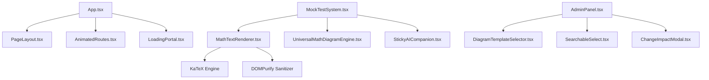

# UI Registry — OdishaExamPrep

This document is the living component registry for **OdishaExamPrep** (`https://www.odishaexamprep.in`). It catalogues every reusable UI component in the codebase.

Before creating any new component, developers and AI agents MUST consult this registry to reuse or extend existing components.

---

## How to Use

1. **Search First:** Before creating a UI component, search this registry.
2. **Reuse Before Creating:** If an existing component satisfies the requirement, use it.
3. **Extend Don't Duplicate:** If an existing component requires minor additions, add optional props to extend it.
4. **Register Immediately:** When a new reusable component is added or modified, update this registry.

---

## Component Index

| Component Name | Category | File Path | Variants | Used By | Status |
| :--- | :--- | :--- | :--- | :--- | :--- |
| **`PageLayout`** | Layout | [`src/components/PageLayout.tsx`](file:///c:/Users/Naresh%20Samal/Downloads/OdishaExamPrep%20Website/src/components/PageLayout.tsx) | Default, Full Width | All Page Views | Active |
| **`Button`** | Utility | [`src/components/Button.tsx`](file:///c:/Users/Naresh%20Samal/Downloads/OdishaExamPrep%20Website/src/components/Button.tsx) | Primary, Secondary, Glass | App.tsx, AdminPanel.tsx | Active |
| **`MathTextRenderer`** | Data Display | [`src/components/MathTextRenderer.tsx`](file:///c:/Users/Naresh%20Samal/Downloads/OdishaExamPrep%20Website/src/components/MathTextRenderer.tsx) | Inline, Block Math | MockTestSystem, BlogPost | Active |
| **`UniversalMathDiagramEngine`**| Data Display | [`src/components/UniversalMathDiagramEngine.tsx`](file:///c:/Users/Naresh%20Samal/Downloads/OdishaExamPrep%20Website/src/components/UniversalMathDiagramEngine.tsx) | Canvas, Vector SVG | MockTestSystem, AdminPanel | Active |
| **`DiagramTemplateSelector`** | Form Control | [`src/components/DiagramTemplateSelector.tsx`](file:///c:/Users/Naresh%20Samal/Downloads/OdishaExamPrep%20Website/src/components/DiagramTemplateSelector.tsx) | Modal Grid | AdminPanel.tsx | Active |
| **`StickyAICompanion`** | AI Assistant | [`src/components/StickyAICompanion.tsx`](file:///c:/Users/Naresh%20Samal/Downloads/OdishaExamPrep%20Website/src/components/StickyAICompanion.tsx) | Drawer, Floating FAB | MockTestSystem, App.tsx | Active |
| **`OnboardingTour`** | Feedback / Tour | [`src/components/OnboardingTour.tsx`](file:///c:/Users/Naresh%20Samal/Downloads/OdishaExamPrep%20Website/src/components/OnboardingTour.tsx) | Desktop Popover, Mobile Action Sheet | App.tsx | Active |
| **`PushPermissionPrompt`** | Feedback | [`src/components/PushPermissionPrompt.tsx`](file:///c:/Users/Naresh%20Samal/Downloads/OdishaExamPrep%20Website/src/components/PushPermissionPrompt.tsx) | Top Banner | App.tsx | Active |
| **`ChangeImpactModal`** | Modal | [`src/components/ChangeImpactModal.tsx`](file:///c:/Users/Naresh%20Samal/Downloads/OdishaExamPrep%20Website/src/components/ChangeImpactModal.tsx) | Warning Overlay | AdminPanel.tsx | Active |
| **`SearchableSelect`** | Form Control | [`src/components/SearchableSelect.tsx`](file:///c:/Users/Naresh%20Samal/Downloads/OdishaExamPrep%20Website/src/components/SearchableSelect.tsx) | Filterable Dropdown | AdminPanel.tsx | Active |
| **`TimePicker`** | Form Control | [`src/components/TimePicker.tsx`](file:///c:/Users/Naresh%20Samal/Downloads/OdishaExamPrep%20Website/src/components/TimePicker.tsx) | Time Input | AdminPanel.tsx | Active |
| **`YouTubeCarousel`** | Media | [`src/components/YouTubeCarousel.tsx`](file:///c:/Users/Naresh%20Samal/Downloads/OdishaExamPrep%20Website/src/components/YouTubeCarousel.tsx) | Video Carousel | App.tsx | Active |
| **`LoadingPortal`** | Feedback | [`src/components/LoadingPortal.tsx`](file:///c:/Users/Naresh%20Samal/Downloads/OdishaExamPrep%20Website/src/components/LoadingPortal.tsx) | Full Screen Spinner | App.tsx | Active |
| **`WelcomeVideoModal`** | Media / Modal | [`src/components/WelcomeVideoModal.tsx`](file:///c:/Users/Naresh%20Samal/Downloads/OdishaExamPrep%20Website/src/components/WelcomeVideoModal.tsx) | YouTube Embed Modal | App.tsx | Active |
| **`AnimatedRoutes`** | Navigation | [`src/components/AnimatedRoutes.tsx`](file:///c:/Users/Naresh%20Samal/Downloads/OdishaExamPrep%20Website/src/components/AnimatedRoutes.tsx) | Motion Fade Transition | App.tsx | Active |
| **`ProtectedRoute`** | Guard | [`src/components/ProtectedRoute.tsx`](file:///c:/Users/Naresh%20Samal/Downloads/OdishaExamPrep%20Website/src/components/ProtectedRoute.tsx) | Auth Route Guard | App.tsx | Active |
| **`VoiceWaveVisualizer`** | Feedback | [`src/components/VoiceWaveVisualizer.tsx`](file:///c:/Users/Naresh%20Samal/Downloads/OdishaExamPrep%20Website/src/components/VoiceWaveVisualizer.tsx) | Equalizer waveform animation | AiMentor.tsx, StickyAICompanion.tsx | Active |
| **`QuestionBankCard`** | Data Display | [`src/App.tsx`](file:///c:/Users/Naresh%20Samal/Downloads/OdishaExamPrep%20Website/src/App.tsx#L6885-L7080) | Grid Card, Mobile List Item | App.tsx | Active |
| **`ScheduledPracticeBankCard`** | Data Display | [`src/App.tsx`](file:///c:/Users/Naresh%20Samal/Downloads/OdishaExamPrep%20Website/src/App.tsx#L3073-L3285) | Desktop Grid, Mobile List Item | App.tsx | Active |
| **`NotificationCenter`** | Navigation / Overlay | [`src/components/NotificationCenter.tsx`](file:///c:/Users/Naresh%20Samal/Downloads/OdishaExamPrep%20Website/src/components/NotificationCenter.tsx) | Bell Trigger + Floating Popover | App.tsx (Header) | Active |
| **`GlobalSearchModal`** | Navigation / Overlay | [`src/components/GlobalSearchModal.tsx`](file:///c:/Users/Naresh%20Samal/Downloads/OdishaExamPrep%20Website/src/components/GlobalSearchModal.tsx) | Spotlight Search Portal (Full-screen portal) | App.tsx (Header) | Active |
| **`AdminSortDirectionToggle`** | Admin / Toolbar | [`src/AdminPanel.tsx`](file:///c:/Users/Naresh%20Samal/Downloads/OdishaExamPrep%20Website/src/AdminPanel.tsx) | Asc/Desc pill toggle in Content Banks sub-header | AdminPanel.tsx | Active |
| **`InlineOrderInput`** | Admin / Table Row | [`src/AdminPanel.tsx`](file:///c:/Users/Naresh%20Samal/Downloads/OdishaExamPrep%20Website/src/AdminPanel.tsx) | Editable numeric ORDER field in table rows | AdminPanel.tsx | Active |
| **`CategoryHierarchyPillBar`** | Admin / Toolbar | [`src/AdminPanel.tsx`](file:///c:/Users/Naresh%20Samal/Downloads/OdishaExamPrep%20Website/src/AdminPanel.tsx) | Hierarchy pill toolbar with auto tab switcher | AdminPanel.tsx | Active |
| **`AttemptPerformanceModal`** | Overlay / Modal | [`src/App.tsx`](file:///c:/Users/Naresh%20Samal/Downloads/OdishaExamPrep%20Website/src/App.tsx) | Glassmorphic score count-up & progress modal | App.tsx | Active |
| **`GuidedRecommendationHero`** | Navigation / Hero | [`src/App.tsx`](file:///c:/Users/Naresh%20Samal/Downloads/OdishaExamPrep%20Website/src/App.tsx) | Dynamic "What to Study Next" Recommendation Module | App.tsx (Exam Details) | Active |
| **`AIStudyPlanCard`** | Data Display / Plan | [`src/components/AIStudyPlanCard.tsx`](file:///c:/Users/Naresh%20Samal/Downloads/OdishaExamPrep%20Website/src/components/AIStudyPlanCard.tsx) | Desktop Grid, Mobile Compact Item | StudyPlanView.tsx, AnalyticsView.tsx, App.tsx | Active |
| **`OdishaLeaderboardCard`** | Gamification / Social | [`src/components/OdishaLeaderboardCard.tsx`](file:///c:/Users/Naresh%20Samal/Downloads/OdishaExamPrep%20Website/src/components/OdishaLeaderboardCard.tsx) | Pinned Hero, 3-Podium, Master List, Nearby Rivals | StudyPlanView.tsx, AnalyticsView.tsx, App.tsx | Active |


---

## Component Details

### 1. `PageLayout`
- **File Path:** [`src/components/PageLayout.tsx`](file:///c:/Users/Naresh%20Samal/Downloads/OdishaExamPrep%20Website/src/components/PageLayout.tsx)
- **Category:** Layout
- **Purpose:** Standard top-level container for all public pages, rendering the main header navigation, drawer menu, content container, and footer.
- **Props:** `children` (`ReactNode`, required), `className` (`string`, optional).
- **Styling:** `min-h-screen flex flex-col bg-[#FBF9F6]`.

```tsx
import { PageLayout } from '../components/PageLayout';

export function CustomPage() {
  return (
    <PageLayout>
      <div className="max-w-7xl mx-auto px-4 py-8">
        <h1>Page Content</h1>
      </div>
    </PageLayout>
  );
}
```

---

### 2. `MathTextRenderer`
- **File Path:** [`src/components/MathTextRenderer.tsx`](file:///c:/Users/Naresh%20Samal/Downloads/OdishaExamPrep%20Website/src/components/MathTextRenderer.tsx)
- **Category:** Data Display
- **Purpose:** Parses raw text strings containing inline (`$...$`) or block (`$$...$$`) LaTeX equations, renders them using KaTeX, and sanitizes the output with DOMPurify.
- **Props:** `text` (`string`, required), `className` (`string`, optional).
- **Dependencies:** `katex`, `dompurify`.

```tsx
import { MathTextRenderer } from '../components/MathTextRenderer';

<MathTextRenderer 
  text="Solve for x: $x^2 + 5x + 6 = 0$" 
  className="text-slate-800 text-base font-medium" 
/>
```

---

### 3. `UniversalMathDiagramEngine`
- **File Path:** [`src/components/UniversalMathDiagramEngine.tsx`](file:///c:/Users/Naresh%20Samal/Downloads/OdishaExamPrep%20Website/src/components/UniversalMathDiagramEngine.tsx)
- **Category:** Data Display
- **Purpose:** Renders dynamic vector SVG and Canvas geometric figures (triangles, circles, polygons, coordinate axes, Venn diagrams, circuits) based on structured JSON props.
- **Props:** `diagram` (`DiagramSpec`, required), `className` (`string`, optional).
- **Dependencies:** KaTeX, React Hooks.

```tsx
import { UniversalMathDiagramEngine } from '../components/UniversalMathDiagramEngine';

<UniversalMathDiagramEngine 
  diagram={{
    type: 'triangle',
    labels: { A: '(0,0)', B: '(4,0)', C: '(2,3)' },
    angles: { A: '60°', B: '60°', C: '60°' }
  }} 
/>
```

---

### 4. `StickyAICompanion`
- **File Path:** [`src/components/StickyAICompanion.tsx`](file:///c:/Users/Naresh%20Samal/Downloads/OdishaExamPrep%20Website/src/components/StickyAICompanion.tsx)
- **Category:** AI Assistant
- **Purpose:** Floating AI assistant drawer that accompanies students during mock tests and page navigation to provide live voice interaction, hints, and strategy guidance.
- **Props:** `isOpen` (`boolean`), `onClose` (`() => void`), `activeTab` (`string`), `user` (`User`), `profile` (`UserProfile`).
- **Dependencies:** `/api/chat/completions`, `useVoiceInteraction.ts`, `VoiceWaveVisualizer.tsx`, `lucide-react`.
- **Last Updated:** July 21, 2026

| Property | Class / Token |
| :--- | :--- |
| **Drawer Container** | `bg-white/95 backdrop-blur-sm border border-slate-200/80 shadow-2xl` |
| **Drawer Header** | `bg-gradient-to-r from-slate-900 via-brand-950 to-slate-900 border-b border-slate-800/90 text-white` |
| **Live Voice Button (Active)** | `bg-gradient-to-br from-emerald-500 to-teal-700 border-emerald-600 text-white shadow-emerald-500/30` |
| **Live Voice Button (Inactive)** | `bg-white hover:bg-slate-100 text-slate-700 border-slate-200/80 hover:border-emerald-300` |
| **Dictation Overlay Bar** | `bg-slate-950/95 backdrop-blur-xl border border-emerald-500/30 shadow-[0_0_20px_rgba(16,185,129,0.15)] rounded-2xl` |
| **Confirm Chip (Check ✓)** | `w-6.5 h-6.5 rounded-lg bg-emerald-500/20 hover:bg-emerald-500/90 text-emerald-300 hover:text-white border border-emerald-500/40` |
| **Cancel Chip (Close X)** | `w-6.5 h-6.5 rounded-lg bg-rose-500/20 hover:bg-rose-500/90 text-rose-300 hover:text-white border border-rose-500/40` |
| **Mute Toggle Button** | `w-7 h-7 rounded-xl border` (`bg-indigo-50 border-indigo-200 text-indigo-600` / `bg-slate-200 border-slate-300 text-slate-500`) |
| **Text — Primary** | `text-slate-800 text-sm font-normal leading-relaxed` |
| **Text — Secondary** | `text-slate-500 text-xs font-medium` |

**Pattern notes:**
- **Glassmorphic Action Chips**: Dictation confirm `[✓]` and cancel `[X]` buttons MUST use frosted glassmorphic chips (`bg-emerald-500/20`, `bg-rose-500/20`) with hover scale micro-animations instead of solid flat color blocks.
- **Flex Overflow Prevention**: Recording bars and parent flex containers MUST declare `min-w-0` across every container level, and control action buttons MUST declare `shrink-0` to guarantee on-screen visibility.
- **Single-Line Banners**: Labels inside `VoiceWaveVisualizer` MUST enforce `whitespace-nowrap shrink-0` to prevent line wrapping.
- **Auto-Scroll on Refresh/Mount**: Chat message lists in `AiMentor` and `StickyAICompanion` MUST place `<div ref={chatEndRef} />` at the bottom and use a mount `useEffect` to scroll directly to the bottom (`behavior: 'auto'`) on initial page load / refresh so users instantly see their latest messages.
- **Live Voice Control**: Clicking the green `((•))` button or the Red `X` button MUST set `setIsLiveVoiceMode(false)` synchronously to ensure auto-restart hooks cleanly halt.
- **Multi-Chat Session Manager**: OdishaExamPrep AI in `AiMentor.tsx` uses `ChatSession[]` stored in `localStorage` (`oep_ai_chat_sessions`). `+ New Chat` starts a fresh thread while `History 🕒` toggles a slide-over glassmorphic drawer (`bg-white/95 backdrop-blur-xl z-40`) featuring live search, inline title editing, and deletion.
- **Fullscreen Workspace Mode**: Fullscreen mode in `AiMentor.tsx` MUST use `fixed inset-0 z-[100] w-screen h-dvh rounded-none border-none shadow-none bg-white` container styling combined with browser HTML5 `requestFullscreen()` and an `ESC` key `fullscreenchange` event listener to ensure seamless enter/exit behavior across desktop viewports.
- **Smart Auto-Toggle Web Search**: The prompt input box in both `AiMentor.tsx` and `StickyAICompanion.tsx` contains an inline, left-aligned `Globe` button (🌐). As the user types, it automatically triggers a web search query (turns brand-blue) when keywords like "today", "current", "news", or "latest" are matched. The user can click it to manually force active/inactive states.
- **15-Domain Future-Proof Classifier (`getQuestionBankVectorTheme`)**: Question Bank cards use dynamic 0ms SVG/CSS vector banners (`h-44`) with 15 specialized domain matchers covering Healthcare/Nursing, Computer/IT, Odisha State GK, Quant/Math, Reasoning, Odia Language, English, Polity/Constitution, History, Geography, Economics/Banking, General Science, Defence/Police, Teaching/Pedagogy, and GK/PYQ. Each domain renders curated HSL gradients, geometric grid watermarks, subject vector icons (`HeartPulse`, `Laptop`, `MapPin`, `PieChart`, `Target`, `Scale`, `Compass`, `Globe`, `Receipt`, `Zap`, `ShieldCheck`, `BookOpen`), and real exam target badges (`OPSC OAS`, `OSSC CGL`, `OSSSC RI/AMIN`, `SSC CGL`, `IBPS PO`, `RRB NTPC`).
- **Multimodal Image Attachment Upload**: Uploaded image files (`.png`, `.jpg`, `.jpeg`, `.webp`) convert to base64 Data URLs (`data:image/...`). Express body parser in `server.ts` enforces `limit: '50mb'` to handle high-resolution image uploads cleanly, routing vision payloads `{ type: 'image_url', image_url: { url } }` to `meta/llama-3.2-11b-vision-instruct` with seamless text-model fallback.
- **ChatGPT-Inspired Attachment Tray**: Attached files render inside a clean horizontal flex strip (`overflow-x-auto gap-2.5 py-1 px-1`). Images display as square 64x64px rounded thumbnail tiles (`w-16 h-16 rounded-xl border border-slate-200/90 shadow-xs object-cover`) with hover-overlay `✕` close buttons. Documents display as horizontal mini-cards (`rounded-xl bg-slate-50 border border-slate-200/80 max-w-[220px]`) with a red PDF badge icon, filename, size, and close icon. Sitting inside the input container, 1, 2, 3, or more files line up side-by-side without vertical stacking or overlapping Quick/Best mode buttons.
- **ChatGPT-Style Visual Chat Message Attachment Cards**: Attached images in student chat bubbles render as visual square thumbnail cards (`w-18 h-18 sm:w-22 sm:h-22 rounded-xl border border-white/30 object-cover shadow-md hover:scale-105`) instead of raw filename strings (`[ 📎 Gemini Generated Image... ]`). Clicking any image tile opens an interactive full-screen Lightbox Zoom Modal (`fixed inset-0 z-[300] bg-slate-950/90 backdrop-blur-md`).

---

### `ChatGPTAttachmentTray`

File: `src/pages/AiMentor.tsx`
Last updated: 2026-07-25

| Property | Class |
| :--- | :--- |
| Background — Container | `bg-white/90` |
| Background — Image Tile | `bg-slate-100` |
| Background — Doc Card | `bg-slate-50` |
| Background — PDF Badge | `bg-rose-50` |
| Border — Container | `border border-slate-200/80` |
| Border — Tile / Card | `border border-slate-200/90` |
| Border radius — Container | `rounded-2xl` |
| Border radius — Tiles / Cards | `rounded-xl` |
| Text — Primary (Filename) | `text-xs font-bold text-slate-800` |
| Text — Secondary (File Size) | `text-[10px] text-slate-400 font-medium font-mono` |
| Spacing — Tray | `mb-2 px-1 py-1` |
| Spacing — Flex Row | `gap-2.5 px-1 py-1 overflow-x-auto no-scrollbar scroll-smooth` |
| Hover state — Image Zoom | `group-hover/thumb:scale-105` |
| Hover state — Dismiss Badge | `bg-slate-950/75 hover:bg-rose-600 text-white` |
| Shadow | `shadow-xs` |

**Pattern notes:**
- Attached files sit inside the input wrapper above the prompt textarea, preventing vertical stacking or button misalignment.
- Image attachments render as 64x64px square thumbnail tiles (`w-14 h-14 sm:w-16 sm:h-16 rounded-xl object-cover`).
- Document attachments render as horizontal mini-cards (`max-w-[220px]`) with a red PDF badge icon, filename, and size.

---

### `ChatGPTChatAttachmentCards`

File: `src/pages/AiMentor.tsx`
Last updated: 2026-07-25

| Property | Class |
| :--- | :--- |
| Background — Chat Image Tile | `bg-slate-900/40` |
| Background — Doc Mini-Card | `bg-white/15 backdrop-blur-xs` |
| Background — Lightbox Overlay | `bg-slate-950/90 backdrop-blur-md` |
| Background — Lightbox Modal Card | `bg-slate-900 border border-slate-700/80` |
| Border — Chat Image Tile | `border border-white/30` |
| Border — Doc Mini-Card | `border border-white/25` |
| Border radius — Chat Tile / Card | `rounded-xl` |
| Border radius — Lightbox Modal | `rounded-2xl` |
| Text — Doc Filename | `text-xs font-semibold text-white` |
| Text — Lightbox Header | `text-xs font-bold text-slate-300` |
| Spacing — Chat Tile Grid | `flex items-center gap-2 flex-wrap mb-2 pt-0.5` |
| Spacing — Tile Dimensions | `w-18 h-18 sm:w-22 sm:h-22` (72x72px to 88x88px) |
| Hover state — Tile Zoom | `group/chatimg hover:scale-105 active:scale-95 transition-all` |
| Hover state — Zoom Overlay Icon | `opacity-0 group-hover/chatimg:opacity-100 transition-opacity` |
| Shadow | `shadow-md` (tiles), `shadow-2xl` (modal) |

**Pattern notes:**
- Attached images in student chat bubbles render as visual square thumbnail cards instead of raw text filename strings (`[ 📎 Gemini Generated Image... ]`).
- Prompt text stays clean and unpolluted by raw file badges.
- Clicking any image tile opens an interactive full-screen Lightbox Zoom Modal for inspecting uploaded question screenshots.

---

### 5. `SearchableSelect`
- **File Path:** [`src/components/SearchableSelect.tsx`](file:///c:/Users/Naresh%20Samal/Downloads/OdishaExamPrep%20Website/src/components/SearchableSelect.tsx)
- **Category:** Form Control
- **Purpose:** Custom dropdown menu with built-in real-time filter search bar for long option lists.
- **Props:** `options` (`Array<{value: string, label: string}>`, required), `value` (`string`, required), `onChange` (`(val: string) => void`, required), `placeholder` (`string`, optional).

```tsx
import { SearchableSelect } from '../components/SearchableSelect';

<SearchableSelect 
  options={[{ value: 'opsc', label: 'OPSC Civil Services' }, { value: 'ossc', label: 'OSSC CGL' }]}
  value={selectedExam}
  onChange={setSelectedExam}
  placeholder="Select Exam..."
/>
```

---

### 6. `LoadingPortal`
- **File Path:** [`src/components/LoadingPortal.tsx`](file:///c:/Users/Naresh%20Samal/Downloads/OdishaExamPrep%20Website/src/components/LoadingPortal.tsx)
- **Category:** Feedback
- **Purpose:** Renders full-screen backdrop loading state with platform logo and animated pulse spinner during initial app load.

### 7. `YouTubeCarousel`
- **File Path:** [`src/components/YouTubeCarousel.tsx`](file:///c:/Users/Naresh%20Samal/Downloads/OdishaExamPrep%20Website/src/components/YouTubeCarousel.tsx)
- **Category:** Media / Carousel
- **Purpose:** Renders an infinite, auto-scrolling strategy video carousel with dynamic YouTube oEmbed title resolution, keyword category tagging, and an integrated modal video player window.
- **Props:** `videoIds` (`string[]`, optional).
- **Last Updated:** July 20, 2026

| Property | Class / Token |
| :--- | :--- |
| **Carousel Background** | `bg-[#F2EFE9]` |
| **Modal Backdrop** | `backdrop-blur-2xl bg-slate-950/85` |
| **Modal Window Header** | `bg-slate-900 border-b border-slate-800/90` |
| **Video Frame Background** | `bg-black` |
| **Border & Radius** | `border-2 border-slate-800 rounded-2xl sm:rounded-3xl` |
| **Header Text** | `text-slate-100 font-serif font-extrabold` |
| **Modal Close Button** | `w-8 h-8 sm:w-9 sm:h-9 bg-slate-800/80 hover:bg-rose-600 text-slate-400 hover:text-white rounded-xl border border-slate-700/60 transition-all duration-200 active:scale-95` |
| **Category Badges** | `Aptitude` (blue), `Strategy` (amber), `General Studies` (emerald), `Language` (purple), `Current Affairs` (rose) |

**Pattern notes:**
- Modal video lightboxes MUST use an integrated top window header bar (`bg-slate-900 border-b border-slate-800`) with the video title on the left and the close button on the top-right corner of the header.
- Never place close buttons directly over embedded `iframe` viewports, as this blocks YouTube's native player controls.
- YouTube video titles MUST be resolved dynamically via the YouTube oEmbed API (`https://noembed.com/embed?url=...`).

---

### 8. `QuizTabChips` (AI Mentor Quizzer)
- **File Path:** [`src/pages/AiMentor.tsx`](file:///c:/Users/Naresh%20Samal/Downloads/OdishaExamPrep%20Website/src/pages/AiMentor.tsx#L4851-L4880)
- **Category:** Form Control / Chips
- **Purpose:** Renders dynamic removable topic suggestion chips in the AI MCQ Quizzer workspace with symmetrical, flex-centered vector delete buttons.
- **Last Updated:** July 20, 2026

| Property | Class / Token |
| :--- | :--- |
| **Chip Container** | `inline-flex items-center gap-1.5 px-2.5 py-1 border text-[9px] font-black uppercase tracking-wider rounded-lg transition-all shrink-0 select-none` |
| **Active Chip State** | `bg-teal-500/10 border-teal-500/35 text-[#2563EB] font-bold` |
| **Inactive Chip State** | `bg-white border-slate-200 text-slate-500 hover:text-slate-700 hover:bg-slate-50` |
| **Delete Icon Button** | `w-3.5 h-3.5 rounded-full flex items-center justify-center text-slate-400 hover:text-rose-600 hover:bg-rose-100/80 transition-all ml-0.5 cursor-pointer shrink-0` |
| **Delete Vector Icon** | `<X className="w-2.5 h-2.5 stroke-[2.5]" />` |

**Pattern notes:**
- Removable tag/chip components MUST use Lucide vector icons (`<X className="w-2.5 h-2.5" />`) inside a dedicated flex-centered circular button (`w-3.5 h-3.5 rounded-full flex items-center justify-center`).
- Never use raw font text characters (`"×"` or `"x"`) for dismiss/delete buttons on chips, as font baselines cause vertical misalignment.
- Parent chip containers MUST enforce `inline-flex items-center` cross-axis alignment to keep text labels and close icons on the exact same vertical center line.

---

### 9. `AIDiagnosticsActionPlan` (Analytics Action Plan Cards)
- **File Path:** [`src/AnalyticsView.tsx`](file:///c:/Users/Naresh%20Samal/Downloads/OdishaExamPrep%20Website/src/AnalyticsView.tsx#L1649-L1680)
- **Category:** Data Display / Checklist Cards
- **Purpose:** Renders dynamic interactive checklist cards for AI diagnostic recommendations without text truncation, maintaining top alignment across multi-line tasks.
- **Last Updated:** July 20, 2026

| Property | Class / Token |
| :--- | :--- |
| **Card Container** | `p-3.5 sm:p-4 bg-slate-50/80 border border-slate-200/70 rounded-2xl flex items-start gap-3 hover:bg-white hover:border-[#2563EB]/40 transition-all duration-300` |
| **Checked State** | `bg-[#2563EB]/5 border-[#2563EB]/20` |
| **Checkbox Square** | `w-5 h-5 rounded-md border flex items-center justify-center shrink-0 mt-0.5` |
| **Active Checkbox** | `bg-emerald-500 border-emerald-400 text-white shadow-xs` |
| **Task Typography** | `text-slate-800 text-xs sm:text-sm font-semibold leading-relaxed whitespace-normal break-words` |
| **Checked Typography** | `line-through text-slate-400` |
| **Score Boost Badge** | `px-2 py-0.5 bg-emerald-50 text-emerald-700 text-[9px] font-black rounded-lg border border-emerald-200/50 uppercase` |

**Pattern notes:**
- Action plan & checklist items MUST NEVER use `truncate` or `line-clamp-1`; sentence tasks must wrap naturally using `whitespace-normal break-words`.
- Multi-line card containers MUST enforce `flex items-start` top alignment so checkboxes and score boost badges stay anchored at the top row.
- Checkbox indicators MUST use vector `<Check className="w-3.5 h-3.5 text-white stroke-[3]" />` icons instead of raw text checkmarks.

---

### 10. `OnboardingTour` (Guided Interactive Tour)
- **File Path:** [`src/components/OnboardingTour.tsx`](file:///c:/Users/Naresh%20Samal/Downloads/OdishaExamPrep%20Website/src/components/OnboardingTour.tsx)
- **Category:** Feedback / Tour
- **Purpose:** Interactive guided onboarding walkthrough with responsive desktop popover positioning and a dedicated mobile bottom action sheet drawer.
- **Last Updated:** July 21, 2026

| Property | Class / Token |
| :--- | :--- |
| **Card Background** | `bg-white` (Popover & Mobile Drawer) |
| **Backdrop Overlay** | `fill="rgba(15, 23, 42, 0.48)"` (SVG Mask, 0 backdrop blur) |
| **Border & Radius** | `border border-slate-200/90 rounded-2xl sm:rounded-3xl` (Desktop), `rounded-[2rem]` (Mobile Drawer) |
| **Spotlight Ring** | `border-2 border-brand-500 shadow-[0_0_0_2px_rgba(255,255,255,0.8),0_0_25px_rgba(37,99,235,0.7)]` |
| **Text — Primary** | `text-slate-900 font-extrabold text-base sm:text-lg` |
| **Text — Secondary**| `text-slate-600 font-medium text-xs sm:text-sm leading-relaxed` |
| **Step Badge** | `text-brand-600 bg-brand-50 border border-brand-100 text-[10px] font-black uppercase tracking-widest px-2.5 py-1 rounded-full` |
| **Mobile Drawer Container** | `fixed bottom-0 left-0 right-0 z-[1000] p-4 pb-6` with `w-10 h-1 bg-slate-200 rounded-full mx-auto` |
| **Mobile Location Badge** | `bg-brand-600 text-white font-extrabold text-[11px] uppercase tracking-wider px-4 py-1.5 rounded-full shadow-lg animate-bounce` |
| **Pointer Arrow** | `w-3.5 h-3.5 bg-white border-slate-300 rotate-45 shadow-sm z-30` |
| **Primary Action Button** | `bg-brand-600 hover:bg-brand-700 text-white font-black text-xs px-4 py-2 rounded-xl shadow-md shadow-brand-500/20` |

**Pattern notes:**
- On mobile viewports (<768px), onboarding tour components MUST render as fixed bottom drawer cards (`bottom-0 left-0 right-0`) rather than pixel-positioned floating cards.
- Tour backdrops MUST NOT use heavy `backdrop-blur` filters that obscure the target UI; backdrop overlays must remain transparent (`rgba(15, 23, 42, 0.48)`) so underlying web content stays crystal clear.
- All step card popovers MUST clamp `left` and `top` coordinates between `16px` and `viewportWidth - actualWidth - 16px` to prevent screen boundary clipping.

---

### 11. `VoiceWaveVisualizer`
- **File Path:** [`src/components/VoiceWaveVisualizer.tsx`](file:///c:/Users/Naresh%20Samal/Downloads/OdishaExamPrep%20Website/src/components/VoiceWaveVisualizer.tsx)
- **Category:** Feedback
- **Purpose:** Renders an animated equalizer frequency bar layout indicating active user recording (Speech-to-Text) or active AI speech readout (Text-to-Speech).
- **Props:** `isActive` (`boolean`), `type` (`'listening' | 'speaking'`), `bars` (`number`), `className` (`string`), `label` (`string`).

---

### 12. `SmartSearchPromptInput`
- **File Path:** [`src/pages/AiMentor.tsx`](file:///c:/Users/Naresh%20Samal/Downloads/OdishaExamPrep%20Website/src/pages/AiMentor.tsx#L4345-L4390) & [`src/components/StickyAICompanion.tsx`](file:///c:/Users/Naresh%20Samal/Downloads/OdishaExamPrep%20Website/src/components/StickyAICompanion.tsx#L2355-L2370)
- **Category:** Form Control / Interactive Input
- **Purpose:** Chat prompt input fields utilized by both AiMentor and the floating StickyAICompanion, optimized for inline web search auto-toggle and voice dictation support.
- **Props:** Input value and state toggles managed locally inside page contexts.

| Property | Class / Token |
| :--- | :--- |
| **Input Background** | `bg-white` (AiMentor) / `bg-slate-50/70` (StickyAICompanion) |
| **Input Border** | `border border-slate-200/60 focus:border-slate-300/80` (AiMentor) / `border border-slate-200/60 focus:border-brand-400/80` (StickyAICompanion) |
| **Border Radius** | `rounded-xl` (AiMentor) / `rounded-2xl` (StickyAICompanion) |
| **Text — Primary** | `text-slate-800 font-semibold` (AiMentor) / `text-slate-800 font-medium` (StickyAICompanion) |
| **Text — Secondary** | `placeholder:text-slate-500` (AiMentor) / `placeholder:text-slate-450` (StickyAICompanion) |
| **Spacing & Padding** | `pl-9 pr-10 py-2.5` (AiMentor) / `pl-7.5 pr-8 py-2 sm:py-2.5` (StickyAICompanion) |
| **Focus Highlight** | Focus glow overlay: `group-focus-within:opacity-100 blur-sm bg-gradient-to-r from-brand-500/40 to-brand-600/20` (AiMentor) / `focus:bg-white` (StickyAICompanion) |
| **Globe Button (Active)** | `absolute left-2.5 (or left-2) top-1/2 -translate-y-1/2 p-1 rounded-lg border text-brand-600 bg-brand-50 border-brand-200/50 shadow-xs hover:bg-brand-100/50 animate-pulse` |
| **Globe Button (Inactive)** | `absolute left-2.5 (or left-2) top-1/2 -translate-y-1/2 p-1 rounded-lg border text-slate-400 border-transparent hover:text-slate-650 hover:bg-slate-100` |

**Pattern notes:**
- **Symmetric Inline Icons:** Chat input fields MUST place the `Globe` search button (🌐) on the absolute left (`left-2.5` / `left-2`) and the `Mic` dictation button (🎙️) on the absolute right (`right-2.5` / `right-2`).
- **Grounded Auto-Toggle Feedback:** As the user types, the `Globe` icon MUST automatically turn brand-blue and pulse when matching current affairs query keywords (such as "today", "current", "latest", "news", "2026", "opsc", etc.). Manual clicking allows toggling and overrides auto-detection.
- **Line Height Prevention:** Parent divs MUST declare `relative flex-1` to prevent flex boundaries from squishing input elements.

---

### 13. `QuestionBankCard`
- **File Path:** [`src/App.tsx`](file:///c:/Users/Naresh%20Samal/Downloads/OdishaExamPrep%20Website/src/App.tsx#L6885-L7080)
- **Category:** Data Display / Card
- **Purpose:** Displays individual downloadable Question Banks and PDF collections with question count indicators, premium/free badges, tagline chips, and interactive view details triggers.
- **Last Updated:** July 25, 2026

| Property | Class / Token |
| :--- | :--- |
| **Background (Desktop Card)** | `bg-white shadow-sm flex flex-col` |
| **Background (Mobile Item)** | `bg-white border border-slate-100 rounded-2xl` |
| **Border & Radius (Desktop)** | `border-slate-200/50 rounded-[2rem]` |
| **Border & Radius (Mobile)** | `border border-slate-100 rounded-2xl` |
| **Hero Image Section** | `h-44 overflow-hidden relative shrink-0 border-b border-slate-100` |
| **Text — Primary Title** | `text-lg font-serif font-extrabold text-slate-900 capitalize tracking-tight leading-snug line-clamp-1` |
| **Text — Secondary Stat** | `text-xs font-bold text-slate-500` |
| **Free Badge** | `px-2 py-0.5 bg-emerald-50 text-emerald-700 text-[8px] font-black uppercase tracking-wider rounded border border-emerald-200/40` |
| **Premium Badge** | `px-2 py-0.5 bg-rose-50 text-[#2563EB] text-[8px] font-black uppercase tracking-wider rounded border border-rose-200/40` |
| **Tagline Badge** | `bg-gradient-to-r from-brand-50/70 to-indigo-50/40 px-3 py-1.5 rounded-xl border border-brand-100/30 text-brand-650 text-[10px] font-black uppercase tracking-wider` |
| **Primary Action Button** | `w-full py-3 px-6 rounded-xl font-black text-xs uppercase tracking-wider border border-brand-100 bg-brand-50/40 text-brand-600 shadow-sm` |
| **Hover State** | `hover:border-brand-300/80 hover:-translate-y-1.5 transition-all duration-500 hover:shadow-xl` |

**Pattern notes:**
- **Admin `questionCount` Priority**: Question Bank cards MUST prioritize displaying `item.questionCount` (the total number of questions configured by the admin for the downloadable bank) rather than overwriting it with interactive DB practice test counts.
- **Defensive Tagline Parsing**: Tagline values stored in `questionBanks` table can be either plain strings (`"Concept-Focused Practice"`) or JSON-encoded strings (`{"text": "...", "price": 499}`). Parsers in `App.tsx` and `AdminPanel.tsx` MUST check `trim().startsWith('{')` before parsing JSON to prevent wiping plain text taglines.

---

## Component Dependency Graph



---

## Duplicate Prevention Rules

1. NEVER create another equation renderer; always use `MathTextRenderer.tsx`.
2. NEVER create static image diagrams when `UniversalMathDiagramEngine.tsx` vectors can be used.
3. NEVER write custom dropdown search logic; always reuse `SearchableSelect.tsx`.
4. NEVER build custom full-screen loading spinners; use `LoadingPortal.tsx`.
5. NEVER duplicate top navigation header structures; wrap pages in `PageLayout.tsx`.
6. NEVER create alternative payment unlock overlays outside Razorpay modal handlers in `App.tsx`.
7. NEVER hardcode Bank Category labels in JSX — always derive from `categoryOptions[tMode]` so labels stay in sync with the selected Display Target.

---

### 14. `ContentBankModal` (Add / Edit Content Bank Form)

File: [`src/AdminPanel.tsx`](file:///c:/Users/Naresh%20Samal/Downloads/OdishaExamPrep%20Website/src/AdminPanel.tsx)
Last updated: 2026-07-25

| Property | Class |
| --- | --- |
| Background — Modal Overlay | `fixed inset-0 bg-slate-950/60 backdrop-blur-sm z-50 flex items-center justify-center` |
| Background — Modal Card | `bg-white rounded-[2rem] shadow-2xl` |
| Background — Bottom Section | `bg-slate-50/40 p-6 rounded-3xl border border-slate-200/60 shadow-sm` |
| Background — PDF Link Row | `bg-slate-50/30 p-5 rounded-2xl border border-slate-200/60 shadow-sm` |
| Border — Modal Card | `border border-slate-200/60` |
| Border radius — Modal | `rounded-[2rem]` |
| Border radius — Bottom Panel | `rounded-3xl` |
| Border radius — PDF Row | `rounded-2xl` |
| Text — Section Label | `text-sm font-black text-slate-800 uppercase tracking-wider` |
| Text — Field Label | `text-xs font-black text-slate-600 uppercase tracking-wider` (via `labelClass`) |
| Text — Helper Caption | `text-xs text-slate-400 font-semibold` |
| Text — Tiny Caption | `text-[10px] font-bold text-slate-400 italic` |
| Spacing — Form Grid | `grid grid-cols-1 md:grid-cols-2 gap-6` |
| Spacing — Bottom Section Gap | `flex flex-col gap-5` |
| Input — Background | `bg-slate-50/50 border border-slate-200/80 rounded-xl` (via `inputClass`) |
| Input — Focus | `focus:outline-none focus:ring-2 focus:ring-brand-500/20 focus:border-brand-400` |
| Select Wrapper | `relative` with `ChevronDown` icon absolutely positioned `right-3.5 top-1/2 -translate-y-1/2 pointer-events-none` |
| Hover state — Divider Row | `pt-4 border-t border-slate-200/60` |
| Toggle — Off | `bg-slate-200` |
| Toggle — On | `peer-checked:bg-brand-500` |
| Shadow | `shadow-sm` on bottom section panel |
| Accent — Banner (Bank Only) | `bg-amber-50 border-amber-200 text-amber-700 rounded-2xl` |
| Accent — Banner (Practice Only) | `bg-brand-50 border-brand-200 text-brand-700 rounded-2xl` |

**Pattern notes:**
- The modal `case 'banks'` block MUST open with a `const tMode` declaration block before the `return ()` so all conditional vars (`showPdf`, `showTagline`, `showPracticeToggle`, `activeCategoryOptions`) are derived from `formData.target_mode` — this keeps the entire form reactive in one place.
- Bank Category labels MUST come from the `categoryOptions[tMode]` lookup table and NEVER be hardcoded in the JSX `<option>` tags, so switching Display Target instantly remaps the labels without requiring a separate state update.
- The PDF Download Links section, Tagline field, and Image URL field MUST all be conditionally hidden when `tMode === 'practice'` — practice-only banks only need Exam, Title, Category, and Questions Count.
- The "Enable Practice Now" toggle MUST only appear when `tMode === 'both'` — it is redundant for bank-only (always OFF) and practice-only (always ON), and auto-managed by selecting the Display Target card.
- Info banners at the top MUST use amber (`bg-amber-50`) for bank-only and brand-blue (`bg-brand-50`) for practice-only to give immediate visual distinction before the user reads any text.

---

### 15. `DisplayTargetSelector` (3-Card Target Picker)

File: [`src/AdminPanel.tsx`](file:///c:/Users/Naresh%20Samal/Downloads/OdishaExamPrep%20Website/src/AdminPanel.tsx)
Last updated: 2026-07-25

| Property | Class |
| --- | --- |
| Background — Card (inactive) | `bg-white` |
| Background — Card (active) | `bg-brand-50` |
| Border — Card (inactive) | `border-2 border-slate-200` |
| Border — Card (active) | `border-2 border-brand-500` |
| Border radius — Card | `rounded-2xl` |
| Text — Card Label (inactive) | `text-xs font-black tracking-tight text-slate-700` |
| Text — Card Label (active) | `text-xs font-black tracking-tight text-brand-700` |
| Text — Card Sub | `text-[10px] font-semibold text-slate-400 leading-tight` |
| Spacing — Card Grid | `grid grid-cols-3 gap-3` |
| Spacing — Card Padding | `p-4` |
| Hover state | `hover:border-brand-300` |
| Shadow — active | `shadow-md shadow-brand-500/10` |
| Icon | `text-xl` emoji, rendered as first item in flex-column |

**Pattern notes:**
- This 3-card picker pattern MUST always use a `grid grid-cols-3 gap-3` layout — never tabs or a single dropdown — so all three options are visually simultaneously visible and comparable.
- Clicking a card MUST also auto-set dependent state (e.g., `hasPracticeMode`) in the same `setFormData` call — never in a separate `useEffect`.
- Active card highlight uses `border-brand-500 bg-brand-50 shadow-md shadow-brand-500/10` (3 properties together) — never just border or background alone.
- Cards use `type="button"` attribute to prevent accidental form submission when clicked inside a `<form>` element.

---

### 16. `BankSubTabSwitcher` (Content Bank vs Practice Mode Switcher)

File: [`src/AdminPanel.tsx`](file:///c:/Users/Naresh%20Samal/Downloads/OdishaExamPrep%20Website/src/AdminPanel.tsx)
Last updated: 2026-07-25

| Property | Class |
| --- | --- |
| Container | `flex flex-col sm:flex-row items-start sm:items-center justify-between gap-4 p-2 bg-slate-100/90 rounded-2xl border border-slate-200/80 mb-6` |
| Active Tab (Question Banks) | `bg-amber-500 text-white shadow-md shadow-amber-500/20` |
| Active Tab (Practice Mode Sets) | `bg-brand-600 text-white shadow-md shadow-brand-500/20` |
| Active Tab (All Items) | `bg-slate-900 text-white shadow-md shadow-slate-900/20` |
| Inactive Tab | `text-slate-600 hover:text-slate-900 hover:bg-white/50` |
| Badge (Active) | `bg-white/20 text-white` |
| Badge (Inactive) | `bg-slate-200 text-slate-700` |

**Pattern notes:**
- Main Admin Content Banks section MUST separate Question Banks (`target_mode !== 'practice'`) and Practice Sets (`target_mode !== 'bank'`) into dedicated sub-tabs so admins never see Practice Mode quizes mixed into Question Banks.
- Switching sub-tabs MUST automatically adjust `formData.target_mode` when clicking "+ Add New" button.

---

### 17. `ScheduledPracticeBankCard` & `ScheduledMockTestCard` (Scheduled & Dynamic Status Practice Cards)

File: [`src/App.tsx`](file:///c:/Users/Naresh%20Samal/Downloads/OdishaExamPrep%20Website/src/App.tsx#L3098-L3312)
Last updated: 2026-07-26

| Property | Class |
| --- | --- |
| Container (Grid Layout) | `h-full flex flex-col justify-between` |
| Background — Card (Upcoming) | `bg-amber-50/10 border-amber-200 cursor-not-allowed` |
| Icon Container (Upcoming) | `bg-gradient-to-br from-amber-400 to-orange-500 shadow-md text-white` |
| Icon Container (Completed) | `bg-gradient-to-br from-emerald-500 to-teal-600 shadow-md text-white` |
| Icon Container (In-Progress) | `bg-gradient-to-br from-amber-400 to-orange-500 shadow-md text-white animate-pulse` |
| Badge — UPCOMING | `bg-amber-100 text-amber-800 border border-amber-200 text-[10px] font-black uppercase tracking-widest` |
| Badge — COMPLETED | `bg-emerald-100 text-emerald-800 border border-emerald-200 text-[10px] font-black uppercase tracking-widest flex items-center gap-1` |
| Badge — IN PROGRESS | `bg-amber-100 text-amber-800 border border-amber-200 text-[10px] font-black uppercase tracking-widest flex items-center gap-1 animate-pulse` |
| Action Button — Completed | `bg-gradient-to-r from-emerald-600 to-teal-600 text-white shadow-emerald-500/20 hover:shadow-emerald-500/40` (`Retake Practice` + `<RotateCw />`) |
| Action Button — In-Progress | `bg-gradient-to-r from-amber-500 to-orange-600 text-white shadow-amber-500/20 hover:shadow-amber-500/40` (`Continue Practice (X%)` + `<Play />`) |
| Action Button — Unattempted | `premium-gradient text-white shadow-brand-500/10 hover:shadow-brand-500/30` (`Start Practice` + `<ChevronRight />`) |
| Unlock Action Button (Upcoming) | `w-full h-[48px] rounded-xl flex items-center justify-center gap-2 font-black text-xs sm:text-sm bg-amber-500/15 border-2 border-amber-400 text-amber-950 shadow-sm cursor-not-allowed mt-auto pointer-events-none` |

**Pattern notes:**
- Scheduled release cards MUST use `h-full flex flex-col justify-between` wrapper to guarantee equal card heights and baseline button alignment across grid rows.
- Action buttons MUST dynamically change label, icon, and color theme based on user progress (`Retake Practice` for completed, `Continue Practice` for in-progress, `Start Practice` for unattempted) rather than generically showing `Start Practice` everywhere.
- Card badges MUST reflect student attempt status at a glance: `COMPLETED` (emerald check), `IN PROGRESS (X%)` (pulsing amber), or `Practice Set` (slate border).
- Mobile list items MUST mirror the exact same badge labels (`COMPLETED`, `IN PROGRESS`) and right indicator icons (`RotateCw`, `Play`, `ChevronRight`).

---

### `NotificationCenter`

File: [`src/components/NotificationCenter.tsx`](file:///c:/Users/Naresh%20Samal/Downloads/OdishaExamPrep%20Website/src/components/NotificationCenter.tsx)
Last updated: 2026-07-25

| Property | Class |
| --- | --- |
| Background — Popover | `bg-white/95 backdrop-blur-3xl` |
| Border — Popover | `border border-white/60` |
| Border radius — Popover | `rounded-3xl` |
| Shadow — Popover | `shadow-[0_20px_50px_rgba(12,35,64,0.15)] premium-shadow` |
| Header — Background | `bg-white/70 backdrop-blur-xs` |
| Header — Border | `border-b border-slate-100` |
| Header — Spacing | `p-4` |
| Header — Title text | `font-extrabold text-sm text-slate-900` |
| Header — Action text | `text-[11px] font-extrabold` (brand-600 for Mark read, slate-500 for Clear) |
| List row — Spacing | `p-3.5` |
| List row — Gap | `gap-3.5` |
| List row — Border | `border-l-2 border-b border-b-slate-100/40` |
| Row state — Unread | `bg-brand-500/[0.02] hover:bg-brand-500/[0.05] border-l-brand-500` |
| Row state — Read | `bg-transparent hover:bg-white/40 border-l-transparent hover:border-l-brand-500/40` |
| Row state — LIVE | `bg-amber-50/60 hover:bg-amber-50 border-l-amber-500` |
| Row state — SOON | `bg-slate-50/50 border-l-slate-200 opacity-80 cursor-default` |
| Icon container | `w-9 h-9 rounded-xl text-white mt-0.5` |
| Icon — new_exam | `bg-gradient-to-br from-indigo-500 to-purple-500 shadow-md shadow-indigo-500/15` |
| Icon — new_test | `bg-gradient-to-br from-blue-500 to-cyan-500 shadow-md shadow-blue-500/15` |
| Icon — new_bank | `bg-gradient-to-br from-emerald-500 to-teal-500 shadow-md shadow-emerald-500/15` |
| Icon — scheduled_live | `bg-gradient-to-br from-amber-500 to-orange-500 shadow-md shadow-amber-500/25 animate-pulse` |
| Icon — scheduled_upcoming | `bg-gradient-to-br from-slate-400 to-slate-500 shadow-sm` |
| Title text — default | `font-extrabold text-xs text-slate-900 group-hover:text-brand-600` |
| Title text — LIVE | `font-extrabold text-xs text-amber-900 group-hover:text-amber-700` |
| Body text — default | `text-[11px] font-semibold text-slate-500 group-hover:text-slate-600` |
| Body text — LIVE | `text-[11px] font-semibold text-amber-700 group-hover:text-amber-800` |
| Badge — Unread dot | `w-2 h-2 rounded-full bg-brand-500 animate-pulse` |
| Badge — LIVE pill | `px-1.5 py-0.5 bg-rose-500 text-white text-[9px] font-black rounded uppercase tracking-wide animate-pulse` |
| Badge — SOON pill | `px-1.5 py-0.5 bg-slate-200 text-slate-600 text-[9px] font-black rounded uppercase tracking-wide` |
| Unread count badge (bell) | `w-4 h-4 bg-rose-500 text-white font-black text-[9px] rounded-full border-2 border-white animate-pulse` |
| Unread count badge (header) | `px-2 py-0.5 text-[10px] font-black text-rose-700 bg-rose-100 rounded-full border border-rose-200 animate-pulse` |
| Bell trigger | `p-2 rounded-xl text-slate-600 hover:text-brand-600 hover:bg-slate-100/80 transition-all duration-200` |
| Scroll container | `max-h-[380px] overflow-y-auto divide-y divide-slate-100/60 premium-scrollbar` |
| Empty state icon | `w-8 h-8 text-brand-500/60 mx-auto animate-bounce` |
| Empty state title | `text-xs font-black text-slate-800` |
| Empty state body | `text-[10px] font-semibold text-slate-400` |

**Pattern notes:**
- The popover uses `rounded-3xl` (not `rounded-2xl`) to feel deliberately distinct from the card modals (`rounded-[2rem]`).
- Notification row icons are always `rounded-xl w-9 h-9` with a `bg-gradient-to-br` two-color gradient. Each notification type gets its own gradient pair — do not mix them.
- LIVE scheduled tests are **always sorted before all other notifications** in the list, regardless of their timestamp. This is enforced in the `useMemo` builder by splitting `liveItems` and `otherItems`.
- UPCOMING (not-yet-live scheduled) notifications are **non-clickable** (`actionType: 'none'`, `cursor-default`). No chevron is rendered for them.
- Empty question banks (0 questions AND 0 pdfLinks) must be filtered out before being added to the notification list. The filter is: `hasQuestions || hasPdfs` must be `true`.
- The bell badge uses `border-2 border-white` to create a cutout effect over the header background.
- Animation entry uses framer-motion `spring` with `damping: 25, stiffness: 300` — do not change to `ease` or `tween` for this component.

---

### `GlobalSearchModal`

File: [`src/components/GlobalSearchModal.tsx`](file:///c:/Users/Naresh%20Samal/Downloads/OdishaExamPrep%20Website/src/components/GlobalSearchModal.tsx)
Last updated: 2026-07-25

| Property | Class |
| --- | --- |
| Background — Modal window | `bg-white/80 backdrop-blur-2xl` |
| Border — Modal | `border border-white/60` |
| Border radius — Modal | `rounded-[2rem]` |
| Shadow — Modal | `shadow-[0_25px_60px_-15px_rgba(12,35,64,0.18)] premium-shadow` |
| Backdrop | `bg-slate-900/60 backdrop-blur-md` |
| Search input bar — Background | `bg-white/40` (focuses to `bg-white/70`) |
| Search input bar — Border | `border-b border-slate-100` |
| Search input bar — Focus ring | `focus-within:ring-2 focus-within:ring-brand-500/8 focus-within:border-brand-500/20` |
| Input text | `text-slate-900 font-extrabold text-base sm:text-lg` |
| Input placeholder | `placeholder:text-slate-400` |
| Section heading | `text-[11px] font-black uppercase tracking-wider text-slate-400` |
| Result card — Default | `p-3.5 bg-white/40 hover:bg-white border border-slate-200/50 rounded-2xl` |
| Result card — Exam hover | `hover:border-brand-300 hover:shadow-lg hover:shadow-brand-500/5` |
| Result card — Test hover | `hover:border-indigo-300 hover:shadow-lg hover:shadow-indigo-500/5` |
| Result card — Bank hover | `hover:border-emerald-300 hover:shadow-lg hover:shadow-emerald-500/5` |
| Result card title | `font-extrabold text-xs sm:text-sm text-slate-900` |
| Result card title hover — Exam | `group-hover:text-brand-700` |
| Result card title hover — Test | `group-hover:text-indigo-700` |
| Result card title hover — Bank | `group-hover:text-emerald-700` |
| Result card body | `text-[10px] text-slate-500` |
| Type badge — Mock Test | `bg-indigo-50 text-indigo-700 border border-indigo-100 text-[9px] font-black uppercase` |
| Type badge — Scheduled | `bg-amber-100 text-amber-800 border border-amber-200 text-[9px] font-black uppercase` |
| Type badge — Practice | `bg-emerald-100 text-emerald-800 font-extrabold text-[10px] rounded-lg` |
| CTA button — Start Test | `bg-indigo-600 text-white hover:bg-indigo-700 rounded-xl font-extrabold text-xs` |
| CTA button — Locked | `bg-amber-50 text-amber-800 border border-amber-200/50 rounded-xl` |
| View All button | `py-2 bg-white/40 hover:bg-white border border-slate-200/50 rounded-2xl font-extrabold text-[11px]` |
| Footer bar | `p-3 bg-slate-50 border-t border-slate-100 text-[11px] font-bold text-slate-400` |
| Kbd shortcut chip | `px-1.5 py-0.5 bg-white border border-slate-200 rounded text-[10px]` |
| Scroll container | `flex-1 overflow-y-auto p-4 sm:p-6 space-y-6 premium-scrollbar` |
| Empty state container | `w-12 h-12 rounded-2xl bg-slate-100 text-slate-400` |
| Empty state title | `font-extrabold text-slate-800 text-base` |
| Empty state body | `text-xs text-slate-500` |

**Pattern notes:**
- The modal renders via `createPortal(…, document.body)` so it sits outside the React component tree and always renders above everything. Do not remove the portal.
- The window uses `rounded-[2rem]` (same as card modals in App.tsx) — **not** `rounded-3xl` like the NotificationCenter popover.
- Each content section (Exams, Mock Tests, Practice Sets) uses its own accent color for hover states: `brand-*` for exams, `indigo-*` for tests, `emerald-*` for banks. This must remain consistent — do not mix accent colors across sections.
- The search input has **no visible border** on its container; focus is communicated only via `focus-within:ring-2` and a subtle background shift (`bg-white/40 → bg-white/70`).
- Upcoming/scheduled tests inside the search results are non-clickable (`cursor-not-allowed opacity-85`) with amber theming, matching the same system as `ScheduledMockTestCard`.
- Animation: `spring` with `damping: 25, stiffness: 300`, modal enters from `scale: 0.95, y: -20` (drops down from top, not slides up).

---

### 18. `AdminSortDirectionToggle` (Asc / Desc Pill Group)

File: [`src/AdminPanel.tsx`](file:///c:/Users/Naresh%20Samal/Downloads/OdishaExamPrep%20Website/src/AdminPanel.tsx)
Last updated: 2026-07-25

| Property | Class |
| --- | --- |
| Background | `bg-white/80 p-1 rounded-xl border border-slate-200/80 shadow-2xs` |
| Border | `border border-slate-200/80` |
| Border radius | `rounded-xl` (container) / `rounded-lg` (each button) |
| Button — inactive | `px-3 py-1 rounded-lg text-xs font-black text-slate-600 hover:text-slate-900` |
| Button — active | `px-3 py-1 rounded-lg text-xs font-black bg-brand-600 text-white shadow-xs` |
| Spacing | `gap-1` between buttons, `p-1` container padding |
| Shadow | `shadow-2xs` on container, `shadow-xs` on active button |
| Accent usage | `bg-brand-600` for active state — always brand, never amber or indigo |

**Pattern notes:**
- This toggle group MUST always use `bg-brand-600 text-white shadow-xs` for the active segment and `text-slate-600 hover:text-slate-900` (no background) for the inactive one.
- The container pill uses `bg-white/80` (slightly translucent) against the `bg-slate-100/90` sub-header backdrop — do not use `bg-white` which would look too heavy.
- This component controls `bankSortDirection` state (`'asc' | 'desc'`) — any new admin section adding a sort toggle MUST follow this same pill group pattern and state shape.
- Border radius: outer container is `rounded-xl`, each button inside is `rounded-lg` — the tighter inner radius prevents visual overcrowding.

---

### 19. `InlineOrderInput` (Numeric Sort Order Field in Table Rows)

File: [`src/AdminPanel.tsx`](file:///c:/Users/Naresh%20Samal/Downloads/OdishaExamPrep%20Website/src/AdminPanel.tsx)
Last updated: 2026-07-25

| Property | Class |
| --- | --- |
| Background | `bg-slate-50/50` |
| Border | `border border-slate-200` |
| Border radius | `rounded-lg` |
| Text | `text-center font-black` (always centered, always black weight) |
| Size | `w-16 px-2 py-1` |
| Focus state | `focus:border-brand-500 focus:ring-2 focus:ring-brand-500/10 outline-none` |
| Shadow | `shadow-sm` |
| Transition | `transition-all` |

**Pattern notes:**
- The input auto-saves to Supabase **on `Blur` and on `Enter` keydown** — never on every keystroke. The `onChange` handler updates local `items` state immediately for visual responsiveness, but the actual save (`handleBankInlineOrderChange` / `handleInlineOrderChange`) fires only on Blur or Enter.
- The save function MUST check `newVal !== originalSortOrder` before calling Supabase to avoid unnecessary DB writes on focus-without-change.
- Table column layout when ORDER is present: `col-span-1` checkbox · `col-span-1` order input · `col-span-5` basic info · `col-span-2` details · `col-span-3` actions = **12 total**.
- Table column layout when ORDER is absent (other tabs): `col-span-1` checkbox · `col-span-5` basic info · `col-span-3` details · `col-span-3` actions = **12 total**.
- The `sortOrder` column in Supabase defaults to `null` — items without a sortOrder sort to position 9999 (end of list) on client. Do not use 0 as a default — 0 would wrongly push null-order items to the top.

---

### 20. `CategoryHierarchyPillBar` (Content Banks Hierarchy Pill Bar)

File: [`src/AdminPanel.tsx`](file:///c:/Users/Naresh%20Samal/Downloads/OdishaExamPrep%20Website/src/AdminPanel.tsx)
Last updated: 2026-07-26

| Property | Class |
| --- | --- |
| Container | `flex flex-wrap items-center gap-2 p-2 bg-white/80 rounded-2xl border border-slate-200/80 shadow-2xs` |
| Category pill — active | `flex items-center gap-2 px-3.5 py-2 rounded-xl text-xs font-black bg-slate-900 text-white shadow-md shadow-slate-900/10` |
| Category pill — inactive | `flex items-center gap-2 px-3.5 py-2 rounded-xl text-xs font-black bg-slate-100/80 text-slate-600 hover:text-slate-900 hover:bg-slate-200/60` |
| Badge — active pill | `px-2 py-0.5 rounded-md text-[10px] font-black bg-white/20 text-white` |
| Badge — inactive pill | `px-2 py-0.5 rounded-md text-[10px] font-black bg-slate-200/80 text-slate-700` |
| Hierarchy Label | `text-xs font-black uppercase tracking-wider text-slate-400 px-3 py-1` |

**Pattern notes:**
- **Pill Count Calculation**: Pill counts must **never be filtered by `bankSubTab`** (`banks`, `practice`). They calculate true total count per category across all modes (`matchExam && matchCat`), guaranteeing counts like High-Yield (6) remain visible even when viewing Question Banks (Step 1).
- **Auto-Switching Sub-Tab**: Clicking a category pill automatically sets both `bankFilter` state AND `bankSubTab` state via `autoTab`:
  - `🌟 All Categories` → `autoTab: 'all'`
  - `📘 Chapter-Wise Practice` → `autoTab: 'banks'`
  - `🎯 High-Yield Topic` → `autoTab: 'practice'`
  - `⚡ Daily Speed Quiz` → `autoTab: 'practice'`
  - `📜 Topic-Wise PYQ` → `autoTab: 'practice'`
- This prevents admins from seeing a 0-item empty view when selecting a category that only has practice-mode items while sitting on the Question Banks sub-tab.

---

### 21. `AttemptPerformanceModal` (Attempt Performance & Progress Detail Overlay)

File: [`src/App.tsx`](file:///c:/Users/Naresh%20Samal/Downloads/OdishaExamPrep%20Website/src/App.tsx)
Last updated: 2026-07-27

| Property | Class |
| :--- | :--- |
| Container — Backdrop | `fixed inset-0 z-[9999] flex items-center justify-center p-4 bg-slate-950/60 backdrop-blur-sm` |
| Container — Card | `bg-white rounded-3xl border border-slate-200/80 shadow-2xl max-w-md w-full p-6 space-y-5 relative overflow-hidden text-left` |
| Score Stat Tile | `p-4 bg-gradient-to-br from-emerald-50/90 to-emerald-100/40 rounded-2xl border border-emerald-200/60 text-center shadow-xs` |
| Accuracy Stat Tile | `p-4 bg-gradient-to-br from-teal-50/90 to-teal-100/40 rounded-2xl border border-teal-200/60 text-center shadow-xs` |
| Progress Bar Container | `w-full bg-slate-200/70 rounded-full h-2.5 overflow-hidden p-0.5 relative` |
| Progress Bar Fill | `bg-gradient-to-r from-amber-400 via-amber-500 to-orange-500 h-1.5 rounded-full relative overflow-hidden shadow-xs` |
| Text — Score Counter | `text-2xl sm:text-3xl font-black text-emerald-950 font-mono tracking-tight` |
| Text — Accuracy Counter | `text-2xl sm:text-3xl font-black text-teal-950 font-mono tracking-tight` |
| Motion Entrance | `initial={{ opacity: 0, scale: 0.9, y: 20 }} animate={{ opacity: 1, scale: 1, y: 0 }} transition={{ type: "spring", damping: 25, stiffness: 350 }}` |

**Pattern notes:**
- **React Portal Isolation**: Modal MUST use `createPortal(..., document.body)` so it mounts directly to `document.body` outside parent component DOM trees, preventing card scale/opacity blinks.
- **Dynamic Count-Up Counters**: Uses `useEffect` with `requestAnimationFrame` and cubic-easing (`1 - Math.pow(1 - progress, 3)`) over 600ms to animate score (`0` ➔ `score`) and accuracy (`0%` ➔ `accuracy%`).
- **Synchronized 1-Indexed Progress Formula**: In-progress tests compute progress percentage as `Math.min(100, Math.round(((currentQuestionIndex + 1) / totalQs) * 100))`, matching the card badge and button (`1%` on Question 1 of 200).
- **Side-by-Side Action Bar Integration**: Triggered from 48px side-by-side action buttons (`[ 📊 Score ]` + `[ 🔄 Retake ]` / `[ 📊 Progress ]` + `[ ⏯ Resume ]`) on cards, maintaining zero height drift across grid rows.

---

### 22. `GuidedRecommendationHero` (Guided Learning Path "What to Study Next" Recommendation Banner)

File: [`src/App.tsx`](file:///c:/Users/Naresh%20Samal/Downloads/OdishaExamPrep%20Website/src/App.tsx)
Last updated: 2026-08-07

| Property | Class |
| :--- | :--- |
| Container | `relative overflow-hidden rounded-2xl sm:rounded-[2.2rem] bg-gradient-to-br from-brand-950 via-slate-900 to-indigo-950 text-white p-4 sm:p-8 md:p-10 shadow-2xl shadow-brand-950/20 border border-brand-500/20 card-3d-deep group mb-6 sm:mb-10` |
| Background Glows | `absolute -right-16 -top-16 w-64 h-64 bg-brand-500/20 rounded-full blur-3xl group-hover:bg-brand-500/30 transition-all duration-700 pointer-events-none` |
| Header Badge | `badge-recommended flex items-center gap-1.5 shadow-sm text-[9px] sm:text-xs py-0.5 sm:py-1 px-2.5 sm:px-3` |
| Category Pill | `px-2.5 py-0.5 sm:px-3 sm:py-1 bg-white/10 text-white/80 text-[8.5px] sm:text-[10px] font-black uppercase tracking-widest rounded-full border border-white/10 backdrop-blur-md` |
| Text — Primary Title | `text-base sm:text-2xl md:text-3xl font-black tracking-tight text-white leading-snug` |
| Text — Description | `text-slate-300 font-medium text-xs sm:text-sm md:text-base leading-relaxed mt-1 sm:mt-2` |
| Text — Stat Chips (Desktop) | `text-xs font-bold text-slate-300 flex items-center gap-1.5` |
| Text — Stat Chips (Mobile) | `text-[11px] font-bold text-slate-300 bg-emerald-950/40 border border-emerald-500/20 px-2.5 py-1 rounded-lg` |
| Action Button | `h-11 sm:h-16 px-5 sm:px-8 rounded-xl sm:rounded-2xl bg-gradient-to-r from-brand-500 via-indigo-600 to-brand-600 hover:from-brand-400 hover:to-indigo-500 text-white font-black text-xs sm:text-base shadow-lg shadow-brand-500/25 hover:shadow-brand-500/50 hover:scale-[1.02] active:scale-95 transition-all flex items-center justify-center gap-2 sm:gap-3 group/btn relative overflow-hidden cursor-pointer w-full sm:w-auto` |

**Pattern notes:**
- **4-Tier Incomplete Activity Matching**: Searches `activities` for `test_incomplete` using a 4-tier fallback (`examId` match ➔ `bankId` match ➔ `title` match ➔ `selectedExam` active fallback), ensuring in-progress sessions are consistently surfaced.
- **Dynamic 3-Tier Metric Engine**:
  1. *Active Session*: Displays real-time session accuracy e.g. `🎯 75% Session Accuracy (3/4 Solved)`.
  2. *Returning Student*: Displays personal average accuracy vs goal e.g. `🎯 Your Avg: 78% | Goal: 85%+`.
  3. *New Student*: Displays qualifying benchmark e.g. `🎯 85% Pass Benchmark`.
- **Exact Unrounded Duration Display**: Computes remaining time as exact minutes and seconds (`remMins = Math.floor(leftSeconds / 60)`, `remSecs = leftSeconds % 60`) e.g. `17m 49s Left`.
- **Mobile Responsive Text Sizing & Glass Pills**: Uses `sm:hidden` concise descriptions (`3 of 20 questions completed. Tap to continue session.`) and semi-transparent pill badges (`[ 🎯 0% Accuracy ]` `[ ⏱️ 17m 49s Left ]`) to eliminate text repetition and visual line wrapping bloat on mobile screens.
- **Direct Resumed Test Launch**: Invokes `handleStartDirectPractice(targetTest, incompleteActivity)` with full `resumeState`, directly restoring saved questions, answered state, and timer.

---

### 23. `StreakDetailModal` (Daily Study Streak & Gamification Retention Drawer)

File: [`src/components/StreakDetailModal.tsx`](file:///c:/Users/Naresh%20Samal/Downloads/OdishaExamPrep%20Website/src/components/StreakDetailModal.tsx)
Last updated: 2026-08-07

| Property | Class |
| :--- | :--- |
| Container | `relative w-full sm:max-w-lg bg-slate-900 border border-slate-800 text-white rounded-t-[2rem] sm:rounded-3xl p-4.5 sm:p-7 shadow-2xl overflow-hidden z-10 space-y-3.5 sm:space-y-5 max-h-[88vh] sm:max-h-none overflow-y-auto no-scrollbar` |
| Mobile Drag Handle | `w-12 h-1 rounded-full bg-slate-700/80 mx-auto sm:hidden -mt-1 mb-1 shrink-0` |
| Top Icon Pill | `p-1.5 sm:p-2 rounded-xl bg-amber-500/10 border border-amber-500/20 text-amber-400` |
| Main Hero Box | `p-3.5 sm:p-5 rounded-2xl bg-gradient-to-br from-slate-850 via-slate-900 to-amber-950/40 border border-amber-500/25` |
| Hero Flame Box | `w-12 h-12 sm:w-20 sm:h-20 rounded-2xl bg-amber-500/10 border border-amber-500/30` |
| Progress Bar Box | `p-3 sm:p-4 rounded-2xl bg-slate-800/80 border border-slate-700/60 space-y-2` |
| Progress Fill | `h-full rounded-full bg-gradient-to-r from-amber-500 via-orange-500 to-amber-400` |
| Week Day Card (Active Today) | `py-1.5 sm:p-2 rounded-xl bg-amber-500/15 border-amber-500/40 text-amber-300 shadow-sm` |
| Week Day Card (Completed) | `py-1.5 sm:p-2 rounded-xl bg-emerald-500/10 border-emerald-500/30 text-emerald-300` |
| Action Button | `w-full h-11 sm:h-12 rounded-xl bg-gradient-to-r from-amber-500 via-orange-500 to-amber-600 text-slate-950 font-black text-xs sm:text-sm shadow-lg shadow-amber-500/20` |

**Pattern notes:**
- **React Portal Mounting**: Uses `createPortal(..., document.body)` so modal mounts directly to document root, preventing z-index blinks or scale clipping from parent containers.
- **Mobile Bottom Sheet Optimization**: Features a top drag handle pill (`w-12 h-1 bg-slate-700`), compact `p-4.5` padding, `max-h-[88vh]` vertical scrolling, `py-1.5` 7-column calendar pills, and `h-11` touch action buttons specifically tuned for mobile viewports.
- **Week-at-a-Glance Grid**: Displays Mon–Sun activity status with real-time green checkmarks and active date highlights.
- **Expandable Milestone Badges Drawer**: Tapping the Milestones tile toggles an animated sub-grid displaying unlock status for Bronze Scholar (7d), Silver Warrior (30d), Gold Master (90d), and Legendary Rank (365d) badges.

---

### 24. `DailyStreakGoalBar` (Zero-Clutter Home Dashboard Progress Widget)

File: [`src/App.tsx`](file:///c:/Users/Naresh%20Samal/Downloads/OdishaExamPrep%20Website/src/App.tsx)
Last updated: 2026-08-07

| Property | Class |
| :--- | :--- |
| Container | `bg-slate-900 border border-slate-800 text-white rounded-2xl p-3.5 sm:p-5 shadow-xl shadow-slate-950/20 relative overflow-hidden group` |
| Mobile 1-Line Bar | `sm:hidden flex items-center justify-between gap-3 text-xs` |
| Mobile Flame Pill | `font-mono font-black text-amber-400 shrink-0 bg-amber-500/10 px-2 py-0.5 rounded-lg border border-amber-500/20` |
| Desktop Action Button | `h-10 px-5 rounded-xl bg-gradient-to-r from-amber-500 to-orange-500 text-slate-950 font-black text-xs shadow-md shadow-amber-500/20` |

**Pattern notes:**
- **Zero-Clutter Mobile Architecture**: Occupies only 44px on mobile viewports with a 1-line progress bar, avoiding vertical page bloat while preserving 100% daily retention engagement.

---

### 25. `ExamReadinessCard` (Unified Goal Progress & Exam Readiness Dashboard Card)

File: [`src/components/ExamReadinessCard.tsx`](file:///c:/Users/Naresh%20Samal/Downloads/OdishaExamPrep%20Website/src/components/ExamReadinessCard.tsx)
Last updated: 2026-08-07

| Property | Class |
| :--- | :--- |
| Container | `bg-slate-900 border border-slate-800 text-white rounded-2xl sm:rounded-[2.2rem] p-4 sm:p-7 shadow-xl shadow-slate-950/20 relative overflow-hidden group mb-6 sm:mb-10` |
| Radial Ring Container | `relative w-24 h-24 flex items-center justify-center shrink-0` |
| Score Text | `text-2xl font-black font-mono text-white tracking-tight leading-none` |
| Rank Badge Pill | `px-2.5 py-0.5 rounded-full text-[9.5px] font-black uppercase tracking-wider border` |
| Component Mini-Card | `p-2.5 rounded-xl bg-slate-800/60 border border-slate-750 space-y-1` |
| Action Button | `h-11 px-5 rounded-xl bg-brand-500 hover:bg-brand-400 text-white font-black text-xs shadow-lg shadow-brand-500/25` |

**Pattern notes:**
- **Unified 4-Weighted Readiness Formula**: Combines 40% Accuracy Rate + 20% Syllabus Coverage + 20% Question Volume + 20% Mock Completion into a single qualification index (0-100%).
- **Spacious & Clean Layout**: Uses wide flex gaps (`gap-8`), rounded corners (`rounded-[2.2rem]`), and subtle mesh radial gradients for a premium, uncluttered presentation.
- **Mobile 1-Line Bar**: On mobile screens, renders as a sleek 44px 1-line bar (`72% Exam Ready • View Diagnosis →`).
- **Calculation Precision Engine**: Calculates cumulative accuracy ratios ($\frac{\sum \text{Correct}}{\sum \text{Attempted}}$) and cleans topic names to guarantee 100% calculation accuracy.

---

### 26. `ReadinessDetailModal` (Comprehensive Readiness Breakdown & Action Plan Drawer)

File: [`src/components/ReadinessDetailModal.tsx`](file:///c:/Users/Naresh%20Samal/Downloads/OdishaExamPrep%20Website/src/components/ReadinessDetailModal.tsx)
Last updated: 2026-08-07

| Property | Class |
| :--- | :--- |
| Container | `relative w-full sm:max-w-lg bg-slate-900 border border-slate-800 text-white rounded-t-[2rem] sm:rounded-3xl p-5 sm:p-7 shadow-2xl overflow-hidden z-10 space-y-4 sm:space-y-6 max-h-[90vh] sm:max-h-none overflow-y-auto no-scrollbar` |
| Large Radial SVG Ring | `w-32 h-32 flex items-center justify-center shrink-0` |
| Breakdown Progress Box | `p-3 rounded-xl bg-slate-800/70 border border-slate-750 space-y-1.5` |
| Action Plan Banner | `p-4 rounded-2xl bg-gradient-to-r from-brand-950 via-slate-900 to-indigo-950 border border-brand-500/30 flex items-center justify-between gap-4` |

**Pattern notes:**
- **React Portal Isolation**: Mounts directly to `document.body` via `createPortal`.
- **Target Action Recommendation**: Provides an actionable target plan (`Solve 25 Qs today to gain +1.5% Readiness!`).

---

### 27. `BeginnerFriendlyExamReadiness` (Simplified Exam Readiness System)

File: [`src/components/ReadinessDetailModal.tsx`](file:///c:/Users/Naresh%20Samal/Downloads/OdishaExamPrep%20Website/src/components/ReadinessDetailModal.tsx) & [`src/components/ExamReadinessCard.tsx`](file:///c:/Users/Naresh%20Samal/Downloads/OdishaExamPrep%20Website/src/components/ExamReadinessCard.tsx)
Last updated: 2026-08-07

| Property | Class |
| :--- | :--- |
| **Container** | `bg-slate-900 border border-slate-800 text-white rounded-2xl sm:rounded-3xl p-5 sm:p-7 shadow-2xl` |
| **Main Title** | `text-base sm:text-lg font-black tracking-tight text-white leading-tight` (**Your Exam Readiness Score**) |
| **Subtitle** | `text-slate-400 text-xs font-medium` (*How ready are you for the exam today?*) |
| **Rank Badge** | `px-3 py-1 rounded-full text-xs font-black uppercase tracking-wider border` (**Getting Started** / **Great Progress!**) |
| **Live Data Audit Banner** | `p-3 rounded-xl bg-slate-800/80 border border-slate-700/80 text-[11px] text-slate-300 font-medium flex items-center gap-2` |
| **Pillar Card Container** | `p-3 rounded-xl bg-slate-800/70 border border-slate-750 space-y-1.5` |
| **Value Text** | `font-mono text-emerald-400 text-xs font-black` (**24% Correct** / **7 of 10 Subjects**) |
| **Subtext Caption** | `text-[10px] text-slate-400 font-medium` (*44 right answers out of 185 questions solved*) |
| **Action Plan Banner** | `p-4 rounded-2xl bg-brand-500/10 border border-brand-500/20 flex flex-col sm:flex-row items-center justify-between gap-3` |
| **Primary Action Button** | `bg-brand-500 hover:bg-brand-400 text-white font-bold text-xs px-4 py-2 rounded-xl` (**Start Today's Practice →**) |

**Pattern notes:**
- **Zero Math Jargon**: Replaced confusing point numbers (`9.6/40 pts`) with plain percentages (**24% Correct**), plain question counts (**185 Questions Solved**), and friendly action steps (**Start Today's Practice →**).
- **Double Parentheses Prevention**: Never use nested parentheses like `(44/185 Correct (24%))`. Use clear subtext lines below progress bars.

---

### 28. `BeginnerFriendlyTopicMatrix` (Simplified Weak Topics & Practice Plan Card)

File: [`src/components/TopicConfidenceMatrix.tsx`](file:///c:/Users/Naresh%20Samal/Downloads/OdishaExamPrep%20Website/src/components/TopicConfidenceMatrix.tsx)
Last updated: 2026-08-07

| Property | Class |
| :--- | :--- |
| **Container** | `bg-white p-4 sm:p-7 rounded-2xl sm:rounded-[2.25rem] shadow-sm border border-slate-200/80 space-y-3 sm:space-y-4` |
| **Header Title** | `text-xs sm:text-base font-black text-slate-900 tracking-tight leading-tight` (**Your Weak Topics & Practice Plan**) |
| **Header Subtitle** | `text-slate-500 text-[10px] sm:text-xs font-medium` (*Focus on your weakest subjects first to quickly raise your exam score*) |
| **Status Badge (Critical)** | `bg-rose-50 text-rose-700 border-rose-200` (**Needs Practice**) |
| **Status Badge (Developing)**| `bg-amber-50 text-amber-700 border-amber-200` (**In Progress**) |
| **Status Badge (Mastered)**  | `bg-emerald-50 text-emerald-700 border-emerald-200` (**Strong Area**) |
| **Top Right Metric** | `font-bold text-slate-700 text-[11px] sm:text-xs` (**0% Correct • 20 Questions**) |
| **Bottom Session Subtext** | `text-[10px] sm:text-[11px] text-slate-500 font-medium` (**6 practice sessions**) |
| **Unfinished Progress Pill** | `px-2 py-0.5 rounded-md bg-amber-100 text-amber-800 border border-amber-300 font-bold text-[9.5px]` (**Unfinished (Question 4 of 20)**) |
| **Action Button (Fresh)** | `bg-brand-50 hover:bg-brand-100 text-brand-600 font-bold px-2.5 py-1 rounded-lg text-xs` (**Start Practice →**) |
| **Action Button (Resume)**| `bg-amber-500 hover:bg-amber-400 text-slate-950 font-black px-2.5 py-1 rounded-lg text-xs shadow-sm` (**Resume Practice →**) |

**Pattern notes:**
- **Encouraging Non-Intimidating Labels**: Avoid scary terms like "CRITICAL"; use friendly badges like **Needs Practice** or **In Progress**.
- **Instant CBT Test Resumption**: Clicking **"Resume Practice →"** dispatches `oep-launch-topic-drill` and opens `MockTestSystem` at the exact saved question index and remaining time.

---

### 29. `BeginnerFriendlyStreakModal` (Simplified Daily Study Streak Modal)

File: [`src/components/StreakDetailModal.tsx`](file:///c:/Users/Naresh%20Samal/Downloads/OdishaExamPrep%20Website/src/components/StreakDetailModal.tsx)
Last updated: 2026-08-07

| Property | Class |
| :--- | :--- |
| **Modal Container** | `relative w-full sm:max-w-lg bg-slate-900 border border-slate-800 text-white rounded-t-[2rem] sm:rounded-3xl p-4.5 sm:p-7 shadow-2xl` |
| **Header Title** | `text-sm sm:text-lg font-black tracking-tight text-white` (**Daily Study Streak**) |
| **Header Subtitle** | `text-slate-400 text-[10px] sm:text-xs font-medium` (*Study every day to build confidence*) |
| **Streak Counter** | `text-2xl sm:text-4xl font-black text-amber-400 font-mono` (**1 Day In A Row**) |
| **Daily Goal Counter** | `font-mono text-amber-400 font-bold` (**227 / 20 Questions Solved**) |
| **Streak Protection Card** | `p-2.5 sm:p-3 rounded-xl bg-slate-800/60 border border-slate-750` (**Streak Protection** • *Protects if you miss 1 day*) |
| **Streak Badges Card** | `p-2.5 sm:p-3 rounded-xl bg-slate-800/60 border border-slate-750` (**Streak Badges** • *Click to view rewards*) |
| **Badges Section Header** | `text-[10px] font-bold uppercase tracking-wider text-slate-400` (**Streak Rewards & Badges**) |

**Pattern notes:**
- **No Abbreviation Jargon**: Replaced `Qs` with full word **Questions**.
- **Plain Explanations**: Subtexts explicitly explain features (*Protects if you miss 1 day*), eliminating confusion for first-time students.

---

### 30. `AIStudyPlanCard` & `StudyPlanView` (Actionable Study Hub & AI Planner)

File: [`src/components/AIStudyPlanCard.tsx`](file:///c:/Users/Naresh%20Samal/Downloads/OdishaExamPrep%20Website/src/components/AIStudyPlanCard.tsx), [`src/StudyPlanView.tsx`](file:///c:/Users/Naresh%20Samal/Downloads/OdishaExamPrep%20Website/src/StudyPlanView.tsx)
Last updated: 2026-08-07

| Property | Class |
| :--- | :--- |
| **Card Container** | `bg-white p-4 sm:p-7 rounded-2xl sm:rounded-[2.25rem] shadow-sm border border-slate-200/80 space-y-4` |
| **Header Title** | `text-xs sm:text-base font-black text-slate-900 tracking-tight leading-tight` (**Today's AI Study Plan**) |
| **Header Subtitle** | `text-slate-500 text-[10px] sm:text-xs font-medium` (*Personalized time-boxed schedule for maximum score improvement*) |
| **Time Budget Pill** | `px-2.5 py-1 rounded-full text-xs font-bold text-slate-700 bg-slate-100 border border-slate-200 font-mono` (**45 Mins Total**) |
| **Expected Gain Pill**| `px-2.5 py-1 rounded-full text-xs font-black text-brand-700 bg-brand-50 border border-brand-200 font-mono` (**+5% Score Gain**) |
| **Progress Track Bar** | `p-3 rounded-xl bg-slate-50 border border-slate-200/80` (**75% Completed (3 of 4 Finished)**) |
| **Task Card (Active)** | `p-3 sm:p-3.5 rounded-xl border border-slate-200/90 bg-white text-slate-900 shadow-xs hover:border-slate-300` |
| **Task Card (Done)** | `p-3 sm:p-3.5 rounded-xl border border-slate-200 bg-slate-50/60 text-slate-500 opacity-75` |
| **Priority 1 Badge** | `px-2 py-0.5 rounded-full text-[9px] font-bold uppercase tracking-wider border bg-rose-50 text-rose-700 border-rose-200` (**Priority 1 • High Impact**) |
| **Priority 2 Badge** | `px-2 py-0.5 rounded-full text-[9px] font-bold uppercase tracking-wider border bg-amber-50 text-amber-700 border-amber-200` (**Priority 2 • High Yield**) |
| **1-Click Execution** | `px-3 py-1.5 rounded-lg text-xs font-bold inline-flex items-center gap-1.5 bg-brand-50 hover:bg-brand-100 text-brand-600 shadow-xs` (**Start Task →**) |

**Pattern notes:**
- **Zero Decision Fatigue**: Delivers 3 to 4 actionable time-boxed tasks calculated from student weak topics and streak goals.
- **1-Click Direct Execution**: Clicking **"Start Task →"** dispatches `oep-launch-topic-drill` and opens the practice session in `< 100ms` with **0 popups or alerts**.

---

### 31. `OdishaLeaderboardCard` (PrepRank & Master State Leaderboard)

File: [`src/components/OdishaLeaderboardCard.tsx`](file:///c:/Users/Naresh%20Samal/Downloads/OdishaExamPrep%20Website/src/components/OdishaLeaderboardCard.tsx)
Last updated: 2026-08-08

| Property | Class |
| :--- | :--- |
| **Card Container** | `bg-white p-3.5 sm:p-7 rounded-2xl sm:rounded-[2.25rem] shadow-xs border border-slate-200/80 space-y-4 sm:space-y-5 mb-6 sm:mb-8 relative overflow-hidden` |
| **Header Title** | `text-xs sm:text-base font-black text-slate-900 tracking-tight leading-tight truncate` (**Odisha Rank & Student Leagues**) |
| **Header Subtitle** | `text-slate-500 text-[10px] sm:text-xs font-medium truncate hidden sm:block` (*Earn effort XP points, unlock league tiers, and compete among 18,500 Odisha aspirants*) |
| **Current League Badge**| `inline-flex items-center gap-1 px-2.5 py-0.5 sm:px-3 sm:py-1 rounded-full text-[10px] sm:text-xs font-extrabold border shrink-0 font-mono shadow-2xs` |
| **Pinned Hero Dark Card**| `p-3.5 sm:p-5 rounded-xl sm:rounded-2xl bg-gradient-to-br from-slate-900 via-slate-950 to-indigo-950 text-white shadow-sm relative overflow-hidden space-y-3` |
| **Yellow Rank Badge** | `min-w-[3.5rem] sm:min-w-[4rem] w-auto h-12 sm:h-14 px-2 py-1 rounded-xl sm:rounded-2xl bg-gradient-to-tr from-amber-400 to-yellow-300 text-slate-950 font-black flex flex-col items-center justify-center font-mono shadow-xs shrink-0 leading-none` |
| **District Badge Pill** | `inline-flex items-center gap-1 text-[9px] sm:text-[10px] font-bold text-amber-300 bg-amber-400/15 hover:bg-amber-400/25 px-2 py-0.5 rounded border border-amber-400/30 transition-all cursor-pointer group shrink-0` |
| **League Progress Box** | `w-full md:w-64 space-y-1 bg-slate-800/80 p-2.5 sm:p-3 rounded-xl border border-slate-700/70 shrink-0` |
| **Time Reset Tabs** | `flex items-center bg-slate-100 p-0.5 sm:p-1 rounded-xl border border-slate-200 shrink-0` (**Daily / Weekly / All-Time**) |
| **All Odisha Badge** | `inline-flex items-center gap-1 px-2.5 py-1 rounded-xl text-[10px] sm:text-xs font-extrabold text-slate-700 bg-slate-100/80 border border-slate-200 shrink-0 font-mono` |
| **Top 3 Podium Step (1st)**| `p-2.5 sm:p-5 rounded-xl sm:rounded-2xl bg-gradient-to-b from-amber-100 via-amber-50 to-orange-100/80 border-2 border-amber-300 space-y-0.5 relative -mt-2 shadow-xs` |
| **Top 3 Podium Step (2nd)**| `p-2 sm:p-4 rounded-xl sm:rounded-2xl bg-gradient-to-b from-slate-100 to-slate-200/70 border border-slate-300/80 space-y-0.5 relative` |
| **Top 3 Podium Step (3rd)**| `p-2 sm:p-4 rounded-xl sm:rounded-2xl bg-gradient-to-b from-amber-50 to-orange-100/50 border border-amber-200/80 space-y-0.5 relative` |
| **Topper Row (User)** | `bg-amber-50/80 border-amber-300 ring-2 ring-amber-400/30 font-bold` |
| **Topper Row (Peer)** | `bg-slate-50/60 border-slate-200/80 hover:bg-slate-100/70` |

**Pattern notes:**
- **Mobile-First Compact Hero**: Header title & league badge remain inline across all viewports.
- **Interactive District Selector**: Tapping the district badge pill opens a modal covering all 30 districts of Odisha with instant profile sync.
- **No Overflowing Badges**: Yellow Rank badge uses `min-w-[3.5rem] sm:min-w-[4rem]` with responsive font scaling to guarantee 5-digit ranks like `#12,891` fit cleanly without border overflow.

---

### 32. `PersonalBestCard` (Personal Records & Milestones Display Card)

File: [`src/components/PersonalBestCard.tsx`](file:///c:/Users/Naresh%20Samal/Downloads/OdishaExamPrep%20Website/src/components/PersonalBestCard.tsx)
Last updated: 2026-08-08

| Property | Class / Token |
| :--- | :--- |
| **Card Container** | `bg-white p-4 sm:p-7 rounded-2xl sm:rounded-[2.25rem] shadow-sm border border-slate-200/80 space-y-4` |
| **Header Title** | `text-xs sm:text-base font-black text-slate-900 tracking-tight leading-tight` (**Your Personal Records & Milestones**) |
| **Header Subtitle** | `text-slate-500 text-[10px] sm:text-xs font-medium` (*Track your best achievements and beat your own records*) |
| **Tile 1 (Score)** | `p-3 sm:p-4 rounded-xl bg-gradient-to-br from-amber-50/70 to-orange-50/40 border border-amber-200/70 space-y-1` |
| **Tile 2 (Accuracy)**| `p-3 sm:p-4 rounded-xl bg-gradient-to-br from-emerald-50/70 to-teal-50/40 border border-emerald-200/70 space-y-1` |
| **Tile 3 (Speed)**   | `p-3 sm:p-4 rounded-xl bg-gradient-to-br from-cyan-50/70 to-blue-50/40 border border-cyan-200/70 space-y-1` |
| **Tile 4 (Streak)**  | `p-3 sm:p-4 rounded-xl bg-gradient-to-br from-orange-50/70 to-amber-50/40 border border-orange-200/70 space-y-1` |
| **Value Typography** | `text-base sm:text-xl font-black text-slate-900 font-mono pt-0.5` |
| **Audit Badge Pill** | `inline-flex items-center gap-1.5 px-3 py-1 rounded-full text-[10px] sm:text-xs font-bold text-slate-700 bg-slate-100 border border-slate-200 shrink-0` |
| **Expandable Drawer Button**| `w-full py-2.5 px-4 rounded-xl bg-slate-50 hover:bg-slate-100 border border-slate-200/80 text-slate-700 text-xs font-bold flex items-center justify-between transition-colors` |

**Pattern notes:**
- **Color-Coded Achievement Gradients**: Score uses Amber/Orange, Accuracy uses Emerald/Teal, Speed uses Cyan/Blue, Streak uses Orange/Amber.
- **Subject-Wise Drawer**: Expandable framer-motion drawer lists subject accuracy badges (`% Correct`) with 1-click visibility toggle.

---

### 33. `SmartRecommendationCard` (AI Target Practice & Weak Area Banner)

File: [`src/components/SmartRecommendationCard.tsx`](file:///c:/Users/Naresh%20Samal/Downloads/OdishaExamPrep%20Website/src/components/SmartRecommendationCard.tsx)
Last updated: 2026-08-08

| Property | Class / Token |
| :--- | :--- |
| **Card Container** | `bg-slate-900 border border-slate-800 text-white rounded-2xl sm:rounded-[2.2rem] p-4 sm:p-7 shadow-xl shadow-slate-950/20 relative overflow-hidden group mb-6 sm:mb-8` |
| **Background Glows** | `absolute -left-20 -top-20 w-64 h-64 bg-amber-500/10 rounded-full blur-3xl` & `bg-brand-500/10` |
| **Header Badge** | `inline-flex items-center gap-1.5 px-3 py-1 rounded-full text-xs font-black uppercase tracking-wider bg-amber-500/15 text-amber-300 border border-amber-500/30` |
| **Marks Weight Pill**| `px-2.5 py-0.5 rounded-full text-[10px] font-mono font-extrabold bg-slate-800 text-slate-300 border border-slate-700` |
| **Focus Topic Title**| `text-lg font-black text-white tracking-tight leading-tight` (with `text-amber-400` highlight) |
| **Action Button** | `w-full sm:w-auto h-12 px-6 rounded-xl bg-gradient-to-r from-amber-500 via-orange-500 to-amber-600 hover:from-amber-400 hover:to-orange-400 text-slate-950 font-black text-xs sm:text-sm shadow-lg shadow-amber-500/20` |
| **Mobile 1-Line Bar** | `sm:hidden flex items-center justify-between gap-3 text-xs cursor-pointer` |

---

### 34. `TopicBankCard & ContinuePracticeCard` (Practice Mode & Resume Cards)

File: [`src/App.tsx`](file:///c:/Users/Naresh%20Samal/Downloads/OdishaExamPrep%20Website/src/App.tsx#L3494-L3780)
Last updated: 2026-08-10

| Property | Class / Token |
| :--- | :--- |
| **Topic Bank Container** | `p-6 bg-white border border-slate-200 shadow-lg shadow-slate-200/30 rounded-[1.5rem] flex flex-col justify-between gap-6 relative overflow-hidden h-full` |
| **Continue Practice Container** | `w-[76vw] sm:w-[300px] lg:w-[340px] rounded-2xl border border-slate-100/90 sm:border-white/40 bg-white sm:glass shadow-[0_4px_16px_rgba(0,0,0,0.035)] p-3.5 sm:p-5 flex flex-col gap-2.5` |
| **Topic Title Typography** | `font-black text-base sm:text-lg text-slate-950 tracking-tight uppercase leading-snug line-clamp-2` |
| **Card Stat Badges** | `flex items-center gap-1 bg-slate-50 px-2 py-1 rounded text-xs font-bold text-slate-555` (`{totalQs} Questions`, `{totalQs} Mins Session`) |
| **Completed Status Badge** | `px-1.5 py-0.5 bg-emerald-100 text-emerald-800 text-[8.5px] font-black rounded border border-emerald-200 uppercase tracking-wider flex items-center gap-1` |
| **In-Progress Status Badge** | `px-1.5 py-0.5 bg-amber-100 text-amber-800 text-[8.5px] font-black rounded border border-amber-200 uppercase tracking-wider animate-pulse` |
| **Action Button — Unattempted** | `w-full h-[48px] rounded-xl flex items-center justify-center gap-2 font-black text-sm premium-gradient text-white shadow-md shadow-brand-500/10 hover:shadow-brand-500/30` |
| **Action Button — Completed** | `bg-gradient-to-r from-emerald-600 to-teal-600 text-white shadow-emerald-500/20 hover:shadow-emerald-500/40` (`Retake` + `<RotateCw />`) |
| **Action Button — In-Progress** | `bg-gradient-to-r from-amber-500 to-orange-600 text-white shadow-amber-500/20 hover:shadow-amber-500/40` (`Resume (X%)` + `<Play />`) |

**Pattern notes:**
- **Synchronized Questions & Duration**: Topic Cards MUST compute `targetCount` and `targetDuration` consistently (`practiceQuestionCount || actualQuestionCount || questionCount`), ensuring card labels, pre-test briefing modals, and session launch logic match 100%.
- **Case-Insensitive Title & ID Matching**: `completedAct` and `incompleteAct` matching algorithms MUST case-normalize title strings (`.toLowerCase()`) and remove session suffixes (`"- Practice Session"`) to handle uppercase/mixed-case title variations cleanly.
- **Egress-Safe Fallback Resume**: When resuming stripped cloud-synced practice activities (`toCloudSafe()`), cards MUST fallback to instant topic question compilation (`getInstantQuestionsForTopic`) to launch sessions in <10ms without throwing missing payload alerts.

---

### 35. `ExamContextSelectorModal` (Glassmorphic Multi-Exam Target Selector)

File: [`src/components/ExamContextSelectorModal.tsx`](file:///c:/Users/Naresh%20Samal/Downloads/OdishaExamPrep%20Website/src/components/ExamContextSelectorModal.tsx)
Last updated: 2026-08-10

| Property | Class / Token |
| :--- | :--- |
| **Backdrop Overlay** | `fixed inset-0 bg-slate-950/75 backdrop-blur-md transition-opacity z-[120]` |
| **Modal Container (Desktop)** | `sm:max-w-xl md:max-w-2xl bg-white/95 sm:bg-white/90 backdrop-blur-2xl rounded-[2.5rem] border border-white/50 sm:border-slate-200/80 shadow-2xl shadow-slate-950/30 overflow-hidden relative text-left flex flex-col max-h-[85vh]` |
| **Bottom Sheet Panel (Mobile)** | `w-full bg-white rounded-t-[2.5rem] border-t border-slate-200 shadow-2xl overflow-hidden max-h-[90vh] flex flex-col` |
| **Sticky Header** | `sticky top-0 z-20 bg-white/95 backdrop-blur-md border-b border-slate-100/90 shrink-0` |
| **Quick Search Bar** | `w-full pl-10 pr-4 py-2.5 bg-slate-50 hover:bg-white focus:bg-white border border-slate-200/90 rounded-xl text-xs sm:text-sm font-semibold text-slate-800 focus:ring-2 focus:ring-brand-500/20 focus:border-brand-500` |
| **Scrollable Body** | `p-4 sm:p-6 overflow-y-auto overscroll-contain space-y-5 flex-1 premium-scrollbar max-h-[55vh] sm:max-h-[60vh]` |
| **All-Exams Combined Card** | `w-full p-4 rounded-2xl border text-left bg-gradient-to-r from-brand-50/90 via-indigo-50/40 to-white border-brand-400 shadow-md ring-2 ring-brand-500/30 hover:scale-[1.008]` |
| **Target Exam Item (Active)**| `bg-brand-50/90 font-bold text-brand-700 border border-brand-200/70 hover:scale-[1.005]` |
| **Target Exam Item (Inactive)**| `hover:bg-slate-50 text-slate-800 border-none` |
| **Active Target Badge** | `px-2.5 py-1 rounded-full text-[10px] font-black uppercase tracking-wider bg-brand-600 text-white shadow-2xs inline-flex items-center gap-1` |
| **Sticky Footer Bar** | `sticky bottom-0 z-20 bg-slate-50/95 backdrop-blur-md border-t border-slate-200/80 px-4 sm:px-6 py-3.5 flex items-center justify-between gap-3 text-xs` |

**Pattern notes:**
- **Sticky Header & Footer Locks**: Title, close icon, and search bar are fixed at top (`sticky top-0 z-20`). Status bar and close button are fixed at bottom (`sticky bottom-0 z-20`). Only the middle body container (`premium-scrollbar max-h-[55vh]`) scrolls.
- **Body Scroll Lock**: Background page scrolling is locked (`document.body.style.overflow = 'hidden'`) while modal is active to eliminate background jank.
- **Database-Driven Category Builder**: All categories and exam list options are generated dynamically from active platform database records (`buildCategorizedExamsFromDb`).

---

### 36. `GuestSignInCalloutBanner` (Auth Guard & Guest CTA Banner)

Files: [`src/App.tsx`](file:///c:/Users/Naresh%20Samal/Downloads/OdishaExamPrep%20Website/src/App.tsx#L3160-L3185), [`src/StudyPlanView.tsx`](file:///c:/Users/Naresh%20Samal/Downloads/OdishaExamPrep%20Website/src/StudyPlanView.tsx#L76-L102)
Last updated: 2026-08-10

| Property | Class / Token |
| :--- | :--- |
| **Banner Container** | `bg-gradient-to-r from-slate-900 via-brand-950 to-slate-900 border border-slate-800 rounded-2xl sm:rounded-[2.25rem] p-6 sm:p-10 text-white shadow-xl relative overflow-hidden flex flex-col sm:flex-row items-center justify-between gap-6` |
| **Feature Tag Badge** | `inline-flex items-center gap-2 px-3 py-1 rounded-full text-xs font-black uppercase tracking-wider bg-brand-500/20 text-brand-300 border border-brand-500/30` |
| **Headline Typography** | `text-xl sm:text-2xl font-black tracking-tight text-white` |
| **Subtext Typography** | `text-xs sm:text-sm font-medium text-slate-300 leading-relaxed` |
| **CTA Action Button** | `px-6 py-3.5 rounded-xl bg-gradient-to-r from-brand-500 to-indigo-600 hover:from-brand-400 hover:to-indigo-500 text-white font-black text-xs sm:text-sm shadow-lg shadow-brand-500/25 transition-all duration-200 active:scale-95 cursor-pointer border-none` |

**Pattern notes:**
- **Strict User Auth Guard**: Rendered ONLY when `!user` (unauthenticated visitors). Completely hides private readiness scores, study plan tasks, weak topic matrices, and daily streak counters until a user logs in.
- **Event-Driven Sign-In Trigger**: Clicking the CTA button dispatches `oep-open-auth-modal` or sets `showAuthModal(true)`, opening the instant login dialog cleanly.
- **Header Flame Removal**: Header streak flame pill buttons (`🔥 X Days` / `🔥 Xd`) are wrapped in `{user && ( ... )}` on desktop and mobile, ensuring zero dummy metrics appear for signed-out guests.

---

### 37. `OdishaLeaderboardCard` (Gamification & Student Leagues Engine)

File: [`src/components/OdishaLeaderboardCard.tsx`](file:///c:/Users/Naresh%20Samal/Downloads/OdishaExamPrep%20Website/src/components/OdishaLeaderboardCard.tsx)
Last updated: 2026-08-10

| Property | Class / Token |
| :--- | :--- |
| **Container Card** | `bg-white p-3.5 sm:p-7 rounded-2xl sm:rounded-[2.25rem] shadow-xs border border-slate-200/80 space-y-4 sm:space-y-5 mb-6 sm:mb-8 relative overflow-hidden` |
| **Header Title** | `text-xs sm:text-base font-black text-slate-900 tracking-tight leading-tight block` |
| **League Badge** | `inline-flex items-center gap-1 px-2.5 py-0.5 sm:px-3 sm:py-1 rounded-full text-[10px] sm:text-xs font-extrabold border shrink-0 font-mono shadow-2xs` |
| **Pinned Dark Hero Banner** | `p-3.5 sm:p-5 rounded-xl sm:rounded-2xl bg-gradient-to-br from-slate-900 via-slate-950 to-indigo-950 text-white shadow-sm relative overflow-hidden space-y-3` |
| **Rank Badge (Hero)** | `min-w-[3.5rem] sm:min-w-[4rem] w-auto h-12 sm:h-14 px-2 py-1 rounded-xl sm:rounded-2xl bg-gradient-to-tr from-amber-400 to-yellow-300 text-slate-950 font-black flex flex-col items-center justify-center font-mono shadow-xs shrink-0 leading-none` |
| **Top 3 Podium (Gold #1)** | `p-2.5 sm:p-5 rounded-xl sm:rounded-2xl bg-gradient-to-b from-amber-100 via-amber-50 to-orange-100/80 border-2 border-amber-300 space-y-0.5 relative -mt-2 shadow-xs` |
| **Master List Item (Topper)** | `p-2.5 sm:p-3 rounded-xl border flex items-center justify-between text-xs transition-all bg-slate-50/60 border-slate-200/80 hover:bg-slate-100/70` |
| **Nearby Rival Item (User)** | `p-2.5 sm:p-3 rounded-xl border flex items-center justify-between text-xs transition-all bg-amber-100/90 border-amber-300 ring-2 ring-amber-400/40 shadow-xs` |
| **Rank Number Container** | `w-14 sm:w-16 font-mono font-black text-left shrink-0 text-[10px] sm:text-xs` |
| **Avatar Circle** | `w-7 h-7 sm:w-8 sm:h-8 rounded-full text-white font-bold flex items-center justify-center shrink-0 text-xs overflow-hidden` |
| **XP Score Pill** | `px-2 py-0.5 sm:px-2.5 sm:py-1 rounded-lg bg-white border border-slate-200 text-slate-800 font-mono font-black text-[10px] sm:text-xs shrink-0 shadow-2xs` |

---

### 38. `TopicConfidenceMatrix` (Your Weak Topics & Practice Plan Engine)

File: [`src/components/TopicConfidenceMatrix.tsx`](file:///c:/Users/Naresh%20Samal/Downloads/OdishaExamPrep%20Website/src/components/TopicConfidenceMatrix.tsx)
Last updated: 2026-08-10

| Property | Class / Token |
| :--- | :--- |
| **Container Card** | `bg-white p-4 sm:p-7 rounded-2xl sm:rounded-[2.25rem] shadow-sm border border-slate-200/80 space-y-3 sm:space-y-4` |
| **Header Icon Pill** | `p-1.5 sm:p-2 rounded-xl bg-amber-50 border border-amber-100 text-amber-600 shrink-0` |
| **Item Card Container** | `p-3 sm:p-3.5 rounded-xl bg-slate-50/70 border border-slate-200/80 space-y-2.5 hover:border-slate-300 transition-colors` |
| **Status Badge (Needs Practice)**| `bg-rose-50 text-rose-700 border-rose-200 px-2 py-0.5 rounded-full text-[8.5px] sm:text-[9px] font-bold uppercase tracking-wider border` |
| **Status Badge (Strong Area)**| `bg-emerald-50 text-emerald-700 border-emerald-200 px-2 py-0.5 rounded-full text-[8.5px] sm:text-[9px] font-bold uppercase tracking-wider border` |
| **Status Badge (In Progress)**| `bg-amber-50 text-amber-700 border-amber-200 px-2 py-0.5 rounded-full text-[8.5px] sm:text-[9px] font-bold uppercase tracking-wider border` |
| **Progress Bar Track** | `w-full h-1.5 sm:h-2 bg-slate-200/80 rounded-full overflow-hidden p-0.5` |
| **Mobile Action CTA Button**| `w-full py-2 rounded-lg text-xs font-black inline-flex items-center justify-center gap-1.5 shadow-2xs bg-amber-500 text-slate-950` |

**Pattern notes:**
- **Dedicated Mobile Card Architecture**: On mobile viewports (`<640px`), uses a structured 2-line header layout (full-width topic title on line 1, status badge and accuracy metadata sub-row on line 2) to eliminate text squishing and truncation.
- **Full-Width Touch CTAs**: Mobile action buttons render full-width (`w-full py-2`) with explicit state labels (`Resume Practice (Q16/100)` or `Start Practice Drill →`), eliminating cramped vertical text wrapping.
- **Desktop/Laptop Layout Lock**: Desktop header (`hidden sm:flex`) and inline CTA buttons remain 100% untouched.

---

### 39. `PersonalBestCard` (Your Personal Records & Milestones Engine)

File: [`src/components/PersonalBestCard.tsx`](file:///c:/Users/Naresh%20Samal/Downloads/OdishaExamPrep%20Website/src/components/PersonalBestCard.tsx)
Last updated: 2026-08-10

| Property | Class / Token |
| :--- | :--- |
| **Container Card** | `bg-white p-4 sm:p-7 rounded-2xl sm:rounded-[2.25rem] shadow-sm border border-slate-200/80 space-y-4` |
| **Data Audit Badge** | `inline-flex items-center gap-1.5 px-3 py-1 rounded-full text-[10px] sm:text-xs font-bold text-slate-700 bg-slate-100 border border-slate-200 shrink-0` |
| **Tile (Best Score)** | `p-3 sm:p-4 rounded-xl bg-gradient-to-br from-amber-50/70 to-orange-50/40 border border-amber-200/70 space-y-1` |
| **Tile (Best Accuracy)** | `p-3 sm:p-4 rounded-xl bg-gradient-to-br from-emerald-50/70 to-teal-50/40 border border-emerald-200/70 space-y-1` |
| **Tile (Fastest Speed)** | `p-3 sm:p-4 rounded-xl bg-gradient-to-br from-cyan-50/70 to-blue-50/40 border border-cyan-200/70 space-y-1` |
| **Tile (Best Streak)** | `p-3 sm:p-4 rounded-xl bg-gradient-to-br from-orange-50/70 to-amber-50/40 border border-orange-200/70 space-y-1` |
| **Tile Main Value** | `text-xs sm:text-xl font-black text-slate-900 font-mono pt-0.5 tracking-tight leading-snug` |

**Pattern notes:**
- **Mobile Header Pill Lock**: On mobile viewports (`<640px`), redundant category tag pills (`Score`, `Accuracy`, `Speed`, `Streak`) are hidden (`hidden sm:inline-block`), giving tile headers 100% width with zero badge-title collisions.
- **Clean Empty State Formatting**: Empty states render as 1 single clean line (`No Record Yet` in `text-slate-400 font-sans font-bold`), preventing words from wrapping line-by-line across 3 vertical lines (`No \n Record \n Yet`).
- **Single Subtext Line**: Eliminates duplicate subtext stacks on mobile to maintain clean tile proportions.
- **Desktop/Laptop View Lock**: Desktop tag pills, large font sizing (`sm:text-xl`), and full titles remain 100% untouched.

---

### 40. `ActiveExamContextBar` & `ExamContextSelectorModal` (Target Exam Context Engine)

Files: [`src/components/ActiveExamContextBar.tsx`](file:///c:/Users/Naresh%20Samal/Downloads/OdishaExamPrep%20Website/src/components/ActiveExamContextBar.tsx) & [`src/components/ExamContextSelectorModal.tsx`](file:///c:/Users/Naresh%20Samal/Downloads/OdishaExamPrep%20Website/src/components/ExamContextSelectorModal.tsx)
Last updated: 2026-08-10

| Property | Class / Token |
| :--- | :--- |
| **Bar Container** | `w-full bg-gradient-to-r from-slate-50/90 via-white to-brand-50/30 sm:bg-white border border-slate-200/90 rounded-2xl sm:rounded-3xl p-3 sm:p-4 shadow-xs mb-6 sm:mb-8` |
| **Active Target Icon** | `w-8 h-8 sm:w-9 sm:h-9 rounded-xl flex items-center justify-center shrink-0 shadow-2xs bg-brand-600 text-white border border-brand-500` |
| **Mobile Trigger Pill** | `inline-flex items-center gap-1 sm:gap-1.5 px-3 py-1.5 sm:px-4 sm:py-2 rounded-xl bg-brand-50 hover:bg-brand-100 sm:bg-slate-900 border border-brand-200/80 text-brand-700 font-black text-xs` |
| **Modal Drag Handle** | `w-12 h-1.5 bg-slate-300 rounded-full mx-auto` |
| **Modal Sheet Panel** | `w-full sm:max-w-xl md:max-w-2xl bg-white rounded-t-[2.5rem] sm:rounded-[2.5rem] border border-slate-200/80 shadow-2xl overflow-hidden text-left flex flex-col max-h-[85vh]` |
| **All Exams Card Badge**| `px-2 py-0.5 rounded-full text-[8.5px] sm:text-[9px] font-black uppercase tracking-wider bg-brand-100 text-brand-700 border border-brand-200/60 shrink-0` |

**Pattern notes:**
- **Sleek Mobile Bar Design**: On mobile (`<640px`), active target bar renders a subtle gradient background card with a sleek brand glassmorphic pill button (`[ Switch ⌄ ]`), replacing heavy solid black buttons.
- **Stacked Badge Sub-Row**: On mobile screens, the `AGGREGATED VIEW` badge renders on Line 2 (`flex flex-col sm:flex-row`), avoiding horizontal collisions with checkmark icons.
- **Compact Selected Indicators**: Selected items render a compact checkmark icon on mobile (`CheckCircle2`), preventing exam titles (`OSSSC Nursing Officer`) from truncating.
- **Desktop/Laptop View Lock**: Desktop dark button (`bg-slate-900`), full titles, and inline badges remain 100% untouched.

---

### 41. `WelcomeVideoModal`, `OnboardingTour` & `PushPermissionPrompt` (Authenticated Onboarding & Permission Engine)

Files: [`src/components/WelcomeVideoModal.tsx`](file:///c:/Users/Naresh%20Samal/Downloads/OdishaExamPrep%20Website/src/components/WelcomeVideoModal.tsx), [`src/components/OnboardingTour.tsx`](file:///c:/Users/Naresh%20Samal/Downloads/OdishaExamPrep%20Website/src/components/OnboardingTour.tsx) & [`src/components/PushPermissionPrompt.tsx`](file:///c:/Users/Naresh%20Samal/Downloads/OdishaExamPrep%20Website/src/components/PushPermissionPrompt.tsx)
Last updated: 2026-08-10

| Property | Class / Token |
| :--- | :--- |
| **Welcome Video Modal Window**| `relative w-full max-w-lg lg:max-w-4xl bg-white rounded-2xl sm:rounded-3xl border border-slate-200/80 shadow-[0_30px_70px_-15px_rgba(0,0,0,0.35)] overflow-hidden z-10` |
| **Welcome Video Header Bar** | `bg-slate-950 px-4 sm:px-6 py-2.5 sm:py-3 flex items-center justify-between border-b border-slate-800 text-white shrink-0 z-30` |
| **Welcome CTA Button** | `py-2.5 px-5 rounded-xl font-black text-xs text-white bg-brand-600 hover:bg-brand-700 transition-all shadow-md hover:shadow-brand-500/20` |
| **Push Permission Card** | `p-4 sm:p-5 rounded-2xl sm:rounded-3xl bg-slate-900/95 text-white border border-slate-800 shadow-2xl backdrop-blur-xl space-y-3` |
| **Push Allow Button** | `px-4 py-2 rounded-xl bg-brand-600 hover:bg-brand-500 text-white font-black text-xs transition-all shadow-sm active:scale-95` |

**Pattern notes:**
- **Strict User Auth Guarding**: Onboarding video modals, guided tour overlays, and push permission prompts are rendered ONLY when a user is authenticated (`user && !loading`). Unauthenticated (logged-out) visitors browsing the site will never see onboarding popups.
- **First-Time Account Persistence**: `WelcomeVideoModal` and `OnboardingTour` auto-trigger ONLY for newly registered accounts on their very first login. Completion state is permanently persisted per account ID (`oep_welcome_video_seen_${userId}` and `oep_tour_completed_${userId}`) so popups never recur for that account.
- **Permission & Dismissal Guards**: `PushPermissionPrompt` auto-triggers ONLY if `permissionState === 'default'` (never allowed or blocked) AND `!localStorage.getItem('oep_push_prompt_dismissed_' + userId)`. Dismissals and permission grants/denials suppress subsequent prompts permanently.

---

### 42. `CurrentAffairsGraphicEngine` & `AutomatedMCQEngine` (Automated Channel Graphic Engine)

Files: [`automations/ca_renderer.py`](file:///c:/Users/Naresh%20Samal/Downloads/OdishaExamPrep%20Website/automations/ca_renderer.py) & [`automations/ca_formatter.py`](file:///c:/Users/Naresh%20Samal/Downloads/OdishaExamPrep%20Website/automations/ca_formatter.py)
Last updated: 2026-08-14

| Property | Class / Token |
| :--- | :--- |
| **Canvas Dimensions** | `1080px x 1080px` (Instagram / Telegram 1:1 High-Res PNG) |
| **Category Pill Badge** | `color: #FFFFFF; padding: 12px 28px; font-weight: 800; font-size: 19px; letter-spacing: 1px; text-transform: uppercase; border-radius: 30px;` |
| **Emoji Policy** | `100% Emoji-Free Pill Badges & Bullet Points` (Clean text category labels + yellow arrow `►` keypoint bullets) |
| **Dynamic Palette Generator** | `DYNAMIC_COLOR_PALETTES` wheel with keyword mapping (`EXAM` ➔ Red, `SCHEMES` ➔ Indigo, `APPOINTMENTS` ➔ Emerald, `ECONOMY` ➔ Cyan, `SPORTS` ➔ Gold, `SCIENCE` ➔ Purple, `DEFENCE` ➔ Orange) + string hash fallback |
| **7 Daily Layout Variants** | Variant 0: Glassmorphic Hero Grid, Variant 1: Split Accent Stripe, Variant 2: Ambient Halo Glow, Variant 3: Nordic Offset Frame, Variant 4: Banner Ribbon, Variant 5: Tech Blueprint Grid, Variant 6: Executive Gold-Rimmed |
| **Logo Icon Branding** | `background: linear-gradient(135deg, #6366F1 0%, #3B82F6 100%);` (Constant signature blue-indigo logo icon across all slides) |
| **Footer Right CTA (CA)** | `Daily CA Quiz & Practice 🚀` (`color: #94A3B8; font-weight: 600; font-size: 19px;`) |
| **Deduplication Engine** | `seen_ca_news.json` persistent 60-day history tracking + 7 rotating daily fallback suites (Mon-Sun) |

**Pattern notes:**
- **Future-Proof Dynamic Tagging**: Category pill badges automatically format and map ANY accurate category string generated by AI (e.g. `SPORTS & GAMES`, `DEFENCE & SECURITY`, `SCIENCE & SPACE`, `SCHEMES & POLICIES`, `ECONOMY & TECH`, `BREAKING NOTICE`, `ENVIRONMENT & ECOLOGY`) to a matching vibrant color palette without emojis.
- **Constant Signature Logo**: The bottom left logo icon always retains its signature blue-indigo brand gradient (`#6366F1` ➔ `#3B82F6`), maintaining core brand identity across every daily layout.
- **Caption HTML Safety**: Telegram captions automatically pass through `clean_html_caption` to auto-balance any truncated `<b>` or `<i>` tags, preventing `Error 400: Unclosed end tag` failures.
- **Multi-Platform Automation**: Renders high-resolution 1080x1080 PNG slides, publishes to Telegram Public Channel (`@OdishaExamPrepOfficial`), YouTube Community, and reports status to `Odisha Prep Admin Bot`.

---

### 43. `StrategicEngagementEngine` (Workflow 4 — Strategic Engagement Engine & Rotational Student Promo Cards)

File: [`automations/engagement_engine.py`](file:///c:/Users/Naresh%20Samal/Downloads/OdishaExamPrep%20Website/automations/engagement_engine.py) & [`automations/post_to_youtube.py`](file:///c:/Users/Naresh%20Samal/Downloads/OdishaExamPrep%20Website/automations/post_to_youtube.py)
Last updated: 2026-08-14

| Property | Class / Token |
| :--- | :--- |
| **Telegram Poll Mode** | `type="regular"` (Open Text Engagement Poll — 0 green checkmarks, 0 red X's) |
| **YouTube Community Mode** | `add a text poll` (Text Poll Mode — 4 visible options: Option A, B, C, D — 0 pre-marked correct answers) |
| **Follow-up Message Bubble** | `sendPhoto` with `student {dayOfWeek}.png` attachment (Rotational Student Promo Photo of the Day) + HTML Strategy Insights |
| **Student Photo Rotation** | 7-day automated cycle (`student 1.png` on Monday ... `student 7.png` on Sunday) |
| **Website Link CTA** | `🎯 Practice Daily Mock Tests & Question Banks:` `👉 https://www.odishaexamprep.in/` |
| **Duplicate Prevention** | `published_history.json` persistent history tracking + DeepSeek quality gate |

**Pattern notes:**
- **Open Engagement Architecture**: Workflow 4 is strictly designed as an open Text Engagement Poll (`type="regular"` on Telegram and `add a text poll` on YouTube Community) rather than a quiz. Students can vote freely on strategy/concept choices without getting marked wrong.
- **Direct Photo Attachment Guarantee**: Instead of relying on Telegram link previews (which cache old OpenGraph images), the follow-up strategy insight message sends `sendPhoto` with `student 1.png` - `student 7.png` directly, rotating high-res student cards every day of the week.
- **YouTube DOM Option Scoping**: YouTube Community option inputs are scoped inside `ytd-backstage-post-dialog-renderer` / `#poll-editor`, dynamically expanding up to 4 option fields (`Option A`, `Option B`, `Option C`, `Option D`) with clean input event dispatching.

---

### 44. `CrossPlatformCTAPromotionEngine` (Unified Cross-Platform Cross-Promotion Engine)

Files: [`automations/ca_publisher.py`](file:///c:/Users/Naresh%20Samal/Downloads/OdishaExamPrep%20Website/automations/ca_publisher.py), [`automations/mcq_engine.py`](file:///c:/Users/Naresh%20Samal/Downloads/OdishaExamPrep%20Website/automations/mcq_engine.py), [`automations/engagement_engine.py`](file:///c:/Users/Naresh%20Samal/Downloads/OdishaExamPrep%20Website/automations/engagement_engine.py), [`automations/post_to_youtube.py`](file:///c:/Users/Naresh%20Samal/Downloads/OdishaExamPrep%20Website/automations/post_to_youtube.py)
Last updated: 2026-08-14

| Property | Standard Pattern / Token |
| :--- | :--- |
| **Telegram Post CTA Footer** | Website Link (`https://www.odishaexamprep.in/`) + YouTube Channel Link (`https://www.youtube.com/@OdishaExamPrep365`) |
| **YouTube Post CTA Footer** | Website Link (`https://www.odishaexamprep.in/`) + Telegram Channel Link (`https://t.me/OdishaExamPrepOfficial`) |
| **Telegram Budget Guard** | `build_bulletproof_caption()` pre-calculates combined header and CTA footer lengths under 1024 limit |
| **Cross-Promotion Scope** | Enforced across all 4 workflows: MCQ Engine, Current Affairs Decks, Engagement Polls, Community Posts |

**Pattern notes:**
- **Symmetric Cross-Platform Growth**: Every Telegram post drives traffic to YouTube (`@OdishaExamPrep365`), and every YouTube post drives traffic to Telegram (`@OdishaExamPrepOfficial`), while both consistently prioritize the official website (`www.odishaexamprep.in`).
- **Zero-Truncation Guarantee**: Pre-calculated Telegram character budgets prevent footer link truncation, ensuring valid, clickable markdown/HTML links on every message.

---

### 45. `ExamVisualContextImageEngine` (Workflow 5 — Exam Visual Context Intelligence & Pexels Photo Deduplication Engine)

Files: [`automations/shared/exam_visual_context.py`](file:///c:/Users/Naresh%20Samal/Downloads/OdishaExamPrep%20Website/automations/shared/exam_visual_context.py), [`automations/shared/pexels_image_fetcher.py`](file:///c:/Users/Naresh%20Samal/Downloads/OdishaExamPrep%20Website/automations/shared/pexels_image_fetcher.py), [`automations/shared/wikimedia_fetcher.py`](file:///c:/Users/Naresh%20Samal/Downloads/OdishaExamPrep%20Website/automations/shared/wikimedia_fetcher.py), [`automations/published_image_history.json`](file:///c:/Users/Naresh%20Samal/Downloads/OdishaExamPrep%20Website/automations/published_image_history.json)
Last updated: 2026-08-14

| Property | Standard Pattern / Token |
| :--- | :--- |
| **Visual Context Registry** | Master `EXAM_VISUAL_CONTEXT` mapping target exams to visual domains, preferred queries, and avoid keywords |
| **Dynamic Context Inference** | Auto-derives visual domain for unlisted exams (`AIIMS Nursing` $\rightarrow$ Nursing, `RRB ALP` $\rightarrow$ Technical/Railway, `CTET` $\rightarrow$ Teaching) |
| **Query Combination** | $\text{Exam Context} + \text{Article Subject} + \text{Real-World Activity}$ (e.g. `"Indian nursing student studying pharmacology textbook"`) |
| **Negative Filtering** | Hard exclusion of home decor/living room furniture (`furniture`, `living room`, `cabinet`, `sofa`, `couch`) |
| **100-Point Scoring** | Exam Match (25%), Article Match (30%), Profession Match (20%), Activity Match (15%), Quality (5%), Uniqueness (5%) |
| **Image Cooldown Window** | 30-blog cooldown filtering + previous blog photo ID hard rejection |
| **Persistent Tracking** | `published_image_history.json` tracks `blog_id`, `slug`, `exam`, `content_type`, `image_source`, `image_id`, `image_url`, `photographer`, `published_at` |
| **Secondary Fallback** | Wikimedia Commons API search with open CC BY / Public Domain license verification |
| **Safe Failure Mode** | `IMAGE_NOT_FOUND` fallback safely publishes article without forcing an irrelevant image |

**Pattern notes:**
- **Zero Generic Campus Photos**: Articles are mapped to real-world profession domains (Healthcare/Nursing, Engineering/Technical, Competitive Exam Study Desk) before querying Pexels API.
- **Zero AI Image Generation**: Uses 100% real landscape stock photography from Pexels API and Wikimedia Commons API.
- **Strict Anti-Repetition**: Persistent tracking in `published_image_history.json` ensures zero duplicate photo IDs across published articles.

---

### 46. `CurrentAffairsPortal` & `CurrentAffairsReaderModal` (Daily 360° Current Affairs Website Portal & Student Community Hub)

Files: [`src/pages/CurrentAffairs.tsx`](file:///c:/Users/Naresh%20Samal/Downloads/OdishaExamPrep%20Website/src/pages/CurrentAffairs.tsx), [`src/components/CurrentAffairsReaderModal.tsx`](file:///c:/Users/Naresh%20Samal/Downloads/OdishaExamPrep%20Website/src/components/CurrentAffairsReaderModal.tsx), [`src/services/currentAffairsService.ts`](file:///c:/Users/Naresh%20Samal/Downloads/OdishaExamPrep%20Website/src/services/currentAffairsService.ts), [`automations/ca_website_publisher.py`](file:///c:/Users/Naresh%20Samal/Downloads/OdishaExamPrep%20Website/automations/ca_website_publisher.py), [`automations/.github/workflows/daily_ca_website.yml`](file:///c:/Users/Naresh%20Samal/Downloads/OdishaExamPrep%20Website/automations/.github/workflows/daily_ca_website.yml)
Last updated: 2026-08-14

| Property | Standard Pattern / Token |
| :--- | :--- |
| **Page Route** | `/current-affairs` (`ROUTE_PATHS.CURRENT_AFFAIRS`) |
| **Vector Exam Card Banners** | Odisha: `bg-gradient-to-br from-amber-600 via-amber-700 to-orange-950 text-amber-50`<br>National: `bg-gradient-to-br from-teal-700 via-emerald-800 to-slate-950 text-teal-50`<br>World: `bg-gradient-to-br from-indigo-700 via-purple-800 to-slate-950 text-purple-50` |
| **Category Pills** | `Odisha State` (amber pill), `National` (emerald pill), `World` (purple pill) |
| **Quick Date Controls** | `⚡ Today's News` (active brand-500) / `📚 All Timeline Archives` (slate button) + inline calendar picker |
| **Hero Header** | `bg-gradient-to-br from-slate-900 via-brand-950 to-slate-900 rounded-3xl p-6 sm:p-10 text-white shadow-xl` |
| **Reader Modal Backdrop** | `bg-slate-950/80 fixed inset-0 z-50 overflow-hidden` (0 backdrop-blur for 60FPS scroll performance) |
| **Reader Modal Window** | `bg-white border border-slate-200/90 rounded-2xl sm:rounded-3xl shadow-2xl max-w-4xl max-h-[92vh] transform-gpu` |
| **Modal Scroll Container** | `overflow-y-auto overscroll-contain p-5 sm:p-8 space-y-6 text-slate-800 scroll-smooth [will-change:transform] [webkit-overflow-scrolling:touch]` |
| **Student Community Banner** | Dynamically themed by category (`from-amber-700` / `from-teal-800` / `from-indigo-800`) with `Join Telegram` (sky blue), `Watch YouTube` (crimson), `Print PDF` (glassmorphic) buttons |
| **Summary Callout Box** | `bg-gradient-to-br from-brand-50/80 to-indigo-50/50 border border-brand-200/80 rounded-2xl p-5 sm:p-6 shadow-xs` |
| **Static GK Callout Card** | `background: linear-gradient(135deg, #eff6ff 0%, #dbeafe 100%); border-left: 4px solid #2563eb; rounded-2xl` |
| **Practice MCQ Cards** | `bg-slate-50/80 border border-slate-200/80 rounded-2xl p-5` with instant option highlight & explanation |

**Pattern notes:**
- **Stock Image-Free Executive Banners**: Card headers render high-contrast vector exam banners with custom geometric grid watermarks, exam target badges (`OPSC • OSSC • OSSSC`, `SSC • RRB • BANKING`, `GLOBAL DIGEST`), and category icons instead of unreliable external stock photos.
- **60FPS Buttery-Smooth Scroll Architecture**: Modal overlay uses a single dedicated scroll container (`overflow-y-auto overscroll-contain`), hardware-accelerated momentum scrolling (`transform-gpu`, `[webkit-overflow-scrolling:touch]`), and background body scroll locking (`useEffect` with `document.body.style.overflow = 'hidden'`).
- **Category-Themed Student Community Hub**: The promotional banner inside the modal dynamically switches color theme, badges, and target exam text to match the article category (Odisha State Amber, National Teal, World Indigo).
- **360° Exam Digest Structure**: Every article contains Headline, 3-Bullet Executive Summary, Full Background Context, Static GK Exam Pointer Box, Key Data Table, and 2 Interactive Practice MCQs.


