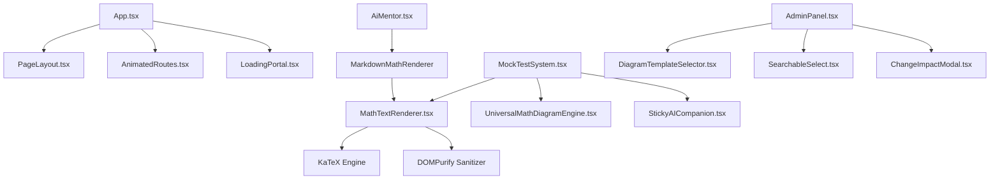

# UI Registry — OdishaExamPrep

This document is the living component registry for **OdishaExamPrep** (`https://www.odishaexamprep.in`). It catalogues every reusable UI component in the codebase.

Before creating any new component, developers and AI agents MUST consult this registry to reuse or extend existing components.

---

## How to Use

1. **Search First:** Before creating a UI component, search this registry.
2. **Reuse Before Creating:** If an existing component satisfies the requirement, use it.
3. **Extend Don't Duplicate:** If an existing component requires minor additions, add optional props to extend it.
4. **Register Immediately:** When a new reusable component is added or modified, update this registry.

---

## Component Index

| Component Name | Category | File Path | Variants | Used By | Status |
| :--- | :--- | :--- | :--- | :--- | :--- |
| **`PageLayout`** | Layout | [`src/components/PageLayout.tsx`](file:///c:/Users/Naresh%20Samal/Downloads/OdishaExamPrep%20Website/src/components/PageLayout.tsx) | Default, Full Width | All Page Views | Active |
| **`Button`** | Utility | [`src/components/Button.tsx`](file:///c:/Users/Naresh%20Samal/Downloads/OdishaExamPrep%20Website/src/components/Button.tsx) | Primary, Secondary, Glass | App.tsx, AdminPanel.tsx | Active |
| **`MathTextRenderer`** | Data Display | [`src/components/MathTextRenderer.tsx`](file:///c:/Users/Naresh%20Samal/Downloads/OdishaExamPrep%20Website/src/components/MathTextRenderer.tsx) | Inline, Block Math, ASCII Diagram, Clickable Link | MockTestSystem, BlogPost, AiMentor | Active |
| **`MarkdownMathRenderer`** | AI Chat | [`src/pages/AiMentor.tsx`](file:///c:/Users/Naresh%20Samal/Downloads/OdishaExamPrep%20Website/src/pages/AiMentor.tsx) | AI message, User message | AiMentor.tsx | Active |
| **`UniversalMathDiagramEngine`**| Data Display | [`src/components/UniversalMathDiagramEngine.tsx`](file:///c:/Users/Naresh%20Samal/Downloads/OdishaExamPrep%20Website/src/components/UniversalMathDiagramEngine.tsx) | Canvas, Vector SVG | MockTestSystem, AdminPanel | Active |
| **`DiagramTemplateSelector`** | Form Control | [`src/components/DiagramTemplateSelector.tsx`](file:///c:/Users/Naresh%20Samal/Downloads/OdishaExamPrep%20Website/src/components/DiagramTemplateSelector.tsx) | Modal Grid | AdminPanel.tsx | Active |
| **`StickyAICompanion`** | AI Assistant | [`src/components/StickyAICompanion.tsx`](file:///c:/Users/Naresh%20Samal/Downloads/OdishaExamPrep%20Website/src/components/StickyAICompanion.tsx) | Drawer, Floating FAB | MockTestSystem, App.tsx | Active |
| **`OnboardingTour`** | Feedback | [`src/components/OnboardingTour.tsx`](file:///c:/Users/Naresh%20Samal/Downloads/OdishaExamPrep%20Website/src/components/OnboardingTour.tsx) | Guided Walkthrough | App.tsx | Active |
| **`PushPermissionPrompt`** | Feedback | [`src/components/PushPermissionPrompt.tsx`](file:///c:/Users/Naresh%20Samal/Downloads/OdishaExamPrep%20Website/src/components/PushPermissionPrompt.tsx) | Top Banner | App.tsx | Active |
| **`ChangeImpactModal`** | Modal | [`src/components/ChangeImpactModal.tsx`](file:///c:/Users/Naresh%20Samal/Downloads/OdishaExamPrep%20Website/src/components/ChangeImpactModal.tsx) | Warning Overlay | AdminPanel.tsx | Active |
| **`SearchableSelect`** | Form Control | [`src/components/SearchableSelect.tsx`](file:///c:/Users/Naresh%20Samal/Downloads/OdishaExamPrep%20Website/src/components/SearchableSelect.tsx) | Filterable Dropdown | AdminPanel.tsx | Active |
| **`TimePicker`** | Form Control | [`src/components/TimePicker.tsx`](file:///c:/Users/Naresh%20Samal/Downloads/OdishaExamPrep%20Website/src/components/TimePicker.tsx) | Time Input | AdminPanel.tsx | Active |
| **`YouTubeCarousel`** | Media | [`src/components/YouTubeCarousel.tsx`](file:///c:/Users/Naresh%20Samal/Downloads/OdishaExamPrep%20Website/src/components/YouTubeCarousel.tsx) | Video Carousel | App.tsx | Active |
| **`LoadingPortal`** | Feedback | [`src/components/LoadingPortal.tsx`](file:///c:/Users/Naresh%20Samal/Downloads/OdishaExamPrep%20Website/src/components/LoadingPortal.tsx) | Full Screen Spinner | App.tsx | Active |
| **`AnimatedRoutes`** | Navigation | [`src/components/AnimatedRoutes.tsx`](file:///c:/Users/Naresh%20Samal/Downloads/OdishaExamPrep%20Website/src/components/AnimatedRoutes.tsx) | Motion Fade Transition | App.tsx | Active |
| **`ProtectedRoute`** | Guard | [`src/components/ProtectedRoute.tsx`](file:///c:/Users/Naresh%20Samal/Downloads/OdishaExamPrep%20Website/src/components/ProtectedRoute.tsx) | Auth Route Guard | App.tsx | Active |
| **`ExamDetailMockTestCard`** | Card | [`src/App.tsx`](file:///c:/Users/Naresh%20Samal/Downloads/OdishaExamPrep%20Website/src/App.tsx) | Live, Upcoming Scheduled, Completed, In Progress, Premium Locked | Exam Detail View | Active |
| **`ScheduledMockTestCard`** | Card | [`src/App.tsx`](file:///c:/Users/Naresh%20Samal/Downloads/OdishaExamPrep%20Website/src/App.tsx) | Live, Upcoming Scheduled | Student Dashboard | Active |
| **`AdminLoginPage`** | View | [`src/pages/AdminLoginPage.tsx`](file:///c:/Users/Naresh%20Samal/Downloads/OdishaExamPrep%20Website/src/pages/AdminLoginPage.tsx) | Glass Card Form | App.tsx | Active |

---

## Component Details

### 1. `PageLayout`
- **File Path:** [`src/components/PageLayout.tsx`](file:///c:/Users/Naresh%20Samal/Downloads/OdishaExamPrep%20Website/src/components/PageLayout.tsx)
- **Category:** Layout
- **Purpose:** Standard top-level container for all public pages, rendering the main header navigation, drawer menu, content container, and footer.
- **Props:** `children` (`ReactNode`, required), `className` (`string`, optional).
- **Styling:** `min-h-screen flex flex-col bg-[#FBF9F6]`.

```tsx
import { PageLayout } from '../components/PageLayout';

export function CustomPage() {
  return (
    <PageLayout>
      <div className="max-w-7xl mx-auto px-4 py-8">
        <h1>Page Content</h1>
      </div>
    </PageLayout>
  );
}
```

---

### 2. `MathTextRenderer`
- **File Path:** [`src/components/MathTextRenderer.tsx`](file:///c:/Users/Naresh%20Samal/Downloads/OdishaExamPrep%20Website/src/components/MathTextRenderer.tsx)
- **Category:** Data Display
- **Purpose:** Parses raw text strings containing inline/block LaTeX, markdown links `[text](url)`, ASCII diagrams, and JSON diagram specs. Renders KaTeX equations, clickable anchor links (via DOMPurify), and falls through to `PlainText` for everything else.
- **Props:** `text` (`string`, required), `isUser` (`boolean`, default `false`), `className` (`string`, optional), `blockSize` (`'sm' | 'md' | 'lg'`, default `'md'`), `isOption` (`boolean`, default `false`).
- **Dependencies:** `katex`, `dompurify`.
- **Last Updated:** 2026-07-24

| Property | Class |
| :--- | :--- |
| Container | `math-text-container break-words` |
| Inline link | `text-brand-500 hover:text-brand-600 hover:underline font-bold transition-colors inline-flex items-center gap-0.5` |
| Inline math | `math-equation-inline` |
| Block math | `math-equation-block` |

**Critical rendering pipeline:**
1. `MathTextRenderer` → `renderMathBlock` splits by `MATH_REGEX` (LaTeX delimiters `$$`, `\[`, `$`, `\(`)
2. Math parts → `BlockMath` / `InlineMath` with KaTeX + `dangerouslySetInnerHTML`
3. Text parts → `renderTextAndDiagrams` → `renderTextAndDiagramsWithAscii`
4. Single-line text → **`PlainText`** (NOT `<span>{text}</span>`) — PlainText detects HTML anchors and renders via `dangerouslySetInnerHTML` with DOMPurify
5. Multi-line text → per-line `PlainText` blocks

**Pattern notes:** `PlainText` MUST be used for all text rendering, never raw `<span>{text}</span>`. Raw JSX expressions escape HTML, which destroys `<a href>` links pre-converted from markdown.

```tsx
import { MathTextRenderer } from '../components/MathTextRenderer';

<MathTextRenderer 
  text="Solve for x: $x^2 + 5x + 6 = 0$" 
  isUser={false}
  blockSize="md"
/>
```

---

### 2b. `MarkdownMathRenderer` (AI Chat Message Renderer)

File: [`src/pages/AiMentor.tsx`](file:///c:/Users/Naresh%20Samal/Downloads/OdishaExamPrep%20Website/src/pages/AiMentor.tsx)
Last updated: 2026-07-24 (v2 — small screen alignment fixes)

| Property | Class |
| :--- | :--- |
| Background | none (transparent — inherits message bubble) |
| Border | none |
| Border radius | none |
| Text — primary | `text-slate-700 leading-relaxed font-medium text-sm md:text-[15px]` |
| Text — user | `text-white leading-relaxed font-medium text-sm md:text-[15px]` |
| Text — heading h2 | `text-lg font-black mt-5 mb-2 text-slate-900` |
| Text — heading h3 | `text-base font-black mt-4 mb-1.5 text-slate-900` |
| Text — heading h4 | `text-sm font-black mt-3 mb-1 text-slate-800` |
| Text — bold inline | `font-extrabold text-slate-900` |
| Bullet dot | `w-1.5 h-1.5 rounded-full bg-[#2563EB] shrink-0 mt-[7px]` (AI) / `bg-brand-200` (user) |
| Numbered label | `font-black text-xs text-[#2563EB] shrink-0 mt-0.5` |
| Option letter badge | `bg-slate-100 border-slate-200/60 text-slate-500 rounded-md w-5 h-5 text-[10px] font-black uppercase` |
| Option badge hover | `group-hover/option:bg-brand-50 group-hover/option:border-brand-200 group-hover/option:text-brand-650` |
| Clickable links | `text-brand-500 hover:text-brand-600 hover:underline font-bold transition-colors` |
| Container spacing | `space-y-3` (AI) / `space-y-1.5` (user) |
| Bullet row | `flex items-start gap-2 pl-3 my-0.5` |
| Bullet text span | `leading-relaxed font-medium flex-1 min-w-0 break-words text-sm md:text-[15px]` |
| Numbered row | `flex items-start gap-2 pl-3 my-0.5` |
| Numbered text span | `leading-relaxed font-medium flex-1 min-w-0 break-words text-sm md:text-[15px]` |
| Option row | `flex items-start gap-2.5 pl-4 my-1 group/option` |
| Shadow | none |
| Accent usage | `text-brand-500`, `bg-[#2563EB]`, `text-[#2563EB]` for list accents |

**Pattern notes:**
- `isUser=true` flips text to white and bullet dots to `bg-brand-200`; headings shift from `text-slate-900` to `text-white`
- Links are plain `inline` elements — **do NOT add `inline-flex items-center`** to anchor tags inside flex list rows; it breaks wrapping on small viewports (≤502px)
- Links use the **brand-500 → brand-600** hover pattern with bold weight; always `target="_blank" rel="noopener noreferrer"`
- Bullet/numbered text spans MUST have `min-w-0 break-words` to prevent flex overflow on narrow screens
- Bullet dot vertical alignment: `mt-[7px]` (NOT `mt-2`) — optically centers a 6px dot against `text-sm` (14px) line-height
- Source citation links from web search follow format `[[N] Title](URL)` — pre-processed to `<a>` before `MathTextRenderer` renders
- `listContent` is stripped of surrounding `*italic*` markers (`/^\*([^*]+)\*$/`) before rendering — AI sometimes wraps source links in single asterisks
- Hardcoded accent `#2563EB` is intentional (Tailwind's `blue-600` equivalent used for list dots/numbers)
- Option letter badge uses `group/option` hover group pattern from Tailwind
- `text-slate-800` for h4 headings (was incorrectly `text-slate-805` — fixed)
- **Multimodal Image Attachment Upload**: Uploaded image files (`.png`, `.jpg`, `.jpeg`, `.webp`) convert to base64 Data URLs (`data:image/...`). Express body parser in `server.ts` enforces `limit: '50mb'` to handle high-resolution image uploads cleanly, routing vision payloads `{ type: 'image_url', image_url: { url } }` to `meta/llama-3.2-11b-vision-instruct` with seamless text-model fallback.
- **ChatGPT-Inspired Attachment Tray**: Attached files render inside a clean horizontal flex strip (`overflow-x-auto gap-2.5 py-1 px-1`). Images display as square 64x64px rounded thumbnail tiles (`w-16 h-16 rounded-xl border border-slate-200/90 shadow-xs object-cover`) with hover-overlay `✕` close buttons. Documents display as horizontal mini-cards (`rounded-xl bg-slate-50 border border-slate-200/80 max-w-[220px]`) with a red PDF badge icon, filename, size, and close icon. Sitting inside the input container, 1, 2, 3, or more files line up side-by-side without vertical stacking or overlapping Quick/Best mode buttons.
- **ChatGPT-Style Visual Chat Message Attachment Cards**: Attached images in student chat bubbles render as visual square thumbnail cards (`w-18 h-18 sm:w-22 sm:h-22 rounded-xl border border-white/30 object-cover shadow-md hover:scale-105`) instead of raw filename strings (`[ 📎 Gemini Generated Image... ]`). Clicking any image tile opens an interactive full-screen Lightbox Zoom Modal (`fixed inset-0 z-[300] bg-slate-950/90 backdrop-blur-md`).

---

### `ChatGPTAttachmentTray`

File: `src/pages/AiMentor.tsx`
Last updated: 2026-07-25

| Property | Class |
| :--- | :--- |
| Background — Container | `bg-white/90` |
| Background — Image Tile | `bg-slate-100` |
| Background — Doc Card | `bg-slate-50` |
| Background — PDF Badge | `bg-rose-50` |
| Border — Container | `border border-slate-200/80` |
| Border — Tile / Card | `border border-slate-200/90` |
| Border radius — Container | `rounded-2xl` |
| Border radius — Tiles / Cards | `rounded-xl` |
| Text — Primary (Filename) | `text-xs font-bold text-slate-800` |
| Text — Secondary (File Size) | `text-[10px] text-slate-400 font-medium font-mono` |
| Spacing — Tray | `mb-2 px-1 py-1` |
| Spacing — Flex Row | `gap-2.5 px-1 py-1 overflow-x-auto no-scrollbar scroll-smooth` |
| Hover state — Image Zoom | `group-hover/thumb:scale-105` |
| Hover state — Dismiss Badge | `bg-slate-950/75 hover:bg-rose-600 text-white` |
| Shadow | `shadow-xs` |

**Pattern notes:**
- Attached files sit inside the input wrapper above the prompt textarea, preventing vertical stacking or button misalignment.
- Image attachments render as 64x64px square thumbnail tiles (`w-14 h-14 sm:w-16 sm:h-16 rounded-xl object-cover`).
- Document attachments render as horizontal mini-cards (`max-w-[220px]`) with a red PDF badge icon, filename, and size.

---

### `ChatGPTChatAttachmentCards`

File: `src/pages/AiMentor.tsx`
Last updated: 2026-07-25

| Property | Class |
| :--- | :--- |
| Background — Chat Image Tile | `bg-slate-900/40` |
| Background — Doc Mini-Card | `bg-white/15 backdrop-blur-xs` |
| Background — Lightbox Overlay | `bg-slate-950/90 backdrop-blur-md` |
| Background — Lightbox Modal Card | `bg-slate-900 border border-slate-700/80` |
| Border — Chat Image Tile | `border border-white/30` |
| Border — Doc Mini-Card | `border border-white/25` |
| Border radius — Chat Tile / Card | `rounded-xl` |
| Border radius — Lightbox Modal | `rounded-2xl` |
| Text — Doc Filename | `text-xs font-semibold text-white` |
| Text — Lightbox Header | `text-xs font-bold text-slate-300` |
| Spacing — Chat Tile Grid | `flex items-center gap-2 flex-wrap mb-2 pt-0.5` |
| Spacing — Tile Dimensions | `w-18 h-18 sm:w-22 sm:h-22` (72x72px to 88x88px) |
| Hover state — Tile Zoom | `group/chatimg hover:scale-105 active:scale-95 transition-all` |
| Hover state — Zoom Overlay Icon | `opacity-0 group-hover/chatimg:opacity-100 transition-opacity` |
| Shadow | `shadow-md` (tiles), `shadow-2xl` (modal) |

**Pattern notes:**
- Attached images in student chat bubbles render as visual square thumbnail cards instead of raw text filename strings (`[ 📎 Gemini Generated Image... ]`).
- Prompt text stays clean and unpolluted by raw file badges.
- Clicking any image tile opens an interactive full-screen Lightbox Zoom Modal for inspecting uploaded question screenshots.

---

### 3. `UniversalMathDiagramEngine`
- **File Path:** [`src/components/UniversalMathDiagramEngine.tsx`](file:///c:/Users/Naresh%20Samal/Downloads/OdishaExamPrep%20Website/src/components/UniversalMathDiagramEngine.tsx)
- **Category:** Data Display
- **Purpose:** Renders dynamic vector SVG and Canvas geometric figures (triangles, circles, polygons, coordinate axes, Venn diagrams, circuits) based on structured JSON props.
- **Props:** `diagram` (`DiagramSpec`, required), `className` (`string`, optional).
- **Dependencies:** KaTeX, React Hooks.

```tsx
import { UniversalMathDiagramEngine } from '../components/UniversalMathDiagramEngine';

<UniversalMathDiagramEngine 
  diagram={{
    type: 'triangle',
    labels: { A: '(0,0)', B: '(4,0)', C: '(2,3)' },
    angles: { A: '60°', B: '60°', C: '60°' }
  }} 
/>
```

---

### 4. `StickyAICompanion`
- **File Path:** [`src/components/StickyAICompanion.tsx`](file:///c:/Users/Naresh%20Samal/Downloads/OdishaExamPrep%20Website/src/components/StickyAICompanion.tsx)
- **Category:** AI Assistant
- **Purpose:** Floating AI assistant drawer that accompanies students during mock tests to provide hints and step-by-step guidance without giving direct answers.
- **Props:** `currentQuestion` (`Question`, optional), `testContext` (`TestContext`, optional).
- **Dependencies:** `/api/chat/completions`, NVIDIA NIM Proxy, `lucide-react`.

---

### 5. `SearchableSelect`
- **File Path:** [`src/components/SearchableSelect.tsx`](file:///c:/Users/Naresh%20Samal/Downloads/OdishaExamPrep%20Website/src/components/SearchableSelect.tsx)
- **Category:** Form Control
- **Purpose:** Custom dropdown menu with built-in real-time filter search bar for long option lists.
- **Props:** `options` (`Array<{value: string, label: string}>`, required), `value` (`string`, required), `onChange` (`(val: string) => void`, required), `placeholder` (`string`, optional).

```tsx
import { SearchableSelect } from '../components/SearchableSelect';

<SearchableSelect 
  options={[{ value: 'opsc', label: 'OPSC Civil Services' }, { value: 'ossc', label: 'OSSC CGL' }]}
  value={selectedExam}
  onChange={setSelectedExam}
  placeholder="Select Exam..."
/>
```

---

### 6. `LoadingPortal`
- **File Path:** [`src/components/LoadingPortal.tsx`](file:///c:/Users/Naresh%20Samal/Downloads/OdishaExamPrep%20Website/src/components/LoadingPortal.tsx)
- **Category:** Feedback
- **Purpose:** Renders full-screen backdrop loading state with platform logo and animated pulse spinner during initial app load.

---

### 7. `AdminLoginPage`
- **File Path:** [`src/pages/AdminLoginPage.tsx`](file:///c:/Users/Naresh%20Samal/Downloads/OdishaExamPrep%20Website/src/pages/AdminLoginPage.tsx)
- **Category:** View
- **Last Updated:** 2026-07-20

| Property | Class |
| :--- | :--- |
| Background | `bg-white/80 backdrop-blur-xl` |
| Border | `border-white/40` |
| Border radius | `rounded-2xl` |
| Text — primary | `text-slate-950 font-black tracking-tight` |
| Text — secondary | `text-slate-500 font-medium` |
| Input fields | `bg-white/50 border-slate-200 focus:ring-4 focus:ring-brand-500/10 focus:border-brand-500` |
| Button — primary | `premium-gradient text-white rounded-2xl shadow-xl shadow-brand-500/20` |
| Alert box | `bg-red-50 text-red-600 rounded-2xl border border-red-100 text-sm font-bold` |

**Pattern notes:**
Uses standard `PageLayout` with glassmorphic elevated backdrop cards (`backdrop-blur-xl bg-white/80`). Form inputs utilize subtle focus ring effects (`focus:ring-brand-500/10`) and rounded `rounded-2xl` radius matching the system design token.

---

### 8. `ExamDetailMockTestCard`
- **File Path:** [`src/App.tsx`](file:///c:/Users/Naresh%20Samal/Downloads/OdishaExamPrep%20Website/src/App.tsx)
- **Category:** Card / Scheduled Content
- **Last Updated:** 2026-07-27 (v1.7.7)

| Property | Class |
| :--- | :--- |
| Background — Live | `bg-white` |
| Background — Scheduled | `bg-amber-50/10` (desktop card) / `bg-amber-50/20` (mobile row) |
| Background — Completed | `bg-white border-emerald-200` |
| Background — In Progress | `bg-white border-amber-250` |
| Border — Live | `border-slate-200` |
| Border — Scheduled | `border-amber-200` |
| Border — Completed | `border-emerald-200` |
| Border radius | `rounded-[1.5rem]` (desktop) / `rounded-xl sm:rounded-2xl` (mobile) |
| Text — Title | `font-black text-base sm:text-lg text-slate-955 tracking-tight uppercase leading-snug line-clamp-2` |
| Text — Upcoming Badge | `text-[10px] font-black text-amber-800 uppercase tracking-widest bg-amber-100 px-2.5 py-0.5 rounded border border-amber-200` |
| Text — Countdown Timer | `font-mono text-xs tracking-wider font-black text-amber-950 bg-amber-200/60 px-2 py-0.5 rounded-md border border-amber-300/60` |
| Spacing — Desktop Card | `p-6 flex flex-col justify-between gap-6` |
| Action Button — Scheduled | `w-full h-[48px] rounded-xl flex items-center justify-center gap-2 font-black text-xs sm:text-sm bg-amber-500/15 border-2 border-amber-400 text-amber-950 shadow-sm cursor-not-allowed` |
| Action Button — Live | `w-full h-[48px] rounded-xl font-black text-sm premium-gradient text-white shadow-lg shadow-brand-500/20` |
| Hover state | `hover:-translate-y-2 hover:shadow-2xl hover:shadow-brand-500/10 hover:border-brand-200 cursor-pointer` |
| Shadow | `shadow-lg shadow-slate-200/30` |

**Pattern notes:**
- **Top-Level `React.memo` Component:** Declared at top-level file scope in `App.tsx` to maintain component reference stability and prevent mount resets on timer state updates.
- **Framer Motion (`initial={false}`):** Countdown ticks update text state smoothly without triggering mount fade/slide entrance animations.
- **Multi-Layer Schedule Extraction:** Uses fallback `test?.scheduled_at || test?.scheduledAt || parsedScheduleFromSeriesId` to accurately render release countdowns across any Supabase schema layout.

---

## Component Dependency Graph



---

### 9. `SolutionBreakdownCard` & `PracticeSolutionToggleHeader`
- **File Path:** [`src/MockTestSystem.tsx`](file:///c:/Users/Naresh%20Samal/Downloads/OdishaExamPrep%20Website/src/MockTestSystem.tsx)
- **Category:** Data Display / Interactive Feedback
- **Last Updated:** 2026-07-28 (v1.7.21)

| Property | Class |
| :--- | :--- |
| Background — Card | `bg-white` |
| Background — Header Icon | `bg-amber-500/10` |
| Background — Toggle Button | `bg-amber-50 hover:bg-amber-100/80` |
| Border — Card | `border border-slate-200/60` |
| Border — Accent Accent | `border-l-4 border-[#2563EB]` |
| Border — Toggle Button | `border border-amber-200` |
| Border radius — Card | `rounded-2xl` |
| Border radius — Icon / Button | `rounded-xl` (icon) / `rounded-lg` (button) |
| Text — Heading | `font-serif font-black text-slate-900 text-base leading-none` |
| Text — Subtitle | `text-[10px] text-slate-400 font-bold uppercase tracking-wider mt-1 block` |
| Text — Explanation Prose | `text-slate-700 text-sm sm:text-base leading-relaxed font-serif font-medium pl-4 py-1` |
| Text — Toggle Button | `text-[10px] font-bold text-amber-700` |
| Spacing & Layout | `p-5 sm:p-6 space-y-3 relative shadow-sm shrink-0 mb-6` |

**Pattern notes:**
- **Auto-Sync Visibility:** In Practice mode, navigating to an answered question automatically displays the `SolutionBreakdownCard` without requiring answer clearing or re-selecting options.
- **Scroll & Overflow Safety:** Whenever `showExplanation` is active, `<main>` and the Options/Explanation container switch to `overflow-y-auto no-scrollbar` with `pb-6` bottom padding, ensuring long multi-paragraph solution text is 100% visible without bottom clipping.
- **Header Action Button:** Positioned directly in the question header next to "Question X of Y" as a responsive `[Solution Breakdown / Hide Explanation]` toggle button.

---

## Duplicate Prevention Rules

1. NEVER create another equation renderer; always use `MathTextRenderer.tsx`.
2. NEVER create static image diagrams when `UniversalMathDiagramEngine.tsx` vectors can be used.
3. NEVER write custom dropdown search logic; always reuse `SearchableSelect.tsx`.
4. NEVER build custom full-screen loading spinners; use `LoadingPortal.tsx`.
5. NEVER duplicate top navigation header structures; wrap pages in `PageLayout.tsx`.
6. NEVER create alternative payment unlock overlays outside Razorpay modal handlers in `App.tsx`.
7. NEVER render raw `<span>{htmlString}</span>` in `MathTextRenderer` — always route through `PlainText` so `dangerouslySetInnerHTML` handles HTML anchors correctly.
8. NEVER build a custom markdown link pre-processor for AI chat — `MarkdownMathRenderer` already handles `[text](url)` → `<a>` conversion before passing to `MathTextRenderer`.

